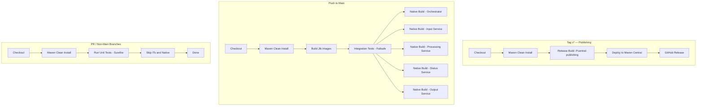

# Builds and Continuous Integration (CI)
The project uses three independent workflows:

1. **build.yml** — PR/non‑main builds
    - Fast build
    - Unit tests only
    - No Jib, no native, no integration tests

2. **full-tests.yml** — push to `main`
    - Full clean build
    - Jib Docker images
    - Integration tests
    - Native builds (matrix)

3. **publish.yml** — `v*` tags
    - Release build
    - Deploys to Maven Central
    - No tests (already validated in main)

## 📛 CI Status

## Container-backed CI caching

The container-backed CSV Payments, Restaurant Approval, and Search E2E lanes
cache the expensive inputs that are safe to reuse:

- Jib layer cache, scoped by runner OS and architecture.
- Testcontainers and Compose base-image sets, keyed by their exact image list.
- Built topology images for the CSV, Restaurant, and Search stacks, keyed by
  their relevant source inputs. CSV and Restaurant bundles also include the
  generated release artifact needed to register the pipeline after a cache hit.

The first run that encounters a new cache key still pulls or builds the image,
then saves it for later jobs. Re-runs of the same PR reuse its cache. Caches
warmed on `main` are also available to later PRs when their exact keys match;
topology-image caches intentionally miss when their application or framework
inputs change.

Container bootstrap scripts use quieter pull output only in CI. Local runs keep
their normal Docker output for diagnosis. The shared CI setup does not set a
global Java logging-manager option: Quarkus test JVMs configure JBoss LogManager
through their Maven test configuration, while Maven bootstrap JVMs must not try
to load it.

## 🛠️ Build Flags Cheat Sheet

- `-DskipITs` — Skip integration tests
- `-DskipNative=true` — Skip native builds
- `-Dquarkus.container-image.build=false` — Skips building Jib image
- `-Pcoverage` — Enable coverage for unit tests only
- `-Pcentral-publishing` — Release mode for Maven Central deploy
- Avoid mixing `skipTests` and `skipITs`
- Quarkus extensions require full reactor builds (`clean install`)

## CI Architecture Diagram

## 🧩 CLI Flags — TL;DR

| Flag                                    | Meaning                                   | When to Use               |
|-----------------------------------------|-------------------------------------------|---------------------------|
| `-DskipITs`                             | Skips `*IT.java`                          | PRs, fast builds          |
| `-DskipNative=true`                     | Skips native images                       | Everything except main    |
| `-Dquarkus.container-image.build=false` | Skips Jib images (but uses Docker builds) | Full tests on main        |
| `-Pcoverage`                            | Run coverage on unit tests                | PRs, quality gates        |
| `-Pcentral-publishing`                  | Release signing + GPG + deploy            | Only on tags              |
| `-DskipTests`                           | Skips **all** tests                       | ⚠️ Avoid — rarely correct |
| `-Dquarkus.native.enabled=true`         | Enables native build                      | Native matrix stage       |

### Golden Rules
- ❌ **Never** mix `skipTests` + `skipITs`.
- ✔ Always run framework builds with:
  `mvn clean install`
- ✔ Examples (CSV Payments) may be built individually.
- ✔ Native builds must run after integration tests.
