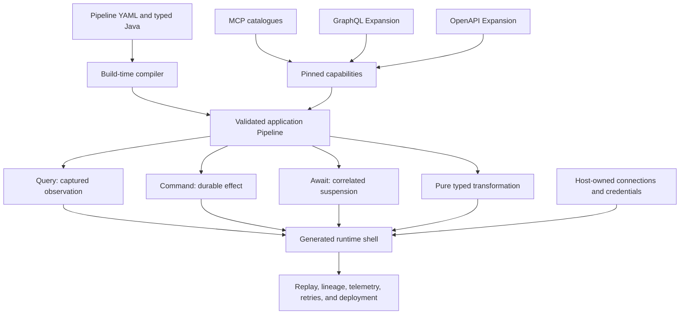

# The Pipeline Framework

[](https://search.maven.org/search?q=g:%22org.pipelineframework%22%20AND%20a:%22pipelineframework%22)
[](https://opensource.org/licenses/Apache-2.0)
[](https://adoptium.net/)
[](https://quarkus.io)
[](https://coderabbit.ai)

## Build with AI. Run with guarantees.

The Pipeline Framework (TPF) is a Java framework for strongly typed application flows. Compose
model decisions, authorised SaaS capabilities, deterministic business logic, and long-running work
in one application model. TPF generates and runs the imperative shell around that model: transport,
connections, persistence, retries, durable effects, waits, replay, telemetry, and deployment
integration.

**Keep the core pure. Connect to reality.**

[Documentation](https://pipelineframework.org) ·
[AI and agentic applications](https://pipelineframework.org/value/ai-and-agentic-applications) ·
[SaaS integration](https://pipelineframework.org/value/saas-integration) ·
[Examples](https://pipelineframework.org/develop/examples/)

## What TPF Lets You Build

- **AI-assisted applications** where a model returns one schema-checked business decision.
- **Composable agentic applications** whose reads, effects, policy, approvals, waits, nested
  pipelines, recurrence, and completion follow the business—not a fixed Agent loop.
- **Connected SaaS applications** built from selected MCP tools, persisted GraphQL operations,
  OpenAPI contracts, and host-owned OAuth connections.
- **Long-running business flows** with durable background execution, callbacks, human interaction,
  checkpoint handoff, crash recovery, and replay.
- **Reusable internal platforms** that distribute typed flows as Blocks, external boundaries as
  Connectors, and coherent capability families as Expansions.
- **Applications that can change runtime shape** without moving transport and deployment concerns
  into business functions.

In TPF, a Pipeline is not CI/CD and not an arbitrary workflow graph. It is an ordered, strongly
typed application flow: each Step transforms an explicit business contract, while semantic
boundaries say when the application observes external reality, performs an effect, or waits for a
later completion.



## AI Is Part of the Application, Not a Second Runtime

TPF models one model inference as an ordinary provider-backed Query. The result is a typed
application value or an inert proposal from a release-pinned callable catalogue. A later generated
boundary validates and invokes at most one approved Query or Command; the model never receives
ambient connector, credential, account, or effect authority.

An agentic loop is then ordinary Pipeline composition. The application decides where to:

- prepare trusted context and business constraints;
- ask the model for one typed decision;
- route reads, effects, approvals, interactions, or specialist Pipelines differently;
- reduce each observation back into trusted state;
- recur within an explicit bound, escalate, wait, or complete.

Repeated loop semantics can be packaged in a Block and distributed with related Connectors, types,
examples, and operations as an Expansion. Applications can consume that loop or compose another
shape from the lower-level capabilities.

The **GraphQL Expansion** proves the model. Its production `graphql-agent` Block packages operation
guidance, persisted Query/Mutation tools, trusted effect-key derivation, observation normalisation,
bounded history, reduction, recursion, and typed completion. The application still owns the LLM
binding, digest-pinned documents, connection, effect scope, Command identity, duplicate policy, and
Command policy.

The same integration model spans:

- **MCP** — discover broadly, import deliberately, and expose selected tools as pinned Query or
  Command operations;
- **GraphQL** — use persisted Query and Mutation Blocks directly or through a packaged agent loop;
- **OpenAPI** — map synchronous operations to Query or Command, asynchronous callbacks to Command →
  Await, and schema differences through direct, LLM-assisted, or curated-DTO adaptation;
- **OAuth-backed hosts** — resolve logical connections to authenticated Google, Microsoft, LLM, or
  MCP clients without putting tokens in Pipeline values. These host APIs remain experimental.

## The Guarantees Behind the Headline

| Concern | TPF model |
| --- | --- |
| Business logic | Explicit canonical input/output types and transport-neutral Java functions |
| External reads | Query captures typed observations for replay without repeating the provider call |
| External writes | Command owns stable effect identity, duplicate policy, confirmation, and ambiguity |
| Deferred work | Await owns durable suspension, correlation, completion admission, timeout, and resume |
| AI decisions | Canonical schema validation, pinned callable catalogues, trusted context, and one inference per Query execution |
| Runtime execution | Generated adapters, lineage, retries, DLQ handling, telemetry, persistence, caching, and replay |
| Deployment | Separate transport, platform, runtime-layout, and build-topology decisions |

Quarkus is the mature production runtime. Spring support is emerging behind the same semantic model
with limited local/REST unary coverage; it is not production parity. See the
[Spring support status](https://pipelineframework.org/develop/spring-support).

## Author with Your Coding Agent

Install the repository's [`tpf-authoring`](.agents/skills/tpf-authoring/SKILL.md) Agent Skill. It
teaches a coding agent which TPF primitive owns data flow, external observation, effects,
suspension, replay, placement, and configuration, then directs it to versioned documentation,
resolved dependencies, examples, and compiler diagnostics for exact details.

```shell
gh skill install The-Pipeline-Framework/pipelineframework tpf-authoring --allow-hidden-dirs
```

## Start from Working Proof

- [`examples/callable-loop-proof`](examples/callable-loop-proof/) packages a domain-neutral typed
  callable loop while the application supplies bindings and Command authority.
- [`examples/graphql-block-proof`](examples/graphql-block-proof/) runs the production GraphQL agent
  through persisted Query → partial-error Mutation → typed completion.
- [`examples/quickbooks-collections-briefing`](examples/quickbooks-collections-briefing/) imports one
  pinned QuickBooks MCP Query and turns its unstructured result into a typed collections plan.
- [`examples/csv-payments`](examples/csv-payments/) is the broad runtime proof for streaming,
  rejection, Await, lineage, replay, telemetry, performance, and multiple runtime layouts.
- [`examples/restaurant-approval`](examples/restaurant-approval/) demonstrates durable human
  interaction and resume through the interaction API.
- [`examples/search`](examples/search/) covers fan-out/fan-in, REST and gRPC, functions, generated
  workers, caching, persistence, replay, and branch-aware execution.
- [`examples/rag-turnkey`](examples/rag-turnkey/) composes separate indexing and query applications
  backed by Ollama and PostgreSQL/pgvector.

The [Examples Guide](https://pipelineframework.org/develop/examples/) links and briefs every example
README in the repository.

## Choose a Documentation Path

- [Functional Core / Imperative Shell](https://pipelineframework.org/architecture/fcis)
- [Pipeline Template Guide](https://pipelineframework.org/develop/pipeline-template/)
- [One-turn LLM Query and callable composition](https://pipelineframework.org/develop/extension/llm-query)
- [MCP Connector Import](https://pipelineframework.org/develop/extension/mcp-connector-import)
- [GraphQL Connector, Blocks, and packaged agent](https://pipelineframework.org/develop/extension/graphql-connector)
- [Connectors](https://pipelineframework.org/develop/connectors/),
  [Blocks](https://pipelineframework.org/develop/blocks/), and
  [Expansions](https://pipelineframework.org/develop/expansions/)
- [Runtime layouts and build topologies](https://pipelineframework.org/deploy/runtime-layouts/)
- [Observability and replay](https://pipelineframework.org/operate/observability/)
- [Architecture conversations in the Coffee Machine](https://pipelineframework.org/architecture/coffee-machine/)
- [Glossary](https://pipelineframework.org/glossary)

## Repository Map

- [`framework/api`](framework/api/) — framework-neutral contracts for generated applications.
- [`framework/runtime-core`](framework/runtime-core/) — framework-neutral TPF semantics.
- [`framework/deployment`](framework/deployment/) — compilation, validation, and code generation.
- [`framework/runtime`](framework/runtime/) — the canonical Quarkus runtime, execution engine,
  telemetry, and configuration.
- [`framework/runtime-spring`](framework/runtime-spring/) — the emerging Spring runtime surface.
- [`framework/connectors`](framework/connectors/) — typed I/O and external-observation/effect
  boundaries.
- [`framework/plugins`](framework/plugins/) — cross-cutting persistence, caching, materialisation,
  telemetry, and related capabilities.
- [`blocks`](blocks/) — reusable compile-time Pipeline definitions, including packaged specialised
  loops.
- [`examples`](examples/) — reference applications and end-to-end compatibility proofs.
- [`docs`](docs/) — the VitePress documentation site.
- [`ai-sdk`](ai-sdk/) — the standalone Java SDK used for delegation, mapping, and transport
  exercises.

## Build and Validation

This repository uses an isolated Maven local repository per worktree.

Framework verification:

```shell
./mvnw -f framework/pom.xml verify -Dmaven.repo.local="$PWD/.m2/repository"
```

Full repository verification:

```shell
./mvnw verify -Dmaven.repo.local="$PWD/.m2/repository"
```

Documentation verification:

```shell
npm --prefix docs test
npm --prefix docs run build
```

## Contributing and Security

Contributions are welcome across framework code, examples, documentation, tooling, and architecture
discussion. Read [CONTRIBUTING.md](CONTRIBUTING.md) to get started and [AGENTS.md](AGENTS.md) for
repository-specific engineering guidance.

Report vulnerabilities through the [security policy](SECURITY.md).
