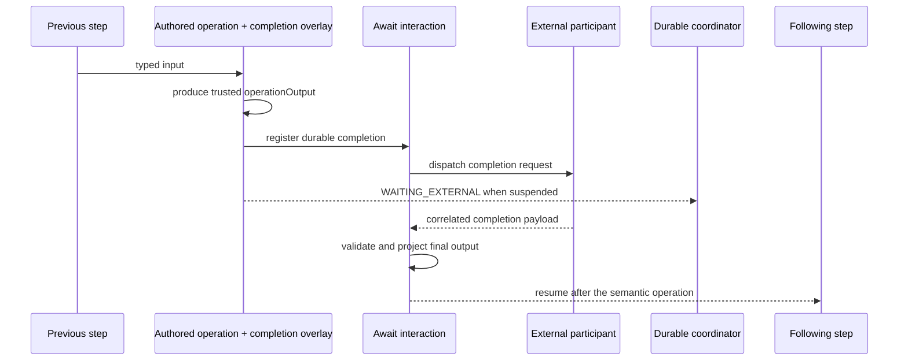

# Deferred Completion And Await Boundaries

Deferred completion models external reality without pretending that waiting is an
operation. An ordinary authored operation produces a trusted immediate result. The
`await:` modifier then pauses the same execution until a correlated external
observation can be projected into that operation's final output.

```text
authored operation: Input → OperationOutput
deferred completion: OperationOutput + Completion → FinalOutput
```

Typical completions include human approvals, webhook callbacks, brokered provider
replies, and long-running jobs. The pipeline owns the operation and continuation. The
external participant owns only the fact or decision it submits.

## When To Use Deferred Completion

Use `await:` when the operation can start now but its final business result arrives
after the current execution turn.

| External shape | Model as |
| --- | --- |
| Local computation returning now | Authored service |
| Inline HTTP/gRPC call returning now | Query, Command, Connector, or remote operator |
| Authored request followed by a human decision | Authored service with `await:` |
| Provider accepts now and calls back later | Native Command with `await.callback` |
| Independent event starts a new business flow | Inbound admission, not deferred completion |
| Another pipeline should own the next lifecycle | Checkpoint handoff |

Await is not a `StepKind`, and “interaction” is not another operation category. A
human UI, callback provider, webhook, Kafka topic, or SQS queue participates through
the completion transport.

## Shape The Operation

The step's top-level `input` and `output` remain its pipeline-visible contract. The
authored service returns `await.operationOutput`, which becomes trusted context for
the completion lifecycle.

```yaml
steps:
  - name: Create pending approval
    service: com.example.CreatePendingApprovalService
    cardinality: ONE_TO_ONE
    input: ValidatedOrder
    output: RestaurantDecision

    await:
      operationOutput:
        type: PendingRestaurantApproval
        java: com.example.PendingRestaurantApproval
      timeout: PT30M
      idempotency:
        fields: [orderId]
      correlation:
        strategy: interactionId
      transport:
        type: interaction-api
      completion:
        type: RestaurantDecisionSubmission
        projector: com.example.RestaurantDecisionProjector
```

The service has the ordinary authored signature:

```text
ValidatedOrder → PendingRestaurantApproval
```

The whole step has the pipeline contract:

```text
ValidatedOrder → RestaurantDecision
```

The projector implements
`AwaitCompletionProjector<PendingRestaurantApproval,
RestaurantDecisionSubmission, RestaurantDecision>`. It receives the trusted
operation output, the untrusted submitted payload, and framework-authored completion
metadata such as `completedAt`. It must be public, constructible, deterministic, and
side-effect free.

When no projector is needed, `await.completion.type` may be omitted and defaults to
the top-level output. Idempotency paths resolve against `operationOutput`, not the
original step input or submitted completion.

TPF persists the operation output and projected completion as canonical values.
Recovery resumes from the admitted final output; it does not invoke the authored
operation or projector again for an already projected canonical completion.

## Command Callback Completion

A native `ONE_TO_ONE` Command can select a callback declared in its provider
manifest. Its `await.operationOutput` is the immediate acknowledgement contract;
the top-level `output` is the final pipeline result. The required completion
projector receives the original canonical Command input and the callback payload,
so it can produce the final result even when dispatch acknowledgement is ambiguous.

TPF registers the durable interaction before dispatch. A callback arriving during
dispatch is stored as `COMPLETION_OBSERVED` and cannot advance the pipeline until
the Command outcome settles. Success or ambiguity permits completion; a callback
followed by definite rejection fails as contradictory provider evidence. Completing
an ambiguous Command does not rewrite its effect history.

Callback selection uses an application binding, signed resume tokens, and explicit
endpoint resolver and authenticator classes. It cannot be combined with
`await.transport` or authored Await idempotency fields. Query, dynamic, packaged
Block, attended Command, and streaming Command completion are unsupported.

See [Command Steps](/deploy/orchestrator-runtime/command#callback-completion) for
the declaration and [ADR-0037](/decisions/0037-command-deferred-completion-joins-effect-and-callback)
for the durable outcome table.

## Branching And Unions

`accepts` still controls whether the semantic operation runs for a union alternative.
It does not create Await-specific routing. The operation's immediate output is the
trusted projector input, so the standalone Await-step narrowing described by older
releases no longer exists.

Alternatives not accepted by the decorated operation continue through ordinary v3
branch routing. There is no completion-specific pass-through mapper and no implicit
collection-to-stream or stream-to-collection conversion.

## Cardinality

The authored operation retains its ordinary cardinality. Each result it emits gets
exactly one deferred completion:

| Operation cardinality | Deferred-completion meaning |
| --- | --- |
| `ONE_TO_ONE` | one operation result receives one completion |
| `ONE_TO_MANY` | every emitted result receives its own completion |
| `MANY_TO_ONE` | the operation emits one result, which receives one completion |
| `MANY_TO_MANY` | every emitted result receives its own completion |

Deferred completion does not introduce aggregate Await cardinality. If an external
participant decides on a whole batch or returns a collection, model that batch or
collection as an explicit bounded canonical type. Use ordinary expansion and
reduction steps when individual items must re-enter a stream.

For brokered per-result completion, the configured in-flight window bounds unresolved
interactions. This is provider-facing backpressure, not a hidden batch or a circuit
boundary.

## Durable Lifecycle

The generated completion modifier reuses the existing durable Await runtime. The
compiler orders its technical adapters as:

```text
ordinary operation adapter
→ operation-scoped aspects
→ deferred completion modifier
```

The modifier consumes the trusted operation result; it never invokes the operation
again. Its durable lifecycle is:

```text
OPERATION_INVOKED
→ OPERATION_COMPLETED(OperationOutput)
→ COMPLETION_REGISTERED
→ REQUEST_DISPATCHING
→ COMPLETION_PENDING / WAITING_EXTERNAL
→ COMPLETION_OBSERVED
→ PROJECTED
→ STEP_COMPLETED(FinalOutput)
```

For an active brokered stream, admitted item completions can continue through the
live reactive segment. If the live owner disappears, TPF falls back to durable
coordination:

1. persist each interaction and dispatch state;
2. park the parent execution as `WAITING_EXTERNAL` when the transition suspends;
3. admit completion by signed token or configured correlation;
4. resume the continuation from the persisted final output;
5. release the execution when every emitted occurrence has completed;
6. publish terminal output before marking the execution successful.

The durable identity combines the root execution, qualified semantic step, and item
occurrence. Nested and recursive deferred completion additionally needs a stable
invocation path and is not supported yet.



Replay and topology metadata show one semantic operation with a deferred-completion
overlay. Broker and external-provider actors may still appear because they are
participants, not pipeline operations.

## Deferred Completion Versus Checkpoint Handoff

| Concern | Deferred completion | Checkpoint handoff |
| --- | --- | --- |
| Execution ownership | same execution parks and resumes | another pipeline admits independent work |
| Boundary | lifecycle attached to one operation | publication/admission between pipelines |
| Completion | correlated external observation | downstream checkpoint admission |
| Retry and DLQ | owning execution remains responsible | downstream orchestrator owns them after admission |
| Use when | the final result belongs to this operation | another flow should own the next lifecycle |

## Current Support Boundary

Authored internal services are supported first. Commands need completion registration
before effect dispatch and are a separate implementation slice. Query, nested
pipeline invocation, remote/delegated operators, dynamic operation dispatch, and
packaged Blocks do not yet accept `await:`. Object admission, publication, and
checkpoint handoff keep their existing ownership models.

Existing deployments with executions waiting on the former standalone Await topology
must let those releases finish or cancel them before retiring the old deployment.
They are not remapped to the new step identity.

## Design Responsibilities

For every decorated operation, choose:

1. an immediate operation-output type containing only trusted request state;
2. a stable business idempotency key over that output;
3. an explicit, minimal completion payload owned by the external participant;
4. a deterministic projector when final output combines trusted and untrusted facts;
5. a timeout and a policy for late, expired, or duplicate completion;
6. a transport adapter appropriate for UI, webhook, Kafka, or SQS delivery.

## Where To Go Next

- [Await runtime setup](/deploy/orchestrator-runtime/await) covers adapters and runtime configuration.
- [Await operations](/operate/await-boundaries) covers admission, timeout, replay, and diagnostics.
- [Concurrency and backpressure sizing](/deploy/concurrency-and-backpressure) covers unresolved-work budgets.
- [Await Unit Runtime](/evolve/await-unit-runtime/) covers the durable implementation.
- [Operators](/architecture/operators) covers immediate remote computation.
