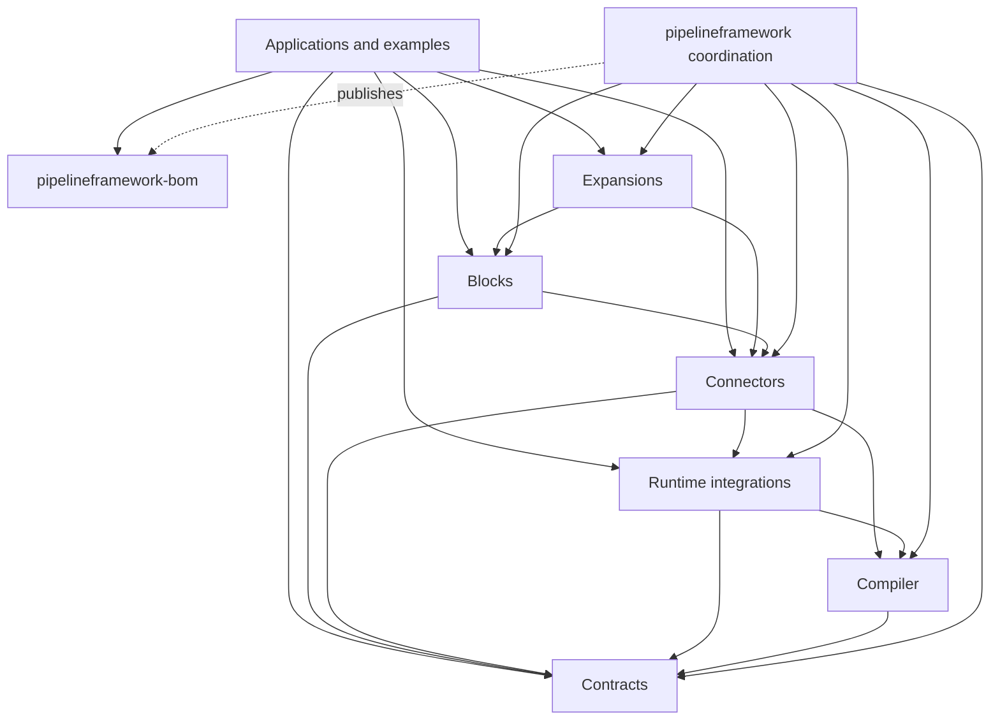

# Components and Repositories

TPF is a set of independently released components, not one source reactor. A repository boundary marks a place
where one side can consume a released contract from the other instead of requiring source-level atomicity. The
[`pipelineframework-bom`](https://central.sonatype.com/artifact/org.pipelineframework/pipelineframework-bom)
records the component versions tested together.

Repository boundaries do not imply runtime processes. In particular, the Quarkus runtime and deployment artifacts
are one framework integration pair in one repository: the deployment artifact runs at build time, while the runtime
artifact is packaged with the application. They consume compiler and contract artifacts but do not own TPF's
language semantics.

## Dependency direction

Solid arrows mean “consumes released artifacts from”; the dashed arrow marks BOM publication. The application layer
includes learning examples, reference implementations, and real applications.

The coordination repository consumes the component set for compatibility testing, owns the immutable
candidate-overlay test policy, and publishes the BOM. It does not regain implementation ownership by testing those
components together. Owner repositories still own their unit, contract, integration, and application-specific E2E
suites.

## Ownership map

| Repository | Owns | Does not own |
| --- | --- | --- |
| [`pipelineframework-contracts`](https://github.com/The-Pipeline-Framework/pipelineframework-contracts) | Authored API, semantic model, DSL, shared serialization, runtime API/protocol/SPI, and portable runtime core | Compiler implementation, Quarkus/Spring integration, provider implementations |
| [`pipelineframework-compiler`](https://github.com/The-Pipeline-Framework/pipelineframework-compiler) | Production JSR-269 build host, semantic phases, validation, contract generation, and source renderers | Runtime implementation or Quarkus deployment ownership |
| [`pipelineframework-runtime`](https://github.com/The-Pipeline-Framework/pipelineframework-runtime) | Quarkus runtime/deployment pair, Spring runtime adapter, foundational plugins, and their smoke tests | Compiler semantics, Connectors, Blocks, or applications |
| [`pipelineframework-connectors`](https://github.com/The-Pipeline-Framework/pipelineframework-connectors) | Typed I/O implementations, representation providers, import tooling, and TPF-owned external-service hosts | Runtime semantics or reusable Pipeline composition |
| [`pipelineframework-blocks`](https://github.com/The-Pipeline-Framework/pipelineframework-blocks) | Reusable compile-time Pipeline definitions | Application bindings, credentials, Command authority, or runtime implementations |
| [`pipelineframework-expansions`](https://github.com/The-Pipeline-Framework/pipelineframework-expansions) | Version-aligned distribution POMs over related Blocks, Connectors, and integration assets | A new step kind, compiler semantics, or application authority |
| [`pipelineframework`](https://github.com/The-Pipeline-Framework/pipelineframework) | Canonical documentation, product BOM, cross-artifact conformance, immutable candidate-overlay policy, compatibility sets, full trains, and release coordination | Source mirrors of independently published components or owner-local tests |
| [`pipelineframework-examples`](https://github.com/The-Pipeline-Framework/pipelineframework-examples) | Learning examples and architectural proofs | Framework implementation |
| [`pipelineframework-reference-implementations`](https://github.com/The-Pipeline-Framework/pipelineframework-reference-implementations) | Long-lived reference systems | Framework implementation |
| [`csv-kafka-payments`](https://github.com/The-Pipeline-Framework/csv-kafka-payments) and [`rag-turnkey`](https://github.com/The-Pipeline-Framework/rag-turnkey) | Real applications over released TPF artifacts | Framework implementation |

## Important artifact families

The contracts repository publishes deliberately separate artifacts because their consumers and compatibility
promises differ:

- `pipelineframework-api`, `pipelineframework-semantic-model`, and `pipelineframework-dsl` describe authored and
  compiled meaning;
- `pipelineframework-runtime-api` is the application-facing programming surface;
- `pipelineframework-runtime-core`, `pipelineframework-runtime-protocol`,
  `pipelineframework-runtime-serialization`, and `pipelineframework-runtime-spi` are the portable runtime seam;
- `representation-provider-api` is the portable representation-provider contract.

The compiler repository publishes `pipelineframework-compiler`. Its production source adapter is JSR-269. A future
Jandex adapter may feed the same semantic model, but it must not create a second language or move semantic ownership
into a Quarkus deployment module.

The runtime repository publishes the Quarkus runtime/deployment artifacts, Spring adapter, and foundational plugin
artifacts. The paired Quarkus artifacts may evolve atomically inside that repository while their dependencies on
compiler and contract artifacts remain ordinary released dependencies.

## Shared runtime seam

Application code and separately operated execution infrastructure may both depend on the portable runtime contract
artifacts. That seam carries stable execution and release identities, serialized values and envelopes, placement
and capability metadata, transition commands and results, durable identifiers, observability context, and provider
SPIs.

It must not expose Quarkus or Spring internals, worker implementations, provider clients, resolved secrets,
tenant-specific connection policy, or deployment wiring. Those details belong to the runtime host or Connector that
implements the contract. TPF does not currently publish a hosted SaaS runtime; this boundary exists so self-hosted
deployments and any future separately operated workers do not have to share implementation ownership.

## Releases and compatibility

Each component repository publishes and versions its own artifacts. Normal Maven versioning governs source and
binary dependencies. Serialized runtime protocol and pipeline-contract compatibility require explicit compatibility
tests, not merely matching version strings. Release identity, artifact digests, imported capability identity, and
other pinned provenance remain data in the Pipeline contract rather than inputs to a generic version resolver.

The product BOM pins one tested combination. Every change first passes its owner repository. A changed component is
then tested as an immutable candidate overlay on the last-known-green baseline; coordinated changes use one
compatibility set containing each candidate. Formal BOM or release promotion requires a green full train. See
[Cross-repository system tests](/evolve/cross-repository-system-tests) for the trust and promotion model.
