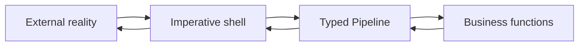

# Architecture

TPF keeps business decisions in a typed functional core and generates or configures the imperative
shell that connects those decisions to transports, external systems, durable state, and deployment.

- [Data Architecture](/architecture/data-architecture/) explains canonical types, immutable flow, Query, Command, and external representations.
- [Functional Core, Imperative Shell](/architecture/fcis) establishes the responsibility boundary.
- [State Model](/architecture/state-model) separates persistence, cache, replay, execution, Await, and effect authority.
- [Application Structure](/architecture/application-structure) shows how the pieces form one application.
- [Coffee Machine](/architecture/coffee-machine/) explores objections and trade-offs as informal architecture conversations.
- [Architectural Decisions](/decisions/) records the durable
  ownership rules and distinctions that should survive implementation changes.

## Connectors and boundaries

- [Await Boundaries](/architecture/await-boundaries) for deferred external completion.
- [Object Ingest And Publish](/architecture/object-ingest) for object-store and file-system input/output shells.
- [JPA Query Connector](/architecture/jpa-query-connector/) for captured database reads that feed business decisions.
- [Persistence Plugin](/architecture/persistence) for write-side business output storage.
