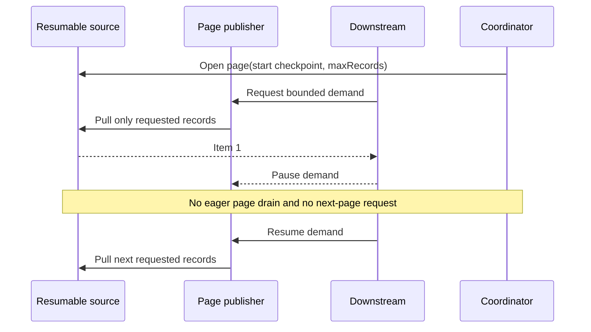
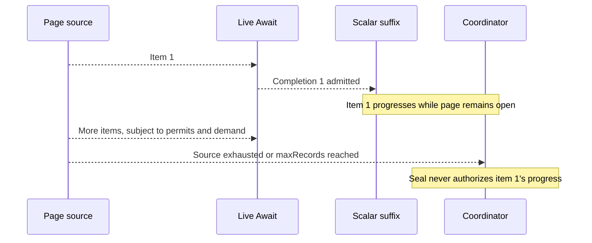
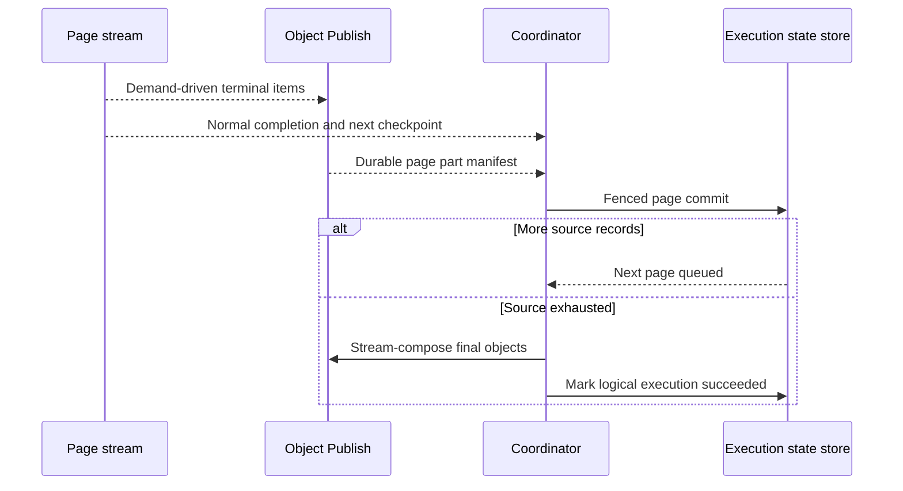
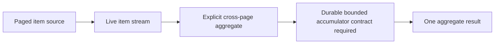

# ADR-0064: Paged resumable sources preserve live item demand

## Context

A finite source can be demand-driven and still keep one queue-async transition, remote worker request, and retry attempt alive for the entire source. Backpressure bounds live pressure; it does not bound the source work repeated after confirmed owner loss. Itemized Await also showed that an aggregate `dispatchComplete` gate can block healthy per-item progress. A page must not recreate that gate.

## Decision

An opt-in page is both a bounded **source slice** and one coordinator-owned **transition slice** of the same logical execution. One page is active per execution. `paging.maxRecords` on the first source-producing `ONE_TO_MANY` step limits logical source records consumed, including skipped or rejected records; a CSV header is outside that count. This limits replay work, not wall-clock time or the memory of an unusually large individual record. Existing step backpressure and Await admission bound in-page demand independently of the page limit.

The source provider owns an immutable or versioned source snapshot and interprets a release-pinned opaque checkpoint. Opening a page supplies the pinned snapshot, optional start checkpoint, and positive record limit. It returns a demand-aware publisher and, only after normal publisher completion and resource release, the consumed-record count, next opaque checkpoint, and exhaustion signal. Cancellation or failure cannot produce an advancing checkpoint. An empty non-exhausted page must advance its checkpoint; an unchanged checkpoint is a contract error. Core never interprets provider cursor bytes.

Items flow into the ordinary pipeline and live Await as they are demanded. Source page seal is not an item continuation condition. The next page becomes eligible only after the current page's source publisher terminates normally, its downstream stream reaches its normal durable terminal boundary, and page output parts are durably staged. The coordinator then fences one page commit by execution version and transition identity, records the next start checkpoint, and queues the successor page. Final exhaustion leads to final output composition and logical execution success. Page commit may gate *next-page* work but cannot gate an item already admitted to the current live stream.

The execution state store is the sole authority for current page identity and start checkpoint. An immutable control-plane fact records each page attempt, commit, and exhaustion for audit and telemetry; it is not a second page scheduler. Retry after **confirmed** owner loss restarts the active page from its start checkpoint. Completed pages are not reread. Page identity and item position participate in lineage, Await, Command, and publication identities, so a page retry reproduces the same logical identities and distinct pages do not collide. Existing effect idempotency and remote `REMOTE_OUTCOME_UNKNOWN` reconciliation still apply; paging grants neither exactly-once effects nor automatic retry of an ambiguous remote attempt.

For the first release, paged execution requires a resumable first source and a streaming terminal consumer. Cross-page `MANY_TO_ONE` aggregation and `MATERIALIZED_MULTI` results fail build validation. An explicitly authored aggregate remains a separate semantic concern and needs an independently defined durable bounded accumulator before cross-page support can be claimed. Object Publish stages attempt-safe page fragments and streams them, in page order, into one final object per group after exhaustion. A page boundary does not require a page `List`, child execution per item, sibling scan, or aggregate parent release.

## Demand and lifecycle sequences

### Slow downstream demand



### Live Await and early suffix progress



### Page advance and final exhaustion



### Confirmed worker loss and duplicate invocation

```mermaid
sequenceDiagram
  participant W as Worker
  participant E as Execution state store
  participant C as Coordinator
  W-->>E: Partial current-page work; no page commit
  Note over W: Confirmed owner loss
  C->>E: Reclaim current page start checkpoint
  C->>W: Retry same page identity
  W-->>C: Same item identities and page completion
  C->>E: Commit with expected version and transition key
  C->>E: Duplicate commit attempt
  E-->>C: Already committed; no second advance
```

### Explicit authored aggregate



The first release rejects that aggregate at build time. Paging itself never silently supplies the accumulator or turns pages into batches.

## Rationale

The existing pipeline runner already owns item demand, Await admission, and downstream propagation. The queue-async coordinator already owns durable transition identity, fencing, retries, and result authority. Extending those owners avoids a second stream runtime and keeps page checkpoints out of business functions. Source-specific parsing and cursor validation remain with providers. Page output staging is needed because the current Object Publish session closes a final object per transition and would otherwise replace earlier page output.

## Consequences

- A configured record limit bounds source replay after confirmed loss to the active page, while slow providers and large individual records can still prolong a remote request. ADR-0014 remains in force.
- Ordinary non-resumable sources continue without paging. A missing paged capability, mutable or mismatched pinned snapshot, unsupported terminal sink, or cross-page aggregate fails closed.
- Durable Await fallback remains available; the current page cannot advance until its normal durable terminal boundary is reached. Already-admitted live items never wait for page seal.
- Source progress, item progress, Await state, page seal, and optional future StreamRegion recovery remain separate concepts.
