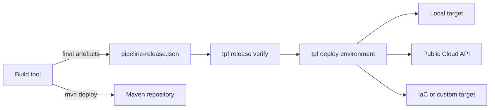

# ADR-0066: Builds Produce Releases and the TPF CLI Deploys Them

## Context

Maven has established lifecycle meanings: `package` creates artefacts, `verify` checks them, `install` stores them
locally, and `deploy` publishes them to an artefact repository. TPF also needs a portable way to verify and deploy an
already-produced Release to local, customer-managed, and service-managed targets without making Maven the deployment
control plane.

The Release Descriptor established by ADR-0064 is already the complete immutable deployment input. Reconstructing
release contents from a Maven project, or introducing a target-specific manifest, would create a second authority.

## Decision

Build integrations produce `pipeline-release.json` after final artefact bytes exist. The Maven integration remains
bound to `verify`; standard `mvn deploy` retains its normal meaning and publishes Maven artefacts. The descriptor is
preserved as an explicit CI artefact rather than being attached to Maven publication by default.

Framework-neutral Release production lives in `pipelineframework-release-producer`. The Maven Mojo is an adapter for
Maven parameters and project layout. Future build integrations use the same producer rather than recreating Release
semantics.

The standalone public `tpf` CLI consumes an existing descriptor. `tpf release verify` resolves and verifies its
complete closure. `tpf deploy <environment>` performs that verification before selecting a Deployment Target. Neither
command builds artefacts or rewrites the descriptor.

Resolver profiles, credentials, endpoints, readiness checks, and target policy live in deployment configuration.
Promotion means deploying identical descriptor bytes to another named environment. The public Cloud target is only a
client of the documented Cloud API; the private TPF Cloud implementation retains its own domain, provisioning, and
Coordinator responsibilities.

## Rationale

This boundary keeps normal build-tool behaviour unsurprising, makes deployment usable from any CI system, and gives
future Gradle and IaC integrations the same Release and resolver contracts. A target receives verified immutable
inputs without learning Maven module layout or compiler output conventions.

## Consequences

- Maven has no TPF environment, credential, or deployment-target model.
- There is no `tpf:deploy` Maven goal and no repurposing of Maven's `deploy` phase.
- The CLI and reusable Java libraries are published from `pipelineframework-cli` and participate in the public
  Compatibility Set.
- Local and remote targets report stages they do not perform as `NOT_REQUESTED` or `EXTERNALLY_MANAGED`; they cannot
  report externally owned work as completed.
- TPF Cloud remains a separate private service. Only its public machine API contract and the thin OSS client cross
  the repository boundary.
- Terraform, OpenTofu, Pulumi, and custom CI remain parallel consumers of the same descriptor and environment inputs.
