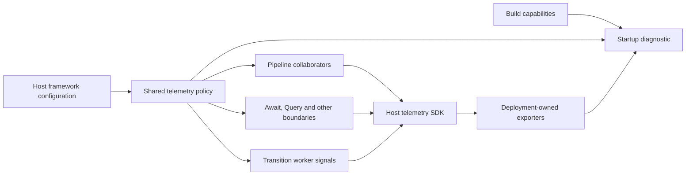

# ADR-0067: Framework telemetry shares policy and host lifecycle

## Context

Runtime telemetry was decomposed into lifecycle, metrics, tracing, replay and retry
collaborators, but boundary emitters could still initialise independently. In a split
layout, enabled pipeline instrumentation could coexist with disabled worker SDKs or
metrics omitted at augmentation.

## Decision

Every managed framework emitter consumes the host's immutable `TelemetryPolicySource`.
`ConfiguredTelemetryPolicy` resolves that policy independently of execution composition.
Metrics and tracing acquire the shared host SDK only when their framework policy enables
them. Await, pages, Query, object boundaries, transport diagnostics and transition workers
use the same policy. `PipelineTelemetry` remains a compatibility façade; the runtime
composition delegates coherent concerns to focused collaborators.

Each host owns activity counters and observable instrument registrations. Registrations
close at host shutdown without closing the platform-owned SDK. Unmanaged compatibility
entry points retain their existing fallback behaviour.

Build-produced `TelemetryCapabilities` describe the actual Quarkus signal configuration.
Startup diagnostics report framework intent, capability, SDK disablement and exporter
routing separately. A requested but unavailable signal produces a warning and startup
continues. Exporter selection, endpoint configuration and delivery health remain deployment
responsibilities; diagnostics never claim successful export.

Replay retains its tracing, per-item, topology and file-exporter prerequisites. Retry
amplification safety retains its independent execution policy. Execution, interaction and
correlation identifiers remain in traces and replay rather than metric labels.

## Consequences

- Framework switches behave consistently at every managed boundary in each process.
- Split layouts require equivalent signal capabilities and intended policies in all hosts.
- Export proof must inspect backend data, including worker signals and asynchronous origin
  continuity; configuration alone is insufficient.
- Existing metric names, dimensions, replay facts and runtime failure semantics remain stable.

This refines [ADR-0011](./0011-runtime-deployment-configuration-and-telemetry.md) and preserves
[ADR-0008](./0008-separate-state-and-replay-authorities.md).
