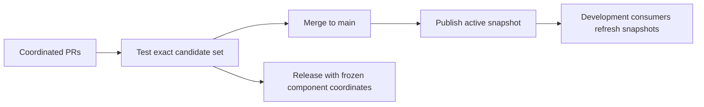

# ADR-0068: Main consumes active snapshots; tests and releases freeze inputs

## Context

Repository extraction introduced independent Maven version properties. Keeping stable or obsolete snapshot
defaults in development consumers prevented contracts, compiler and runtime changes from moving together, even
after the current upstream snapshots had been published. Maven resolves coordinates, not Git branch heads.

## Decision

Development branches consume the active TPF snapshot line, currently `26.10.1-SNAPSHOT`. This applies to the
coordination BOM, framework components, ecosystem packages, examples, reference systems and applications.
Applications select a product BOM rather than independently choosing every framework component version.
Existing component properties remain available for explicit compatibility-test overrides.

Maven producers publish snapshots after pushes to `main`, retaining manual publication for recovery.
Nightly full-train testing remains enabled independently; snapshot publication is not scheduled nightly.
Repository-local Maven configuration uses `-U` to refresh snapshot metadata. `LATEST`, `RELEASE` and version
ranges are not Git-main selectors and are not used for this purpose.

## Consequences

- Snapshot publication is asynchronous and may fail. During publication, consumers can observe a mixed set;
  merge-triggered publication reduces this interval but does not eliminate it. Check publisher results before
  assuming downstream builds use the new code. Manual publication provides a recovery path.
- Owner tests and the full train detect incompatibility; snapshot resolution itself is not proof of compatibility.
- ADR-0062's immutable compatibility-test overlays and baseline provenance remain unchanged. Refreshing Maven
  metadata does not change an explicitly selected immutable candidate version.
- Stable releases freeze compatible coordinates. Pipeline releases, external Connector contract identities and
  authored artifact pins retain their own semantics; this decision does not make them float.
- This refines ADR-0063's published-contract ownership model without undoing repository boundaries.
