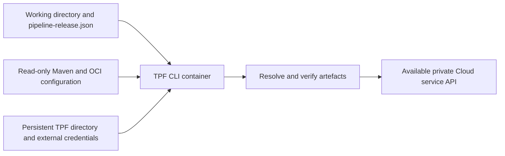

# Install the TPF CLI

The initial supported distribution is the Java 21 CLI container at
`ghcr.io/the-pipeline-framework/tpf`. Docker or Podman supplies the runtime; the host does not need Java or Maven to
verify or register a Release. The first image targets `linux/amd64`; other architectures need container-engine
emulation. Use the publication workflow's successful anonymous-pull result to confirm availability.



## Pull and run

For an initial development check, use the trusted `main` build:

```sh
docker pull ghcr.io/the-pipeline-framework/tpf:main
docker run --rm ghcr.io/the-pipeline-framework/tpf:main --version

podman pull ghcr.io/the-pipeline-framework/tpf:main
podman run --rm ghcr.io/the-pipeline-framework/tpf:main --help
```

Released builds have a `<version>` tag. Every build also has `sha-<full commit>` and
`<Maven version>-sha-<full commit>` tags. The `main` tag moves. For reproducible CI, copy the digest reference from the
successful publication summary or `container-publication.json` artefact, then set:

```sh
export TPF_IMAGE='ghcr.io/the-pipeline-framework/tpf@sha256:<reported 64-character digest>'
docker pull "$TPF_IMAGE"
```

Replace the digest placeholder before running. A commit tag identifies source; rebuilding can still change the base
image or snapshot dependencies. The reported digest pins the actual CLI image bytes and is separate from every
application artefact digest in `pipeline-release.json`.

## Install a shell wrapper

Save this as `tpf` in a directory on your `PATH`, then make it executable with `chmod +x tpf`. It mounts the current
directory read-write, a persistent TPF directory, and two resolver configuration files read-only. Paths supplied in
the shell variables are absolute host paths.

```sh
#!/bin/sh
set -eu
: "${TPF_IMAGE:?Set TPF_IMAGE to a version tag or reported digest}"
: "${TPF_MAVEN_SETTINGS:?Set TPF_MAVEN_SETTINGS to a readable settings.xml}"
: "${TPF_OCI_CONFIG:?Set TPF_OCI_CONFIG to a readable Docker config.json}"
engine=${TPF_CONTAINER_ENGINE:-docker}
credentials=${TPF_CREDENTIAL_DIR:-"$HOME/.tpf"}
mkdir -p "$credentials"
test -f "$TPF_MAVEN_SETTINGS"
test -f "$TPF_OCI_CONFIG"
set -- run --rm --init --user "$(id -u):$(id -g)" \
  --mount "type=bind,src=$PWD,dst=/work" \
  --mount "type=bind,src=$credentials,dst=/home/tpf/.tpf" \
  --mount "type=bind,src=$TPF_MAVEN_SETTINGS,dst=/home/tpf/.m2/settings.xml,readonly" \
  --mount "type=bind,src=$TPF_OCI_CONFIG,dst=/home/tpf/.docker/config.json,readonly" \
  "$TPF_IMAGE" "$@"
if [ -n "${TPF_CLOUD_CREDENTIAL_ENV:-}" ]; then
  case "$TPF_CLOUD_CREDENTIAL_ENV" in
    TPF_CREDENTIAL_*) ;;
    *) echo 'TPF_CLOUD_CREDENTIAL_ENV must name a TPF_CREDENTIAL_* variable' >&2; exit 2 ;;
  esac
  shift
  set -- run --env "$TPF_CLOUD_CREDENTIAL_ENV" "$@"
fi
if [ "$(basename "$engine")" = podman ] && [ "$("$engine" info --format '{{.Host.Security.Rootless}}')" = true ]; then
  shift
  set -- run --userns keep-id "$@"
fi
exec "$engine" "$@"
```

The same wrapper is maintained in the
[CLI repository](https://github.com/The-Pipeline-Framework/pipelineframework-cli/blob/main/scripts/tpf-container).
Select Podman with `export TPF_CONTAINER_ENGINE=podman`. The wrapper selects `--userns=keep-id` for rootless Podman
so the calling user's mounted directories stay writable. SELinux hosts must apply their approved bind-mount labelling
policy. No container socket is required by the CLI.

Prepare configuration explicitly, including empty files when no private resolver is needed:

```sh
mkdir -p "$HOME/.config/tpf" "$HOME/.tpf"
printf '<settings/>\n' > "$HOME/.config/tpf/settings.xml"
printf '{"auths":{}}\n' > "$HOME/.config/tpf/oci-config.json"
chmod 600 "$HOME/.config/tpf/"*
export TPF_MAVEN_SETTINGS="$HOME/.config/tpf/settings.xml"
export TPF_OCI_CONFIG="$HOME/.config/tpf/oci-config.json"
export TPF_CREDENTIAL_DIR="$HOME/.tpf"
```

Use dedicated resolver files for private repositories. The initial Maven reader supports repository profiles, active
profiles, servers and a local repository path; do not assume all Maven settings features are supported. Supply resolved
server credentials in the protected settings file: environment interpolation, encrypted Maven passwords and host
credential tools do not become available merely because the file is mounted.

For OCI, Docker `auths` entries work in the image. A host `credsStore` or `credHelpers` entry requires its helper
executable and backing store inside the container; host helpers are not bundled. Prefer explicit registry credential
references backed by selected `TPF_CREDENTIAL_*` variables, or a dedicated protected `auths` file. Never put secrets in
the Release Descriptor.

## Configure container paths

The current host directory appears as `/work`; Java's user home is `/home/tpf`. Deployment configuration must use
paths visible inside the container:

```yaml
resolverProfiles:
  default:
    maven:
      settings: /home/tpf/.m2/settings.xml
      localRepository: /home/tpf/.tpf/maven
    oci:
      credentials: docker-config
environments: {}
```

Save this as `tpf-deploy.yaml` in the working directory. The persistent directory stores the resolver cache in this
example. Deployment credentials are resolved from selected environment variables; the initial CLI does not implement
a login command or automatically read a credential file from this directory. Verification output is written beneath
`/work/.tpf/verification`.

An absolute `file:` URI is resolved in the container's filesystem. A host URI such as
`file:///Users/alex/payments/target/app.jar` does not become `file:///work/target/app.jar` automatically. For a local
descriptor, add a read-only mount at the **same absolute path** recorded in the URI, for example
`--mount "type=bind,src=$PWD,dst=$PWD,readonly"` when the file is beneath the current directory. Preserve descriptor
bytes. Promotable releases use immutable `maven:` or digest-qualified `oci:` references instead.

The initial `local-process` target starts children inside the CLI container. A `--rm` invocation ends that container
when the CLI exits, so it cannot keep a local application running afterwards. Use this wrapper for verification and
Cloud registration; a durable local-container Deployment Target is a separate capability.

## Local author use

After configuring the [Release producer](./release-descriptors), build a local descriptor on the host:

```sh
./mvnw verify -Dtpf.release.version=local-1 -Dtpf.release.allowLocalUris=true \
  -Dmaven.repo.local="$PWD/.m2/repository"
```

Add the same-path mount described above to the wrapper for its host `file:` URI, then verify:

```sh
tpf release verify --release target/pipeline-release.json
```

For Maven publication, human Cloud deployment and CI Cloud deployment, follow
[Verify and Deploy a Release](./deployment-cli). Those examples use the same unchanged descriptor and keep repository
publication separate from target selection.

## Distribution verification

The CLI publication workflow tests Java 21 first, builds a non-root image, and publishes only from trusted `main` or
release code using repository `GITHUB_TOKEN` with package-write permission. A package administrator must make the GHCR
package public on first publication; the workflow fails until an anonymous pull succeeds.
[GitHub documents these publication and visibility rules](https://docs.github.com/en/packages/working-with-a-github-packages-registry/working-with-the-container-registry).

After publication, the workflow pulls the reported digest anonymously and tests verification and deployment inside it.
Each working directory begins with only `pipeline-release.json`; resolver and deployment configuration is mounted
externally and caches begin empty. Controlled authenticated Maven, OCI and Cloud API fixtures check resolution,
digests, JSON output, authentication failure and exact-byte Cloud registration. This proves the installed client
contract, not availability of the private Cloud service.

Native executables and JReleaser downloads are not currently supported installations. They follow a passing native
conformance build covering JSON, Maven Resolver, OCI and authentication using this plain-Java CLI's own
[Native Build Tools](https://graalvm.github.io/native-build-tools/latest/maven-plugin)/Mandrel configuration and
reachability checks. Quarkus container-native CI is useful prior art;
[JReleaser packaging](https://jreleaser.org/guide/latest/reference/distributions.html) follows that evidence.
