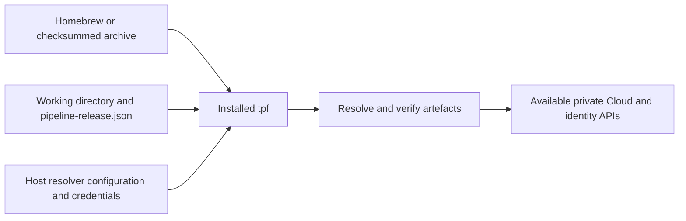

# Install the TPF CLI

Native releases provide `tpf` for macOS Apple Silicon and Linux x64/ARM64 without requiring Java, Maven or Docker.
Check [CLI downloads](https://github.com/The-Pipeline-Framework/pipelineframework-cli/releases) for an available build.
Choose a stable release for regular use or a nightly snapshot to try changes on main. The container is a secondary option.

## Stable and nightly downloads

| Channel | Download | Updates | Installation |
| --- | --- | --- | --- |
| Stable | A version release, such as `v26.10.1` | When a stable version is released; published version assets stay fixed | Homebrew or checksummed ZIP |
| Nightly snapshot | The [`latest` prerelease](https://github.com/The-Pipeline-Framework/pipelineframework-cli/releases/tag/latest), with a version such as `26.10.1-SNAPSHOT` | Each successful nightly build of main; manual publication is also possible | Checksummed ZIP |

The nightly build starts daily at **20:47 UTC**, alongside the separate Maven snapshot publication. Downloads update
only after build, compatibility and candidate installation checks pass. If those checks fail, the previous snapshot
remains available.
Merging a CLI PR validates its changes but does not immediately publish a native snapshot. The next successful nightly
build includes the changes on main.

The name `latest` identifies the development snapshot channel. It does not replace a stable version release or update
the stable Homebrew formula. Check the prerelease's version and source commit before installing; if no native assets
are available yet, use the container alternative below.



## Homebrew

On a supported macOS or Linux host with Homebrew installed:

```sh
brew install The-Pipeline-Framework/tap/tpf
tpf --version
tpf --help
tpf release verify --help
```

Upgrade with `brew upgrade tpf`. Native releases support macOS ARM64 and Ubuntu 24.04 x64/ARM64 or a compatible
glibc-based system. Intel macOS, Windows and Alpine are not supported native targets. The native executable needs
no Java runtime; application JARs launched by the local-process target still need their own Java runtime.

## Download an archive

Open the chosen [stable release or nightly prerelease](https://github.com/The-Pipeline-Framework/pipelineframework-cli/releases)
and copy the version from its native ZIP filename, including `-SNAPSHOT` when present. Select your platform:

| Host | `TPF_PLATFORM` |
| --- | --- |
| macOS Apple Silicon | `osx-aarch_64` |
| Linux x64 | `linux-x86_64` |
| Linux ARM64 | `linux-aarch_64` |

The same commands install either channel. The version suffix selects the download location automatically:

```sh
TPF_VERSION='<exact published version, including -SNAPSHOT if present>'
TPF_PLATFORM=osx-aarch_64
case "$TPF_VERSION" in
  *-SNAPSHOT) TPF_TAG=latest ;;
  *) TPF_TAG="v$TPF_VERSION" ;;
esac
TPF_ARCHIVE="tpf-$TPF_VERSION-$TPF_PLATFORM.zip"
TPF_RELEASE="https://github.com/The-Pipeline-Framework/pipelineframework-cli/releases/download/$TPF_TAG"
curl -fLO "$TPF_RELEASE/$TPF_ARCHIVE"
curl -fLO "$TPF_RELEASE/$TPF_ARCHIVE.sha256"
curl -fLO "$TPF_RELEASE/tpf-$TPF_VERSION-$TPF_PLATFORM.json"
case "$(uname -s)" in
  Darwin) shasum -a 256 -c "$TPF_ARCHIVE.sha256" ;;
  Linux) sha256sum -c "$TPF_ARCHIVE.sha256" ;;
  *) echo 'Unsupported native host' >&2; exit 1 ;;
esac
unzip "$TPF_ARCHIVE"
mkdir -p "$HOME/.local/bin"
install -m 0755 "tpf-$TPF_VERSION-$TPF_PLATFORM/bin/tpf" "$HOME/.local/bin/tpf"
export PATH="$HOME/.local/bin:$PATH"
tpf --version
```

The ZIP contains `LICENSE`, an installation README and `bin/tpf` beneath its named root directory.
Add `$HOME/.local/bin` to your shell's persistent `PATH` for later sessions. To upgrade an archive installation,
repeat these steps with the desired download; this replaces your installed executable. Snapshot executables report
their full `-SNAPSHOT` version.

For repeatable CI, preserve the archive, checksum and JSON metadata, which records the source commit and toolchain.
Pin the expected checksum independently. The moving `latest` URL can return different bytes even when the snapshot
version string stays the same; the version alone does not pin a snapshot installation.

macOS archives are initially unsigned and unnotarised. Prefer Homebrew for stable releases. For a verified direct
download, if Gatekeeper blocks execution, approve that executable in System Settings → Privacy & Security; do not
disable Gatekeeper globally.

## Use the application directory

```sh
cd /path/to/payments
tpf release verify
```

The installed CLI reads `pipeline-release.json` or `target/pipeline-release.json` relative to your current directory.
Use `--release` when both exist. It does not build the application: produce the descriptor with
[the Maven Release producer](./release-descriptors), or obtain the preserved descriptor from CI.
Host `file:` paths work directly. Resolver settings, Docker credential helpers and deployment configuration also use
host paths. No folder mounts are involved. Cache writes use the configured Maven repository or `$HOME/.m2/repository`.
Human credentials default to `$HOME/.tpf/credentials`, kept separate from the application workspace.

For [human Cloud deployment and CI Cloud deployment](./deployment-cli), configure the existing private Cloud and
identity APIs. Human users run `tpf auth login` explicitly; `deploy` remains non-interactive.

## Container alternative

The public image is `ghcr.io/the-pipeline-framework/tpf`, with a Java 25 runtime and non-root default user.
It currently targets Linux AMD64; ARM hosts need emulation. Docker's short image name `tpf` does not name the GHCR
image. Always use the full name, or explicitly create a local image tag.

A container has its own filesystem. Mounting the working directory lets it read your descriptor and write verification
results; separate mounts provide a persistent cache and credentials, with resolver configuration read-only.
Use the following wrapper only when choosing the container installation.

### Pull and run

For an initial development check, use the trusted `main` build:

```sh
docker pull ghcr.io/the-pipeline-framework/tpf:main
docker run --rm ghcr.io/the-pipeline-framework/tpf:main --version

podman pull ghcr.io/the-pipeline-framework/tpf:main
podman run --rm ghcr.io/the-pipeline-framework/tpf:main --help
```

Released builds have a `<version>` tag. Every build also has `sha-<full commit>` and
`<Maven version>-sha-<full commit>` tags. The `main` tag moves. For reproducible CI, copy the digest reference from the
successful publication summary or `container-publication.json` artefact, then set:

```sh
export TPF_IMAGE='ghcr.io/the-pipeline-framework/tpf@sha256:<reported 64-character digest>'
docker pull "$TPF_IMAGE"
```

Replace the digest placeholder before running. A commit tag identifies source; rebuilding can still change the base
image or snapshot dependencies. The reported digest pins the actual CLI image bytes and is separate from every
application artefact digest in `pipeline-release.json`.

### Install a shell wrapper

Save this as `tpf` in a directory on your `PATH`, then make it executable with `chmod +x tpf`. It mounts the current
directory read-write, a persistent TPF directory, and two resolver configuration files read-only. Paths supplied in
the shell variables are absolute host paths.

```sh
#!/bin/sh
set -eu
: "${TPF_IMAGE:?Set TPF_IMAGE to a version tag or reported digest}"
: "${TPF_MAVEN_SETTINGS:?Set TPF_MAVEN_SETTINGS to a readable settings.xml}"
: "${TPF_OCI_CONFIG:?Set TPF_OCI_CONFIG to a readable Docker config.json}"
engine=${TPF_CONTAINER_ENGINE:-docker}
credentials=${TPF_CREDENTIAL_DIR:-"$HOME/.tpf"}
mkdir -p "$credentials/maven"
test -f "$TPF_MAVEN_SETTINGS"
test -f "$TPF_OCI_CONFIG"
set -- run --rm --init --user "$(id -u):$(id -g)" \
  --mount "type=bind,src=$PWD,dst=/work" \
  --mount "type=bind,src=$credentials,dst=/home/tpf/.tpf" \
  --mount "type=bind,src=$credentials/maven,dst=/home/tpf/.m2/repository" \
  --mount "type=bind,src=$TPF_MAVEN_SETTINGS,dst=/home/tpf/.m2/settings.xml,readonly" \
  --mount "type=bind,src=$TPF_OCI_CONFIG,dst=/home/tpf/.docker/config.json,readonly" \
  "$TPF_IMAGE" "$@"
if [ -n "${TPF_CLOUD_CREDENTIAL_ENV:-}" ]; then
  case "$TPF_CLOUD_CREDENTIAL_ENV" in
    TPF_CREDENTIAL_*) ;;
    *) echo 'TPF_CLOUD_CREDENTIAL_ENV must name a TPF_CREDENTIAL_* variable' >&2; exit 2 ;;
  esac
  shift
  set -- run --env "$TPF_CLOUD_CREDENTIAL_ENV" "$@"
fi
if [ "$(basename "$engine")" = podman ] && [ "$("$engine" info --format '{{.Host.Security.Rootless}}')" = true ]; then
  shift
  set -- run --userns keep-id "$@"
fi
exec "$engine" "$@"
```

The same wrapper is maintained in the
[CLI repository](https://github.com/The-Pipeline-Framework/pipelineframework-cli/blob/main/scripts/tpf-container).
Select Podman with `export TPF_CONTAINER_ENGINE=podman`. The wrapper selects `--userns=keep-id` for rootless Podman
so the calling user's mounted directories stay writable. SELinux hosts must apply their approved bind-mount labelling
policy. No container socket is required by the CLI.

Prepare configuration explicitly, including empty files when no private resolver is needed:

```sh
mkdir -p "$HOME/.config/tpf" "$HOME/.tpf"
printf '<settings/>\n' > "$HOME/.config/tpf/settings.xml"
printf '{"auths":{}}\n' > "$HOME/.config/tpf/oci-config.json"
chmod 600 "$HOME/.config/tpf/"*
export TPF_MAVEN_SETTINGS="$HOME/.config/tpf/settings.xml"
export TPF_OCI_CONFIG="$HOME/.config/tpf/oci-config.json"
export TPF_CREDENTIAL_DIR="$HOME/.tpf"
```

Use dedicated resolver files for private repositories. The initial Maven reader supports repository profiles, active
profiles, servers and a local repository path; do not assume all Maven settings features are supported. Supply resolved
server credentials in the protected settings file: environment interpolation, encrypted Maven passwords and host
credential tools do not become available merely because the file is mounted.

For OCI, Docker `auths` entries work in the image. A host `credsStore` or `credHelpers` entry requires its helper
executable and backing store inside the container; host helpers are not bundled. Prefer explicit registry credential
references backed by selected `TPF_CREDENTIAL_*` variables, or a dedicated protected `auths` file. Never put secrets in
the Release Descriptor.

### Configure container paths

The current host directory appears as `/work`; Java's user home is `/home/tpf`. Deployment configuration must use
paths visible inside the container:

```yaml
resolverProfiles:
  default:
    maven:
      settings: /home/tpf/.m2/settings.xml
      localRepository: /home/tpf/.tpf/maven
    oci:
      credentials: docker-config
environments: {}
```

Save this as `tpf-deploy.yaml` in the working directory. The persistent directory stores the resolver cache in this
example and is also mounted at Maven Resolver's default `/home/tpf/.m2/repository` path, so configuration that omits
`localRepository` stays writable. For human Cloud login, mount a dedicated credential directory at a persistent container path and set
`TPF_CREDENTIAL_DIRECTORY` to that path on every auth/deploy invocation. When using the wrapper, also export
`TPF_CLOUD_CREDENTIAL_ENV=TPF_CREDENTIAL_DIRECTORY` on every auth/deploy invocation so it forwards that selected
container path. CI uses injected service credentials. Verification output is written beneath
`/work/.tpf/verification`.

An absolute `file:` URI is resolved in the container's filesystem. A host URI such as
`file:///Users/alex/payments/target/app.jar` does not become `file:///work/target/app.jar` automatically. For a local
descriptor, add a read-only mount at the **same absolute path** recorded in the URI, for example
`--mount "type=bind,src=$PWD,dst=$PWD,readonly"` when the file is beneath the current directory. Preserve descriptor
bytes. Promotable releases use immutable `maven:` or digest-qualified `oci:` references instead.

The initial `local-process` target starts children inside the CLI container. A `--rm` invocation ends that container
when the CLI exits, so it cannot keep a local application running afterwards. Use this wrapper for verification and
Cloud registration; a durable local-container Deployment Target is a separate capability.

### Local author use

After configuring the [Release producer](./release-descriptors), build a local descriptor on the host:

```sh
./mvnw verify -Dtpf.release.skip=false -Dtpf.release.version=local-1 -Dtpf.release.allowLocalUris=true \
  -Dmaven.repo.local="$PWD/.m2/repository"
```

Add the same-path mount described above to the wrapper for its host `file:` URI, then verify:

```sh
tpf release verify --release target/pipeline-release.json
```

For Maven publication, human Cloud deployment and CI Cloud deployment, follow
[Verify and Deploy a Release](./deployment-cli). Those examples use the same unchanged descriptor and keep repository
publication separate from target selection.

### Distribution verification

The CLI publication workflow tests Java 25 first, builds a non-root image, and publishes only from trusted `main` or
release code using repository `GITHUB_TOKEN` with package-write permission. A package administrator must make the GHCR
package public on first publication; the workflow fails until an anonymous pull succeeds.
[GitHub documents these publication and visibility rules](https://docs.github.com/en/packages/working-with-a-github-packages-registry/working-with-the-container-registry).

After publication, the workflow pulls the reported digest anonymously and tests verification and deployment inside it.
Each working directory begins with only `pipeline-release.json`; resolver and deployment configuration is mounted
externally and caches begin empty. Controlled authenticated Maven, OCI and Cloud API fixtures check resolution,
digests, JSON output, authentication failure and exact-byte Cloud registration. This proves the installed client
contract, not availability of the private Cloud service.
