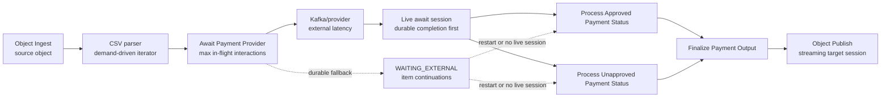
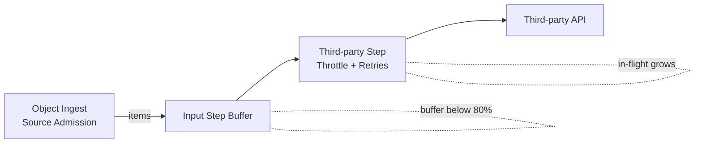

# Concurrency and Backpressure Sizing

Concurrency and backpressure settings are the two levers that determine how well the pipeline can keep doing useful
work while waiting for I/O.

### How to size `pipeline.max-concurrency`

`pipeline.max-concurrency` limits live work admitted by a step or live connector segment. For platform-owned compute and I/O work, it is a density control: more permitted in-flight work can use available platform capacity more efficiently, subject to memory, downstream demand, and the work's own saturation point.

For a `ONE_TO_ONE` await that depends on a third-party provider, the same setting has a more specific meaning. It bounds unresolved provider interactions. The provider, rather than TPF, performs the long-running work, so increasing this value cannot make the pipeline complete faster than the provider can accept and complete work. Size it from the provider's sustainable concurrency, latency, and contractual limits—not from the CPU available to the await service.

Kafka and SQS live awaits use the value as the local pending-interaction window: the source can dispatch up to that many unresolved interactions, then advances only after a completion is durably admitted and accepted by the live await session.

With `parallelism=AUTO` or parallel execution, TPF uses bounded merge at that same limit so completed items may continue out of source order. Set `parallelism=SEQUENTIAL` when source order matters: TPF concatenates work and uses an effective window of one. Webhook and interaction-API awaits remain durable-only unless their transport adapter explicitly opts into the live-window capability.

### Durable provider admission

Durable admission is enabled by default. It makes that same value a durable pending-interaction budget for `ONE_TO_ONE` awaits in `QUEUE_ASYNC` mode. The budget is scoped to the logical pipeline, await step, and normalized provider endpoint, so it is shared across tenants and runtime replicas rather than multiplied by each worker. A full budget pauses source admission; it is framework-enforced backpressure, not a dispatch-rate limiter or a provider-side quota. Set `pipeline.await-admission.enabled=false` only for a deliberate compatibility or recovery override.

Use `pipeline.await-admission.store=dynamo` for multi-replica deployment and provision `tpf_await_admission` with `scope_key` (string) and `slot` (number) as its composite key. The in-memory store is intended for tests and single-process development. Reservations survive dispatch retries and are released only after durable completion handoff, terminal failure, timeout, cancellation, or expiry.

Observe `tpf.await.admission.pending` for reservations made by the current runtime, `tpf.await.admission.outcomes.total` for `acquired`, `reused`, `waited`, `released`, and `reconciled` outcomes, and `tpf.await.admission.wait` for admission delay. These are operational signals, not a distributed provider quota; do not add tenant, execution, interaction, or endpoint labels.

1. **Start from CPU cores and I/O profile**:
   - CPU-bound steps: set concurrency near the number of vCPUs (for example 4 cores → 4–8).
   - I/O-bound steps: you can go higher (for example 4 cores → 32–128), but validate with metrics.
2. **Watch `tpf.step.inflight`**:
   - If it stays far below the limit, the step cannot use the concurrency (increase only if you see queueing).
   - If it is pinned at the limit and `tpf.step.buffer.queued` is growing, you need more concurrency or a faster downstream.

### How to size `pipeline.defaults.backpressure-buffer-capacity`

1. **Size for burst absorption**:
   - Buffer capacity should cover a burst window you are willing to absorb, not the entire dataset.
2. **Estimate memory impact**:
   - `buffer capacity × average item size = memory footprint per step`.
   - Example: 4-core pod, 1 KB average item size, buffer 4,000 → ~4 MB per step (plus overhead).
3. **Use the buffer metrics**:
   - `tpf.step.buffer.queued` should spike and drain.
   - Flat, high values indicate backpressure is not propagating or downstream is too slow.

### Practical starting point (example)

For a 4-core Graviton pod running platform-owned I/O-heavy steps:
- `pipeline.max-concurrency`: start at 32–64 for I/O-heavy steps, 4–8 for CPU-heavy steps.
- `pipeline.defaults.backpressure-buffer-capacity`: start at 2,048–8,192 for bursty streams and tune downward.

Always validate in your environment using the in-flight and buffer metrics and adjust per step when needed.

### Quick rule-of-thumb table

| Workload profile | `pipeline.max-concurrency` (per step) | Buffer capacity guidance |
|------------------|---------------------------------------|--------------------------|
| CPU-bound        | 1–2 × vCPU cores                       | Small (128–1,024)        |
| Mixed            | 4–16 × vCPU cores                      | Medium (1,024–4,096)     |
| I/O-bound        | 8–32 × vCPU cores                      | Larger (2,048–8,192)     |

Tune downward if the buffer stays high or GC increases, and upward only when `tpf.step.inflight` is consistently
below the limit while `tpf.step.buffer.queued` spikes.

### Sizing a third-party await

Treat an enabled durable-admission budget as a provider-facing safety limit, not a target for keeping local CPUs busy. Start below the provider's demonstrated sustainable unresolved-work capacity, exercise slow and burst completion profiles, then increase only when provider latency, error rate, and admission waiting show spare capacity.

An await deployed as its own service normally needs modest compute: it coordinates durable interaction state, broker I/O, and source backpressure while the provider performs the substantive work. More replicas improve availability and recovery capacity, but do not multiply provider throughput because they share the durable admission budget. In a function deployment, the initiated interaction is persisted and the invocation can return while the provider works; it does not consume compute while synchronously waiting for a response.

### Durable boundaries

Backpressure propagates through live reactive segments. A brokered await can participate in that live flow while the same queue-async transition still owns a live await session: source dispatch is bounded by `pipeline.max-concurrency`, completions are recorded durably, and downstream demand decides when accepted completions move into the next step.

Durability takes over when the live session is unavailable. A request may complete later through Kafka, SQS, a webhook, a human/API completion, or a restarted worker. In that path, TPF uses await unit state, execution state, and queue admission rather than a single in-memory demand signal.

For await-heavy pipelines, size the system around two kinds of pressure:

- live segment pressure: step inflight counts, step buffers, pending live await interactions, terminal publish write latency, and source admission;
- durable boundary pressure: pending await interactions, completions waiting for durable fallback continuation, work-queue depth, provider permits, broker lag, retry rate, and DLQ events.

In connector-first CSV Payments, Object Ingest controls source-object admission, the CSV parser advances by reactive demand and the live await in-flight window, and Object Publish accepts terminal chunks through a target session. The old CSV reader demand pacer is a legacy fallback for the deprecated file-step path; it is not the main backpressure mechanism for the connector-owned path.

The repo proof run for the built-in CSV Payments replay used a `250/s` payment-provider permit setting. It processed 1k records in `15.621s` of replay time and showed the approved or unapproved status branches starting at `2.001s`, before the parser finished at `6.901s` and before the last await completion at `15.585s`. The overlap is the backpressure signal to look for: the parser, brokered await, branch-specific status steps, terminal merge, and Object Publish are moving as connected live segments, with durable fallback available for recovery.

### Retry amplification example (real-world)

When an upstream source can admit work faster than a downstream step can call a slow third-party
(avg 250 ms per item), it is easy to misconfigure concurrency and trigger retry amplification.

Observed pattern:
- Retries climb while `tpf.step.inflight` on the third-party step grows steadily (for example +1,000 every 5 minutes).
- The input step buffer utilization stays below 80%.
- Success rate oscillates around 50% as retries saturate the step.

Mitigations:
- Lower per-step concurrency on the third-party step.
- Increase retry wait/backoff to reduce retry pressure.
- Align source admission, per-step concurrency, and downstream throughput.
- Consider enabling the retry amplification guard in `log-only` mode first, then switch to `fail-fast`
  once you have stable thresholds for inflight slope and retry rate.

## Deployment

- Package services as independent deployable units
- Use containerization for consistent deployment
- Configure health checks and readiness probes
