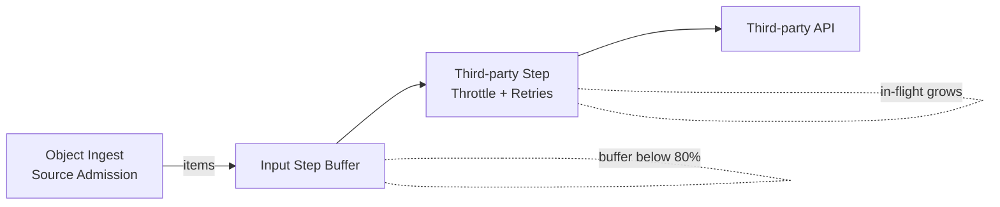

# Concurrency and Backpressure Sizing

Concurrency and backpressure settings are the two levers that determine how well the pipeline can keep doing useful
work while waiting for I/O.

## Backpressure versus circuit admission

Backpressure controls how much work can flow through a live reactive path. It is the right protection for slow consumers and bounded outstanding await interactions. Circuit admission answers a separate question: whether a TPF-managed dependency call should begin when recent health failures show that dependency is unavailable. A circuit-open rejection performs no remote I/O; for eligible shared transition-worker dispatch, its `notBefore` hint lets durable scheduling defer the encountered execution without consuming a remote-attempt retry.

These mechanisms are complementary. Backpressure does not prevent rapid connection-refused loops, and a circuit does not replace demand propagation or provider-capacity sizing. See [Execution Safety](/architecture/execution-safety) and [Operate Circuit Protection](/operate/circuit-breakers).

Paging adds a third bound for large resumable sources. `paging.maxRecords` limits logical source work owned and replayed by one transition; it does not prefetch that many records. The current page still follows normal reactive demand, Await admission, and downstream capacity. One page is active per logical source, with no concurrent next-page acquisition. The next page starts only after normal stream completion, resource release, page-output publication, and a fenced execution-state commit.

A smaller page generally reduces replay and remote-transition exposure after confirmed worker loss, at the cost of more source opens, coordinator commits, queue dispatches, and publication/checkpoint overhead. A larger page improves batching efficiency but increases the active-page replay window. Slow downstream work may still make either page exceed a worker invocation or transport deadline. Size the page from acceptable replay cost and transition lifetime, then size concurrency and buffers from provider and memory capacity. Page size does not need to equal buffer capacity or concurrency. Do not use a larger buffer to imitate a page, or a larger page to override backpressure.

### How to size `pipeline.max-concurrency`

`pipeline.max-concurrency` limits live work admitted by a step or live connector segment. For platform-owned compute and I/O work, it is a density control: more permitted in-flight work can use available platform capacity more efficiently, subject to memory, downstream demand, and the work's own saturation point.

For a `ONE_TO_ONE` await that depends on a third-party provider, the same setting has a more specific meaning. It bounds unresolved provider interactions. The provider, rather than TPF, performs the long-running work, so increasing this value cannot make the pipeline complete faster than the provider can accept and complete work. Size it from the provider's sustainable concurrency, latency, and contractual limits—not from the CPU available to the await service.

Kafka and SQS live awaits use the value as the local pending-interaction window: the source can dispatch up to that many unresolved interactions, then advances only after a completion is durably admitted and accepted by the live await session.

With `parallelism=AUTO` or parallel execution, TPF uses bounded merge at that same limit so completed items may continue out of source order. Set `parallelism=SEQUENTIAL` when source order matters: TPF concatenates work and uses an effective window of one. Webhook and interaction-API awaits remain durable-only unless their transport adapter explicitly opts into the live-window capability.

### Durable provider admission

Durable admission is enabled by default for deferred completions whose adapter exposes a provider endpoint, such as Kafka and SQS in `QUEUE_ASYNC` mode. It makes the concurrency value a durable pending-interaction budget. The budget is scoped to the logical pipeline, decorated operation, and normalised provider endpoint, so it is shared across tenants and runtime replicas rather than multiplied by each worker. A full budget pauses source admission; it is framework-enforced backpressure, not a dispatch-rate limiter or a provider-side quota. Durable-only adapters without a provider endpoint, including interaction API and webhook completion, do not acquire a reservation. Set `pipeline.await-admission.enabled=false` only for a deliberate compatibility or recovery override.

Use `pipeline.await-admission.store=dynamo` for multi-replica deployment and provision `tpf_await_admission` with `scope_key` (string) and `slot` (number) as its composite key. The in-memory store is intended for tests and single-process development. Reservations survive dispatch retries and are released only after durable completion handoff, terminal failure, timeout, cancellation, or expiry.

Observe `tpf.await.admission.pending` for reservations made by the current runtime, `tpf.await.admission.outcomes.total` for `acquired`, `reused`, `waited`, `released`, and `reconciled` outcomes, and `tpf.await.admission.wait` for admission delay. These are operational signals, not a distributed provider quota; do not add tenant, execution, interaction, or endpoint labels.

1. **Start from CPU cores and I/O profile**:
   - CPU-bound steps: set concurrency near the number of vCPUs (for example 4 cores → 4–8).
   - I/O-bound steps: you can go higher (for example 4 cores → 32–128), but validate with metrics.
2. **Watch `tpf.step.inflight`**:
   - If it stays far below the limit, the step cannot use the concurrency (increase only if you see queueing).
   - If it is pinned at the limit and `tpf.step.buffer.queued` is growing, you need more concurrency or a faster downstream.

### How to size `pipeline.defaults.backpressure-buffer-capacity`

1. **Size for burst absorption**:
   - Buffer capacity should cover a burst window you are willing to absorb, not the entire dataset.
2. **Estimate retained memory, not only payload bytes**:
   - Include deserialized payloads, transformation scratch space, SDK objects, retry state, and any `ONE_TO_MANY` expansion retained at that step.
   - A first approximation is `buffer capacity × worst-case retained bytes per queued item` for each live buffered step.
3. **Use the buffer metrics**:
   - `tpf.step.buffer.queued` should spike and drain.
   - Flat, high values indicate backpressure is not propagating or downstream is too slow.

### Size concurrency, buffers, and pages together

Use measurements from representative records rather than copying a default:

1. Reserve memory for the JVM/runtime, code, telemetry, provider clients, and safety margin. The remainder is the worker's **stream-work budget**.
2. Measure average and high-percentile retained bytes for an input item at each step, including per-item working memory. For `ONE_TO_MANY`, measure the largest live fan-out, not only the source record size.
3. Choose concurrency from CPU and dependency capacity. Estimate active memory as `concurrency × per-item working bytes` at each concurrently executing step.
4. Allocate the remaining stream-work budget across the live step buffers. Estimate queued memory as `buffer capacity × retained bytes per queued item` per buffer. Sum across steps; a pipeline can have several buffers live at once.
5. Choose `paging.maxRecords` no larger than both the source-fetch/batch target and the acceptable confirmed-loss replay window. Estimate replay cost from all transformations and effects reachable from those source records, including fan-out. A page of one record can still have a large replay envelope when that record expands heavily.
6. Verify that worst-case page processing fits the worker invocation or transport deadline with recovery margin. Reduce the page or use a different worker boundary when it does not.
7. Exercise burst, slow-provider, failure, and high-percentile item-size cases. Tune downward when memory, GC, queue time, or replay cost exceeds the budget; tune upward only when measurements show spare capacity and source/checkpoint overhead is material.

A conservative memory check for `T` concurrent transition workers is:

```text
T × (source/page state
     + sum(step buffer capacity × worst-case retained queued-item bytes)
     + sum(step concurrency × worst-case per-item working bytes)
     + open publication/provider state)
<= stream-work memory budget
```

This is an envelope, not an allocation guarantee. Account separately for provider-internal read-ahead or buffering. The built-in resumable-source path opens one page at a time and does not add concurrent-page prefetch, so there is no extra `prefetched pages × page size` term today.

For **COMPUTE**, multiply by the number of transition invocations admitted concurrently in the process or pod, and leave headroom for heap fragmentation, GC, native buffers, and co-located requests. For **FUNCTION**, the same retained-memory calculation must fit the configured function memory, while worst-case page time must fit the provider invocation limit and TPF's worker deadline. Smaller pages can reduce duration and retry cost, but increase request, checkpoint, queue, and publication operations.

Example: if a worker has 1 GiB available after runtime and safety reserves, admits four transitions, and assigns 60% of that remainder to stream work, each transition has roughly 150 MiB. Measure the pipeline's active-work and buffered-item footprint against that number, then choose the page size from the smaller of the source's efficient batch and the number of records whose repeated processing is acceptable. Do not derive page size from the buffer capacity merely because both are counts.

### Sizing a third-party await

Treat an enabled durable-admission budget as a provider-facing safety limit, not a target for keeping local CPUs busy. Start below the provider's demonstrated sustainable unresolved-work capacity, exercise slow and burst completion profiles, then increase only when provider latency, error rate, and admission waiting show spare capacity.

An await deployed as its own service normally needs modest compute: it coordinates durable interaction state, broker I/O, and source backpressure while the provider performs the substantive work. More replicas improve availability and recovery capacity, but do not multiply provider throughput because they share the durable admission budget. In a function deployment, the initiated interaction is persisted and the invocation can return while the provider works; it does not consume compute while synchronously waiting for a response.

### Durable boundaries

Backpressure propagates through live reactive segments. A brokered await can participate in that live flow while the same queue-async transition still owns a live await session: source dispatch is bounded by `pipeline.max-concurrency`, completions are recorded durably, and downstream demand decides when accepted completions move into the next step.

Durability takes over when the live session is unavailable. A request may complete later through Kafka, SQS, a webhook, a human/API completion, or a restarted worker. In that path, TPF uses await unit state, execution state, and queue admission rather than a single in-memory demand signal.

### Generated owned-payload HTTP boundaries

For `httpPayloads` on a REST/COMPUTE deployment, size Quarkus multipart temporary storage for
the largest permitted upload multiplied by expected concurrent requests. Quarkus stages each
multipart part before the generated adapter transfers it to the Object Publish target. Set
`quarkus.http.limits.max-body-size` to accommodate the declared `maxBytes` plus multipart framing;
the adapter applies its own per-boundary limit before opening a provider write. The provider
transfer uses a fixed 64 KiB buffer and waits for each write before reading the next chunk.
Storage capacity and temporary-directory cleanup therefore remain deployment concerns even
though application steps never handle the multipart body. See
[Handling File Operations](/develop/handling-file-operations) for the route and reference contract.

### Finite streaming Query boundaries

A `StreamingQueryOperation` emits a finite ordered row publisher into an ordinary ONE_TO_MANY step.
LOCAL preserves that publisher directly. Generated gRPC uses server streaming, and generated REST
uses its existing streaming response path, so row demand and cancellation remain visible through
those live transports. Spring generation still rejects non-unary shapes rather than claiming parity.

FUNCTION handlers return one materialized response. Their list sink enforces `BatchingPolicy.maxItems`
and fails overflow for `FAIL` and `BUFFER`; only an explicitly selected `DROP` policy truncates. A
finite Query may still be far too large to materialize, so choose a streaming transport or configure
and test an honest function boundary limit. Provider fetch windows never change the pipeline item
model on either path.

For await-heavy pipelines, size the system around two kinds of pressure:

- live segment pressure: step inflight counts, step buffers, pending live await interactions, terminal publish write latency, and source admission;
- durable boundary pressure: pending await interactions, completions waiting for durable fallback continuation, work-queue depth, provider permits, broker lag, retry rate, and DLQ events.

In connector-first CSV Payments, Object Ingest controls source-object admission, the CSV parser advances by reactive demand and the live await in-flight window, and Object Publish accepts terminal chunks through a target session. The old CSV reader demand pacer is a legacy fallback for the deprecated file-step path; it is not the main backpressure mechanism for the connector-owned path.

With source paging enabled, CSV Payments still submits one CSV object. OpenCSV advances in parser-valid logical records, including quoted multiline and UTF-8 fields. Each page uses the same live path shown below; Object Publish stages attempt-safe page parts and composes them in page order into one final object after source exhaustion.


```mermaid
flowchart LR
    A["Object Ingest<br/>one source object"] --> P["Coordinator<br/>open bounded page"]
    P --> B["CSV parser<br/>demand-driven logical records"]
    B --> C["Process CSV Payments Input<br/>deferred-completion budget"]
    C --> D["Kafka/provider<br/>external latency"]
    D -. "active eligible live owner<br/>in-process in the captured paging proof" .-> E["Live await session<br/>completion admitted first"]
    E --> F["Process Approved Payment Status"]
    E --> G["Process Unapproved Payment Status"]
    F --> H["Finalize Payment Output"]
    G --> H
    H --> I["Object Publish<br/>stage page parts"]
    D -. "no live session, ineligible portable shape,<br/>interaction API, or webhook" .-> J["WAITING_EXTERNAL<br/>coordinator continuation"]
    J -. "durable continuation" .-> F
    J -. "durable continuation" .-> G
    I --> M["Commit page-part manifest"]
    M --> K{"Source exhausted?"}
    K -->|no| L["Fenced page commit<br/>successor checkpoint"]
    L --> P
    K -->|yes| N["Compose ordered parts<br/>publish final object"]
    E -. "downstream capacity<br/>releases source demand" .-> B
```

The loop advances only after the current publisher has completed, released its source resources, and committed its page output. A slow Await provider or Object Publish target withholds downstream capacity, which stops parser demand inside the open page. Opening a page therefore does not drain it, and page completion does not gate an item already admitted to the live suffix. After confirmed worker loss, the durable start checkpoint reopens the active page; previously committed pages are not reread. Pure computation and idempotent effects in that active page may repeat, so page size is part of the recovery envelope as well as the fetch and batching policy.

The built-in CSV Payments replay predates paging and shows live demand and early per-item progress in one unpaged execution.
That proof run used execution max concurrency `250` and
a deterministic `0.08` provider-rejection rule. It processed 1k records in `19.685s` of replay
time and showed both status paths starting at `1.573s`, before parser emission finished at
`16.208s`. The capture records completion admission and interaction-dispatch events on the
decorated `Process CSV Payments Input` operation, with no standalone Await node and no durable
await-unit completion or resume events. That overlap is the backpressure signal to look for: the
parser, brokered completion, status steps, terminal branch join, and Object Publish are moving as
connected live segments, with durable fallback available for recovery.

### Measured page-size cost

An exploratory LOCAL monolith comparison submitted the same 1,000-record CSV as one file in
each run, with the mock provider held at 250 permits per second and replay capture disabled.
The span below runs from the first `PIPELINE BEGINS` to the last `PIPELINE FINISHED`; it measures
transition execution, while final-object row parity was checked separately.

| `paging.maxRecords` | Pages | Transition span | Change from one page |
| ---: | ---: | ---: | ---: |
| 1,000 | 1 | 8.107s | baseline |
| 100 | 10 | 8.338s | +0.231s (+2.8%) |
| 10 | 100 | 9.854s | +1.747s (+21.5%) |

Every run produced exactly 1,000 rows, one CSV header, and 1,000 database records. The
100-page run shows measurable coordinator/page overhead at small page sizes, but the absolute
increase was under two seconds in this environment. These are single runs, not a sizing SLA.

The [paired replay captures](/operate/observability/replay) test a different limit: one 1k page
at 10 provider permits per second took 100.811s of replay time, while one 10k file across ten
pages at 100 permits per second took 100.932s. Both preserve early item progress. This is the
expected provider-paced result when the provider is slower than the healthy pipeline.

### HA scale fixture budgets

The CSV Payments self-host HA reference deliberately tests two different concerns: the `slow`
profile proves bounded admission and eventual liveness under intentional provider delay, while
the `burst` profile proves scale with exact, distinct output IDs. Its three timing limits are not
interchangeable:

- `TPF_CSV_TRANSITION_TRANSPORT_DEADLINE` bounds one coordinator-to-worker REST call.
- `TPF_CSV_FIXTURE_RUN_DEADLINE_SECONDS` bounds the flow and its assertions.
- `TPF_CSV_BURST_PERFORMANCE_BUDGET_SECONDS` is an optional burst-only throughput gate, set only
  from a measured healthy HA baseline or explicit service objective.

Changing the transport deadline alone is not a scale or recovery fix. The fixture writes its
observed budget classification alongside the admission observation; its runnable configuration is
documented in the
[`csv-kafka-payments` self-host container runbook](https://github.com/The-Pipeline-Framework/csv-kafka-payments/tree/main/self-host/container).

### Retry amplification example (real-world)

When an upstream source can admit work faster than a downstream step can call a slow third-party
(avg 250 ms per item), it is easy to misconfigure concurrency and trigger retry amplification.

Observed pattern:
- Retries climb while `tpf.step.inflight` on the third-party step grows steadily (for example +1,000 every 5 minutes).
- The input step buffer utilization stays below 80%.
- Success rate oscillates around 50% as retries saturate the step.

Mitigations:
- Lower per-step concurrency on the third-party step.
- Increase retry wait/backoff to reduce retry pressure.
- Align source admission, per-step concurrency, and downstream throughput.
- Consider enabling the retry amplification guard in `log-only` mode first, then switch to `fail-fast`
  once you have stable thresholds for inflight slope and retry rate.


```mermaid
flowchart LR
    A[Object Ingest<br/>Source Admission] -->|items| B[Input Step Buffer]
    B --> C[Third-party Step<br/>Throttle + Retries]
    C --> D[Third-party API]
    C -. retry amplification .-> C
    B -. buffer below 80% .- B
    C -. in-flight grows .- C
```

## Deployment

- Package services as independent deployable units
- Use containerization for consistent deployment
- Configure health checks and readiness probes
