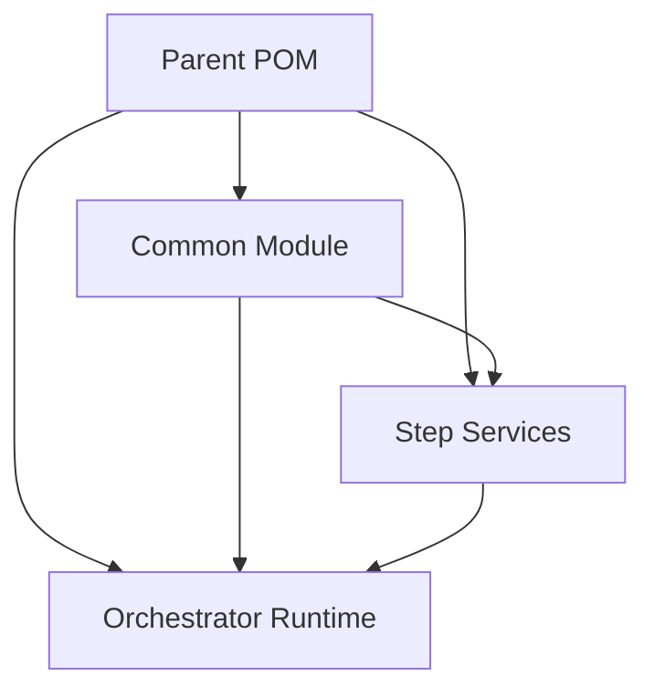

# Dependency Management

Proper dependency management is crucial for maintaining clean, modular pipeline applications.

## Quarkus platform alignment

TPF targets Java 21 and Quarkus **3.39.2**. Import the Quarkus platform BOM in
the application parent, and use the same version for the Quarkus Maven plugin and
annotation processors. Child modules should inherit that version.

```xml
<properties>
    <quarkus.platform.version>3.39.2</quarkus.platform.version>
</properties>

<dependencyManagement>
    <dependencies>
        <dependency>
            <groupId>io.quarkus.platform</groupId>
            <artifactId>quarkus-bom</artifactId>
            <version>${quarkus.platform.version}</version>
            <type>pom</type>
            <scope>import</scope>
        </dependency>
        <dependency>
            <groupId>io.quarkus.platform</groupId>
            <artifactId>quarkus-amazon-services-bom</artifactId>
            <version>${quarkus.platform.version}</version>
            <type>pom</type>
            <scope>import</scope>
        </dependency>
    </dependencies>
</dependencyManagement>
```

Include the Amazon Services BOM when using the DynamoDB, SQS, or S3 extensions.
Use the platform-aligned BOM rather than an independently versioned Quarkiverse
Amazon Services BOM. Leave gRPC, protobuf, OpenTelemetry, JUnit, and Testcontainers
dependency versions to the platform BOM; generation tools and runtime libraries
must agree. Testcontainers 2 modules use names such as
`testcontainers-junit-jupiter`, `testcontainers-localstack`, and
`testcontainers-postgresql`.

Native builds require GraalVM/Mandrel **25.0 or newer**, even when compiling the
application with Java 21. Use Quarkus's supported native builder container with
`-Dquarkus.native.enabled=true -Dquarkus.native.container-build=true`; the native
validation workflow uses this path. GraalVM for JDK 21 is no longer a supported
native builder. See the [Quarkus native-builder announcement](https://quarkus.io/blog/mandrel-25-minimum-version/).

Applications using Hibernate ORM or Hibernate Reactive with PostgreSQL require
PostgreSQL 14 or newer. TPF reference applications use PostgreSQL 17. Review schema
validation before upgrading an existing database, particularly Hibernate version
and timestamp columns and collection-set constraints.

For the upstream changes, see the Quarkus migration guides for
[3.34](https://github.com/quarkusio/quarkus/wiki/Migration-Guide-3.34),
[3.35](https://github.com/quarkusio/quarkus/wiki/Migration-Guide-3.35),
[3.36](https://github.com/quarkusio/quarkus/wiki/Migration-Guide-3.36),
[3.37](https://github.com/quarkusio/quarkus/wiki/Migration-Guide-3.37),
[3.38](https://github.com/quarkusio/quarkus/wiki/Migration-Guide-3.38), and
[3.39](https://github.com/quarkusio/quarkus/wiki/Migration-Guide-3.39).

## Parent POM

The parent POM defines common properties and manages dependencies. The pipeline framework is included as a single dependency that bundles both runtime and build-time components:

```xml
<!-- pom.xml -->
<project>
    <groupId>com.example</groupId>
    <artifactId>my-pipeline-application-parent</artifactId>
    <version>1.0.0</version>
    <packaging>pom</packaging>

    <properties>
        <maven.compiler.release>21</maven.compiler.release>
        <quarkus.platform.version>3.39.2</quarkus.platform.version>
        <tpf.version>26.5.2</tpf.version>
    </properties>

    <modules>
        <module>common</module>
        <module>step-one-svc</module>
        <module>step-two-svc</module>
        <module>orchestrator-svc</module>
    </modules>

    <dependencyManagement>
        <dependencies>
            <dependency>
                <groupId>io.quarkus.platform</groupId>
                <artifactId>quarkus-bom</artifactId>
                <version>${quarkus.platform.version}</version>
                <type>pom</type>
                <scope>import</scope>
            </dependency>
            <dependency>
                <groupId>io.quarkus.platform</groupId>
                <artifactId>quarkus-amazon-services-bom</artifactId>
                <version>${quarkus.platform.version}</version>
                <type>pom</type>
                <scope>import</scope>
            </dependency>
            <dependency>
                <groupId>com.example</groupId>
                <artifactId>common</artifactId>
                <version>${project.version}</version>
            </dependency>
            <dependency>
                <groupId>org.pipelineframework</groupId>
                <artifactId>pipelineframework</artifactId>
                <version>${tpf.version}</version>
            </dependency>
        </dependencies>
    </dependencyManagement>

    <build>
        <pluginManagement>
            <plugins>
                <plugin>
                    <groupId>io.quarkus.platform</groupId>
                    <artifactId>quarkus-maven-plugin</artifactId>
                    <version>${quarkus.platform.version}</version>
                    <extensions>true</extensions>
                </plugin>
                <plugin>
                    <groupId>org.apache.maven.plugins</groupId>
                    <artifactId>maven-compiler-plugin</artifactId>
                    <configuration>
                        <annotationProcessorPaths>
                            <path>
                                <groupId>io.quarkus</groupId>
                                <artifactId>quarkus-extension-processor</artifactId>
                                <version>${quarkus.platform.version}</version>
                            </path>
                        </annotationProcessorPaths>
                    </configuration>
                </plugin>
            </plugins>
        </pluginManagement>
    </build>
</project>
```

The `${tpf.version}` property is defined in the parent POM so every child service uses the same `org.pipelineframework:pipelineframework` version.

## Service POMs

Services declare dependencies on the common module and framework. Both runtime and deployment components are bundled in a single dependency:

```xml
<!-- step-one-svc/pom.xml -->
<project>
    <parent>
        <groupId>com.example</groupId>
        <artifactId>my-pipeline-application-parent</artifactId>
        <version>1.0.0</version>
    </parent>

    <artifactId>step-one-svc</artifactId>

    <dependencies>
        <dependency>
            <groupId>com.example</groupId>
            <artifactId>common</artifactId>
        </dependency>
        <dependency>
            <groupId>org.pipelineframework</groupId>
            <artifactId>pipelineframework</artifactId>
        </dependency>
    </dependencies>
</project>
```

## Build Warning Note

When compiling role-specific outputs in a single module (for example, orchestrator-client and pipeline-server), Maven may emit a warning like "Overwriting artifact's file". This comes from the compiler plugin updating the project's output directory per execution and does not indicate class files are being overwritten.

## Dependency Flow Diagram


