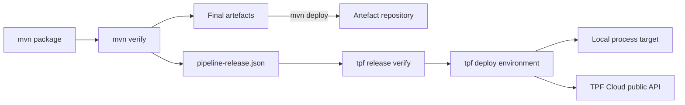

# Verify and Deploy a Release with the TPF CLI

The public `tpf` CLI starts from an existing [Pipeline Release Descriptor](./release-descriptors). It never invokes
Maven or Gradle, rebuilds an artefact, or changes Release identity.



## Build, publish, and preserve

Build the application normally. The Release plugin runs during `verify`, after packaging, so its digests describe the
final bytes:

```sh
./mvnw verify -Dtpf.release.version=2026.09.28.1
./mvnw deploy
```

`mvn deploy` publishes Maven artefacts; it does not deploy the application. Preserve the unchanged
`target/pipeline-release.json` as a separate CI artefact and pass it to later verification and deployment jobs.

## Verify from the descriptor

Run verification in a fresh directory containing the descriptor and deployment configuration:

```sh
tpf release verify --release pipeline-release.json
```

Verification loads the original bytes once, validates Release invariants, resolves every `file:`, `maven:`, or `oci:`
reference through its configured resolver, verifies every digest, recovers complete `META-INF/pipeline/**` Compiled
Truth, and checks Contract/Release consistency. It does not mutate the descriptor.

If `--release` is omitted, the CLI checks `./pipeline-release.json` and then `./target/pipeline-release.json`.
Providing both is ambiguous and fails. Use `--output json` for one machine-readable result on standard output;
diagnostics remain on standard error.

## Configure named environments

Deployment inputs live in strict `tpf-deploy.yaml`, separate from the Release:

```yaml
resolverProfiles:
  default:
    maven:
      settings: ~/.m2/settings.xml
    oci:
      credentials: docker-config

environments:
  local:
    resolverProfile: default
    target:
      type: local-process
      workspace: .tpf/deployments/local
      units:
        - artifactId: application
          readiness:
            http: http://127.0.0.1:8080/q/health/ready

  staging:
    resolverProfile: default
    target:
      type: tpf-cloud
      endpoint: https://api.example.tpf.cloud
      organization: example
      application: payments
      environment: staging
      mode: CUSTOMER_MANAGED
      credential: tpf-staging
```

Resolver profiles may point at different repository endpoints and credential sources. Secret values stay in Maven
settings, Docker credential helpers, environment variables, or workload identity systems; they do not belong in the
configuration file or Release Descriptor. Unknown keys, duplicate names, and references to unknown profiles fail.

## Deploy locally

```sh
tpf deploy local --release pipeline-release.json
```

The initial `local-process` target supports verified `jar` and `native-binary` units selected by Release
`artifactId`. JARs use the configured Java executable and native units execute directly. All artefacts and Compiled
Truth verify before any process starts. Readiness failure stops processes started by that attempt; success ends in
`ACTIVE`.

Local containers, Kubernetes, LocalStack, and Lambda emulation are separate future Deployment Target providers. A
local target is not defined as “run one JVM”.

## Register with TPF Cloud

```sh
tpf deploy staging --release pipeline-release.json
```

The OSS CLI sends the exact descriptor bytes, bearer or workload credentials, and an idempotency key to the public
TPF Cloud API. The first Cloud target registers an immutable Release and creates a `CUSTOMER_MANAGED` Deployment for
an existing Application and Environment. Its successful terminal status is `REGISTERED`; physical infrastructure,
runtime verification, and activation are reported as `NOT_REQUESTED`.

TPF Cloud itself is not part of the OSS repository. Organisation authority, Cloud domain records, provisioning, and
Coordinator association remain in that private service. The public module is a thin API client and contains none of
that private implementation.

## Promote unchanged bytes

```sh
tpf deploy staging --release pipeline-release.json
tpf deploy production --release pipeline-release.json
```

Both operations use identical descriptor bytes and therefore report the same descriptor SHA-256 and Release
identity. Environment configuration may change credentials, mirrors, accounts, and target policy, but never artefact
URIs, digests, associations, or Compiled Truth. Promotable releases must not contain `file:` references.

## CI exit classes

| Exit | Meaning |
| --- | --- |
| `0` | Target-specific successful terminal state reached. |
| `2` | Invalid command or configuration. |
| `3` | Invalid Release Descriptor or closure. |
| `4` | Artefact resolution or digest failure. |
| `5` | Authentication or authorisation failure. |
| `6` | Target deployment failure. |
| `7` | Runtime verification or activation failure. |

The first CLI is non-interactive. Terraform, OpenTofu, Pulumi, and custom CI can consume the same Release Descriptor
and environment/provider inputs directly; the CLI does not embed or execute an IaC engine.
