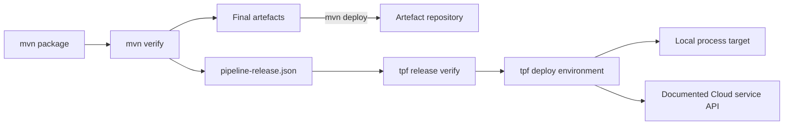

# Verify and Deploy a Release with the TPF CLI

The public `tpf` CLI starts from an existing [Pipeline Release Descriptor](./release-descriptors). It never invokes
Maven or Gradle, rebuilds an artefact, or changes Release identity.

[Install the Docker/Podman CLI wrapper](./cli-installation) before following these commands. The initial supported
distribution is the Java 21 GHCR image; native downloads and JReleaser packaging follow native conformance.



## Maven publication and the CLI hand-off

Configure [`pipelineframework-release-maven-plugin:generate-release-descriptor`](./release-descriptors#configure-the-maven-goal)
in the application POM, then build normally. The Release plugin runs during `verify`, after packaging, so its digests
describe the final bytes:

```sh
./mvnw verify -Dtpf.release.version=2026.10.02.1 -Dmaven.repo.local="$PWD/.m2/repository"
# Optional: publish the exact Maven artefacts referenced by the descriptor.
./mvnw deploy -Dtpf.release.version=2026.10.02.1 -Dmaven.repo.local="$PWD/.m2/repository"
```

`mvn deploy` publishes Maven artefacts; it does not deploy the application. It also traverses `verify`, so supply the
same Release version again and preserve the resulting descriptor. The plugin is the Release producer, not an
alternative Cloud deployment client; there is no `tpf:deploy` Maven goal or Maven deployment-target selection. Preserve
the unchanged `target/pipeline-release.json` as a separate CI artefact and pass it to later verification and deployment jobs.

## Verify from the descriptor

Run verification in a fresh directory containing the descriptor and deployment configuration:

```sh
tpf release verify --release pipeline-release.json
```

Verification loads the original bytes once, validates Release invariants, resolves every `file:`, `maven:`, or `oci:`
reference through its configured resolver, verifies every digest, recovers complete `META-INF/pipeline/**` Compiled
Truth, and checks Contract/Release consistency. It does not mutate the descriptor.

If `--release` is omitted, the CLI checks `./pipeline-release.json` and then `./target/pipeline-release.json`.
Providing both is ambiguous and fails. Use `--output json` for one machine-readable result on standard output;
diagnostics remain on standard error.

## Configure named environments

Deployment inputs live in strict `tpf-deploy.yaml`, separate from the Release:

```yaml
resolverProfiles:
  default:
    maven:
      settings: /home/tpf/.m2/settings.xml
      localRepository: /home/tpf/.tpf/maven
    oci:
      credentials: docker-config

environments:
  local:
    resolverProfile: default
    target:
      type: local-process
      workspace: .tpf/deployments/local
      units:
        - artifactId: application
          readiness:
            http: http://127.0.0.1:8080/q/health/ready

  staging:
    resolverProfile: default
    target:
      type: tpf-cloud
      endpoint: https://api.example.tpf.cloud
      organization: example
      application: payments
      environment: staging
      mode: CUSTOMER_MANAGED
      credential: tpf-staging
```

Resolver profiles may point at different repository endpoints and credential sources. Secret values stay in Maven
settings, Docker credential configuration, environment variables, or workload identity systems; they do not belong
in the configuration file or Release Descriptor. In the container, host Docker helpers are unavailable unless explicitly
provided with their backing stores; use dedicated `auths` configuration or credential references. Unknown keys,
duplicate names, and references to unknown profiles fail.

## Local author use

Verify a local descriptor from the application directory. The native installation reads host paths directly; container
users need the [same-path mount for host `file:` URIs](./cli-installation#configure-container-paths):

```sh
tpf release verify --release target/pipeline-release.json
```

The `local-process` provider is included in the installed CLI:

```sh
tpf deploy local --release pipeline-release.json
```

The initial `local-process` target supports verified `jar` and `native-binary` units selected by Release
`artifactId`. JARs use the configured Java executable and native units execute directly. All artefacts and Compiled
Truth verify before any process starts. Readiness failure stops processes started by that attempt; success ends in
`ACTIVE`. The container wrapper stops when the CLI exits and cannot preserve child application processes beyond
that lifetime; it is suitable for verification and Cloud registration, not a persistent local runtime.

Local containers, Kubernetes, LocalStack, and Lambda emulation are separate future Deployment Target providers. A
local target is not defined as “run one JVM”.

## Human Cloud deployment

Configure the existing Application and Environment in `tpf-deploy.yaml`, using `credential: oauth-session:cloud`.
Obtain the public CLI client ID and HTTPS issuer from your Cloud operator, then sign in explicitly:

```sh
tpf auth login --issuer https://auth.example.com --client-id client_public
tpf auth status
tpf release verify --release pipeline-release.json
tpf deploy staging --release pipeline-release.json
```

Login prints a verification URL and user code. Approve the sign-in there. Credentials live in the dedicated
`$HOME/.tpf/credentials` directory with owner-only permissions; expired sessions are refreshed when possible.
`auth status` checks local credentials, not remote tenant membership. `auth logout` removes local credentials.
An alternate verification host requires an explicit operator-approved `--verification-host` value.
`deploy` never starts an interactive login. See the
[CLI authentication reference](https://github.com/The-Pipeline-Framework/pipelineframework-cli/blob/main/docs/cloud-authentication.md).

The OSS CLI sends the exact descriptor bytes, bearer or workload credentials, and an idempotency key to the documented
TPF Cloud API. The first Cloud target registers an immutable Release and creates a `CUSTOMER_MANAGED` Deployment for
an existing Application and Environment. Its successful terminal status is `REGISTERED`; physical infrastructure,
runtime verification, and activation are reported as `NOT_REQUESTED`.

Cloud deployment, onboarding and related external services are private and are not shipped with the OSS CLI.
Their APIs must be deployed and reachable before a Cloud command can work. An example URL is not an available
service. The caller must already have organisation authority and the target Application and Environment.

TPF Cloud itself is not part of the OSS repository. Organisation authority, Cloud domain records, provisioning, and
Coordinator association remain in that private service. The public module is a thin API client and contains none of
that private implementation.

## CI Cloud deployment

Start in a fresh directory with only the preserved descriptor plus external resolver and deployment configuration.
Install a pinned native release and verify its checksum. Use `credential: oauth-client:ci` in the Cloud target and
inject `TPF_OAUTH_CI_ISSUER`, `TPF_OAUTH_CI_CLIENT_ID`, and `TPF_OAUTH_CI_CLIENT_SECRET` through the CI secret store.
Never put the secret in YAML, the descriptor or a build cache. The issuer and Cloud APIs must be reachable.

```sh
tpf release verify --release pipeline-release.json --output json
tpf deploy staging --release pipeline-release.json --output json
```

CI acquires a short-lived token through client credentials, without reading human credential files or prompting.
It needs neither a source checkout nor Maven. Successful Cloud registration reports `REGISTERED`; physical deployment,
runtime verification and activation remain `NOT_REQUESTED`. Container CI can still pin the published image digest and
use the [container mounts](./cli-installation#container-alternative) instead. The container wrapper forwards one
selected `TPF_CREDENTIAL_*` variable; for `oauth-client:ci`, explicitly forward all three OAuth variables:

```sh
# TPF_IMAGE is a pinned digest; OAuth values are already injected by the CI secret store.
docker run --rm --init --user "$(id -u):$(id -g)" \
  --mount "type=bind,src=$PWD,dst=/work" \
  --mount "type=bind,src=$TPF_CREDENTIAL_DIR,dst=/home/tpf/.tpf" \
  --mount "type=bind,src=$TPF_CREDENTIAL_DIR/maven,dst=/home/tpf/.m2/repository" \
  --mount "type=bind,src=$TPF_MAVEN_SETTINGS,dst=/home/tpf/.m2/settings.xml,readonly" \
  --mount "type=bind,src=$TPF_OCI_CONFIG,dst=/home/tpf/.docker/config.json,readonly" \
  --env TPF_OAUTH_CI_ISSUER \
  --env TPF_OAUTH_CI_CLIENT_ID \
  --env TPF_OAUTH_CI_CLIENT_SECRET \
  "$TPF_IMAGE" deploy staging --release pipeline-release.json --output json
```

Prepare the persistent cache directories and resolver files as in the installation page. The mounted
`tpf-deploy.yaml` must select `credential: oauth-client:ci` and use container-visible resolver paths.

## Promote unchanged bytes

```sh
tpf deploy staging --release pipeline-release.json
tpf deploy production --release pipeline-release.json
```

Both operations use identical descriptor bytes and therefore report the same descriptor SHA-256 and Release
identity. Environment configuration may change credentials, mirrors, accounts, and target policy, but never artefact
URIs, digests, associations, or Compiled Truth. Promotable releases must not contain `file:` references.

## CI exit classes

| Exit | Meaning |
| --- | --- |
| `0` | Target-specific successful terminal state reached. |
| `2` | Invalid command or configuration. |
| `3` | Invalid Release Descriptor or closure. |
| `4` | Artefact resolution or digest failure. |
| `5` | Authentication or authorisation failure. |
| `6` | Target deployment failure. |
| `7` | Runtime verification or activation failure. |

Deployment is non-interactive; human authentication is an explicit `auth login` command. Terraform, OpenTofu, Pulumi, and custom CI can consume the same Release Descriptor
and environment/provider inputs directly; the CLI does not embed or execute an IaC engine.
