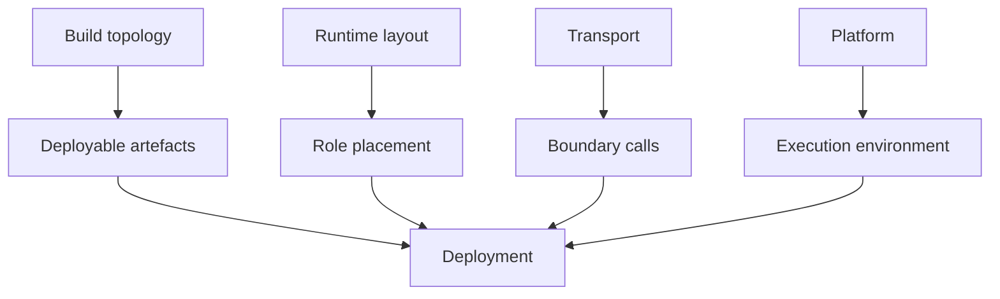

# Deploy TPF

Deployment answers four separate questions: what is built, where each runtime role is placed, how
roles communicate, and which platform starts them.

Start with [Runtime Layouts](./runtime-layouts/) for monolith, pipeline-runtime, and modular placement.
Use [Pipeline Release Descriptors](./release-descriptors) to bind Compiled Truth to the exact packaged artefact
bytes and immutable address registered with a coordinator or hosted control plane.
Use [Orchestrator Runtime](./orchestrator-runtime/) for durable `QUEUE_ASYNC`, transition workers,
checkpoint handoff, Command, and Await setup. Function-style entry points are deployment patterns
composed from a transport and platform; they are covered under [Function Platforms](./function-providers).

Runtime mapping does not rewrite Maven modules, and `FUNCTION` is not a transport mode. Current
`pipeline.transport` values are `LOCAL`, `REST`, and `GRPC`.
