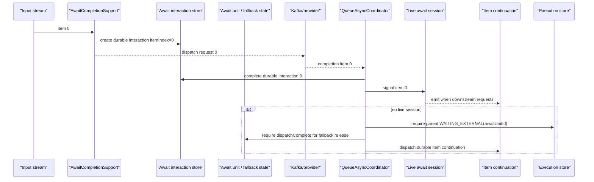

# Await Runtime Setup

The `await:` modifier gives an ordinary authored operation durable deferred completion inside `QUEUE_ASYNC` execution. TPF persists the operation's immediate result, dispatches through the configured adapter, and admits a correlated final completion back into the owning execution. Scalar and recovery paths suspend as `WAITING_EXTERNAL`; brokered itemized streams can also flow through a live await session while the transition is active.

## Single-process LOCAL execution

`LOCAL` selects generated in-process pipeline contracts; it does not select a different await model. In-process queue-async execution may retain a live session only when the await adapter supports one. `interaction-api` and webhook awaits suspend through the normal await interaction and continuation path, while Kafka and SQS itemized streams may use a live completion window with durable fallback. SQS is an await adapter for provider requests and completions, not a transition-worker transport. An eligible portable transition worker invoked over REST or gRPC keeps that live session and terminal stream in the worker; every other portable shape retains coordinator-owned durable handoff. `FUNCTION` selects a platform mode; `REST`, `GRPC`, and `LOCAL` are the only `pipeline.transport` values.

The memory execution, await, and event-dispatch providers support this behavior for a single running process. They preserve the typed interaction, completion, and continuation lifecycle while the process is alive, but lose all orchestration state on process exit. They are suitable for local development and attended single-process applications; they do not provide restart recovery, multi-replica coordination, or high availability. Those require a complete durable coordination-store suite, not an application registry adapter.

For modeling guidance, start with [Await Boundaries](/architecture/await-boundaries). For production operation, see [Await Boundary Operations](/operate/await-boundaries). Internally, await is backed by durable await units; for implementation diagrams and the state model, see [Await Unit Runtime](/evolve/await-unit-runtime/).

## Version 3 completion representation

Version 3 generated completion modifiers keep business code on canonical domain types while their adapter
boundary can use protobuf. At completion, TPF validates the transport value first and invokes the
generated domain/protobuf adapter before it resumes the canonical pipeline. This preserves a
concrete union arm across a durable handoff instead of asking JSON conversion to instantiate an
abstract domain union.

This is generated wiring, not a transport-mode exception: LOCAL, REST, and GRPC pipeline
contracts all use the same canonical/transport distinction when deferred completion has a representation
boundary. The generated descriptor pins that boundary; runtime does not reconstruct it from
`pipeline.yaml`.

## Supported Runtime Shapes

| Authored operation cardinality | Immediate operation results | Deferred completion |
| --- | --- | --- |
| `ONE_TO_ONE` | one result | one interaction for that result |
| `ONE_TO_MANY` / `EXPANSION` | zero or more emitted results | one interaction per emitted result |
| `MANY_TO_ONE` / `REDUCTION` | one reduced result | one interaction for that result |
| `MANY_TO_MANY` | zero or more emitted results | one interaction per emitted result |

There is no aggregate Await cardinality. Model a provider-visible batch as an explicit
bounded canonical collection and use ordinary expansion or reduction around it.

`csv-payments` uses an authored `EXPANSION` operation that emits `PaymentRecord`
results. Each record receives one unary completion interaction; the framework does
not materialize the stream into an aggregate Await request.

## Itemized Queue-Async Mechanics

When a decorated operation emits a stream, TPF creates one owning await unit and one interaction per operation result. The unit gives the whole boundary one durable identity, while each item keeps its own correlation id, request payload, response payload, and item index.

For brokered completion transports such as Kafka, the normal path is a live await session:

1. the source stream dispatches item interactions up to the configured live in-flight window,
2. each provider completion is recorded against its interaction before it is emitted,
3. the live session emits completed items to the resumed segment only as downstream requests them,
4. the source parser receives more demand as accepted completions free capacity.

This is still durable completion, not a plain in-memory request/reply stream. If the worker crashes, the live session is cancelled, or a completion arrives with no live session, the queue-async coordinator falls back to durable item continuation:

1. the source stream must finish dispatching the unit and persist `dispatchComplete`,
2. the parent execution must be durably parked as `WAITING_EXTERNAL` for the same await unit,
3. the item completion must be recorded against the expected interaction,
4. only then can the queue-async coordinator dispatch that item's continuation.

This handles crash recovery, fast providers, and broker redelivery safely. A completion that cannot be accepted by a live session is recorded, then released through durable continuation only when the parent execution is actually waiting on that unit. Duplicate completions resolve through the same interaction record instead of re-running the continuation.

The live path does not write `dispatchComplete` or update item aggregate state merely to deliver a completed item. Those are fallback-only facts, rebuilt from durable interaction rows when a live owner has been lost. Nested and recursive deferred completion remains unsupported until invocation-instance identity can preserve the exact continuation position.

For `csv-payments`, `Process Csv Payments Input` emits `PaymentRecord` rows incrementally and dispatches each trusted result through its deferred-completion overlay. The approved or unapproved status branch runs as completions are accepted by the live session or durable fallback, and `Finalize Payment Output` performs the terminal merge before Object Publish writes `PaymentOutput` objects.



The built-in `interaction-api` adapter is for human/UI inboxes and mock-provider style flows where another client queries pending interactions and later calls the generated completion API. The built-in `webhook` adapter dispatches an HTTP request to an external system and includes a signed resume token in the envelope. The built-in `kafka` adapter publishes a request envelope to Kafka and admits completion envelopes from a configured response channel. The built-in `sqs` adapter does the same request/completion pattern with SQS standard queues.

For runnable examples, use [`examples/restaurant-approval`](https://github.com/The-Pipeline-Framework/pipelineframework/tree/main/examples/restaurant-approval) for human/UI await and [`examples/csv-payments`](https://github.com/The-Pipeline-Framework/pipelineframework/tree/main/examples/csv-payments) for brokered unary await over a stream.

## Runtime Guardrails

Await has the same side-effect rule as the rest of `QUEUE_ASYNC`: orchestrator state transitions are guarded, but external dispatch and external side effects are at-least-once. Use stable business idempotency keys at the external boundary.

Deferred completion applies once to each result emitted by the authored operation. It does not define aggregate Await cardinalities. Model whole-batch requests or completions as explicit bounded canonical collection types and use ordinary expansion or reduction steps around them.

The runtime also enforces aggregate materialization guardrails:

| Config key | Default | Applies to |
| --- | --- | --- |

Set either value to `0` only when the application has its own upstream size control and storage budget. Prefer stable business limits at the API/file/broker boundary rather than relying on these guards as the first line of defense.

### Durable admission budget

Durable provider admission is enabled by default for endpoint-capable `ONE_TO_ONE` awaits in `QUEUE_ASYNC`. Use Dynamo for a multi-replica deployment:

```properties
pipeline.await-admission.store=dynamo
pipeline.orchestrator.dynamo.await-admission-table=tpf_await_admission
# Configure pipeline.orchestrator.dynamo.region and endpoint-override for the deployment.
# This existing value is the pending-interaction budget.
pipeline.max-concurrency=250
```

TPF derives one shared budget scope from the logical pipeline, decorated operation, and request endpoint. It acquires a conditional Dynamo slot before creating the interaction and holds it until durable completion handoff or a terminal transition. Use the in-memory store only for local development and tests; it cannot coordinate replicas.

Replay records `await_admission_acquired`, `await_admission_reused`, `await_admission_reconciled`, and `await_admission_released` before the normal provider-completion lifecycle. This separates admission pressure from an await unit that is already waiting for an external completion.

Transport choice changes operational responsibility. `interaction-api` requires an API consumer to query and complete pending work. `webhook` requires stable resume-token signing and callback reachability. `kafka` requires broker channel configuration, consumer health, and response-envelope monitoring. `sqs` requires request/response queue configuration, poller health, visibility-timeout sizing, and queue DLQ policy. The operational checklist is covered in [Await Boundary Operations](/operate/await-boundaries).

That matters for plugin-style side effects after an await boundary. A resumed queue-async execution can replay the remainder of the pipeline after a downstream retry, so once-only side-effect checkpointing is a separate concern from await durability itself.

## Webhook Example

```yaml
steps:
  - name: "Fraud Check"
    service: "com.example.CreateFraudCheckRequestService"
    cardinality: "ONE_TO_ONE"
    input: "com.example.FraudCheckRequest"
    output: "com.example.FraudCheckDecision"
    await:
      operationOutput:
        type: "com.example.FraudCheckRequest"
        java: "com.example.FraudCheckRequest"
      timeout: "PT10M"
      idempotency:
        fields: ["orderId"]
      correlation:
        strategy: "signedResumeToken"
      transport:
        type: "webhook"
        request:
          url: "https://partner.example/fraud-check"
        callback:
          baseUrl: "https://orchestrator.example"
```

Webhook dispatch sends an envelope containing the interaction id, correlation id, resume token, deadline, request payload, tenant id, step id, output type, and callback metadata when configured. Completion is submitted through the generated REST/gRPC completion APIs; TPF validates the token before accepting the response snapshot.

## Kafka Example

```yaml
steps:
  - name: "Brokered Fraud Check"
    service: "com.example.CreateFraudCheckRequestService"
    cardinality: "ONE_TO_ONE"
    input: "com.example.FraudCheckRequest"
    output: "com.example.FraudCheckDecision"
    await:
      operationOutput:
        type: "com.example.FraudCheckRequest"
        java: "com.example.FraudCheckRequest"
      timeout: "PT10M"
      idempotency:
        fields: ["orderId"]
      correlation:
        strategy: "signedResumeToken"
      transport:
        type: "kafka"
        request:
          topic: "fraud-check.requests"
          key: "correlationId" # optional: interactionId or correlationId
        response:
          topic: "fraud-check.decisions"
        consumer:
          group: "fraud-check-orchestrator" # optional; channel config remains authoritative
        headers:
          x-source: "tpf"
```

Kafka dispatch sends a framework-owned JSON envelope containing tenant id, execution id, interaction id, correlation id, step id, deadline, input/output types, resume token, request payload, and dispatch metadata. The response envelope is consumed by TPF and completed directly through `AwaitCoordinator`, not by looping back through REST. Use the generated REST/gRPC completion APIs for human/UI or webhook clients that are not broker consumers.

```yaml
steps:
  - name: "Process Csv Payments Input"
    service: "org.pipelineframework.csv.orchestrator.service.RequestPaymentProviderService"
    cardinality: "ONE_TO_ONE"
    input: "org.pipelineframework.csv.common.domain.PaymentRecord"
    output: "org.pipelineframework.csv.common.domain.PaymentStatus"
    await:
      operationOutput:
        type: "org.pipelineframework.csv.common.domain.PaymentRecord"
        java: "org.pipelineframework.csv.common.domain.PaymentRecord"
      timeout: "PT5M"
      idempotency:
        fields: ["csvId", "recipient", "amount", "currency"]
      correlation:
        strategy: "signedResumeToken"
      transport:
        type: "kafka"
        request:
          topic: "csv-payments.payment.requests"
          key: "correlationId"
        response:
          topic: "csv-payments.payment.results"
```

Add the Quarkus Kafka messaging extension to the application that hosts the orchestrator, enable the default Kafka bridge with `tpf.await.kafka.reactive-messaging.enabled=true`, then configure the SmallRye channels:

```properties
tpf.await.kafka.reactive-messaging.enabled=true
mp.messaging.outgoing.tpf-await-kafka-requests.connector=smallrye-kafka
mp.messaging.outgoing.tpf-await-kafka-requests.value.serializer=org.apache.kafka.common.serialization.StringSerializer
mp.messaging.incoming.tpf-await-kafka-responses.connector=smallrye-kafka
mp.messaging.incoming.tpf-await-kafka-responses.topic=csv-payments.payment.results
mp.messaging.incoming.tpf-await-kafka-responses.value.deserializer=org.apache.kafka.common.serialization.StringDeserializer
```

## SQS Example

```yaml
steps:
  - name: "Brokered Fraud Check"
    service: "com.example.CreateFraudCheckRequestService"
    cardinality: "ONE_TO_ONE"
    input: "com.example.FraudCheckRequest"
    output: "com.example.FraudCheckDecision"
    await:
      operationOutput:
        type: "com.example.FraudCheckRequest"
        java: "com.example.FraudCheckRequest"
      timeout: "PT10M"
      idempotency:
        fields: ["orderId"]
      correlation:
        strategy: "signedResumeToken"
      transport:
        type: "sqs"
        request:
          queueUrl: "https://sqs.us-east-1.amazonaws.com/123456789012/fraud-check-requests"
        response:
          queueUrl: "https://sqs.us-east-1.amazonaws.com/123456789012/fraud-check-decisions"
```

SQS dispatch sends a framework-owned JSON envelope with the same interaction identity and resume token fields as Kafka. The coordinator-side SQS completion poller consumes the response queue and admits completions through the await coordinator. SQS await v1 supports standard queues, not FIFO queue URLs. This is separate from SQS work dispatch, SQS DLQ publication, and the SQS transition-worker request/reply protocol.

```properties
tpf.await.sqs.poller.enabled=true
tpf.await.sqs.response-queue-url=https://sqs.us-east-1.amazonaws.com/123456789012/fraud-check-decisions
pipeline.orchestrator.sqs.region=us-east-1
```

`pipeline.orchestrator.resume-token-secret` must be stable for the lifetime of outstanding webhook, Kafka, and SQS interactions. If `pipeline.orchestrator.resume-token-secret` is missing, signed dispatch and token validation fail with a clear error rather than allowing insecure or unsigned resumptions.
