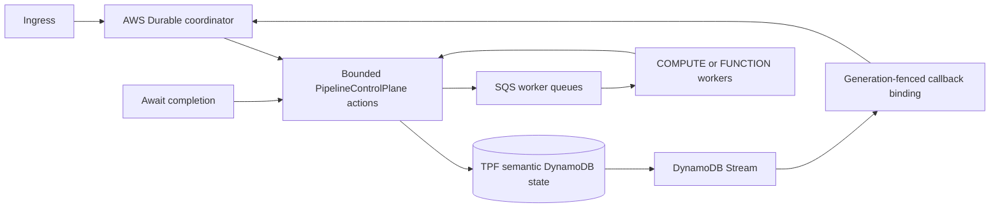

# AWS Durable Coordination

AWS Lambda Durable Functions is the preferred AWS coordination host for `QUEUE_ASYNC`. It owns mechanical orchestration liveness—checkpointing, suspension, wake-up, replay and retry timing—while TPF remains authoritative for execution identity, Await admission, release identity, transition commits, results, retry/DLQ evidence, uncertain outcomes and re-drive decisions.

The native coordinator remains the portable reference, conformance implementation and fallback. Selecting this host does not create a different execution model and does not change the meaning of `FUNCTION`.



## Dependencies and build selection

Import one `pipelineframework-bom` version. Declare the application runtime and AWS Durable host without versions; keep the compiler on the annotation-processor path using the BOM-managed version.

Use a published BOM version that manages the runtime, model, host, deployment and compiler artifacts together. If the documentation for this topology appears ahead of that coordinated release, it is not yet available to applications from the latest published BOM.

```xml
<dependencyManagement>
  <dependencies>
    <dependency>
      <groupId>org.pipelineframework</groupId>
      <artifactId>pipelineframework-bom</artifactId>
      <version>${tpf.version}</version>
      <type>pom</type>
      <scope>import</scope>
    </dependency>
  </dependencies>
</dependencyManagement>

<dependencies>
  <dependency>
    <groupId>org.pipelineframework</groupId>
    <artifactId>pipelineframework</artifactId>
  </dependency>
  <dependency>
    <groupId>org.pipelineframework</groupId>
    <artifactId>pipelineframework-aws-durable-coordination-host</artifactId>
  </dependency>
</dependencies>
```

Pass `-Apipeline.coordination.host=AWS_DURABLE` to compilation. The compiler requires `pipeline.platform=FUNCTION` and generates the application-specific input decoder consumed by the generic host handlers. The default is `NATIVE`.

The deployment artifact `pipelineframework-aws-durable-coordination-deployment` contains the reference SAM contract. It is a template resource, not an application runtime dependency.

## Deployment contract

Deploy these resources together:

- a versioned Lambda Durable coordinator and stable alias;
- a generated Quarkus action/worker package containing the application pipeline and generated input decoder;
- TPF semantic DynamoDB execution and Await stores, including execution-scoped Await lookup and an Await stream;
- the append-only callback binding table and its provider-execution index;
- SQS work, Await-completion and transition queues with DLQs;
- the Await/binding Stream wake-up handler and the bounded terminal reconciliation handler;
- alarms for worker DLQs and Stream failure destinations.

Set `pipeline.orchestrator.process-loops-disabled=true` in event-source-hosted Lambdas. This prevents native poll and sweep loops from competing with Lambda event sources. `PipelineControlPlane` actions remain available and initialise their providers without starting resident loops.

Keep each numbered Durable function version for at least the longest supported execution lifetime. New deployments move the alias for new executions; existing executions must retain their pinned code version and release identity.

The reference template retains the Durable function, numbered versions and callback binding table on stack deletion or replacement. Retained resources require explicit cleanup after all executions and their recovery windows have expired. Retain the compatible action and worker packages as well: a retained coordinator version alone does not protect an unqualified action target from a later deployment. Validate action-version and replacement-generation release compatibility before moving an alias.

### Semantic table upgrade

Before enabling the AWS Durable host against an existing Await interaction table, add these `ALL`-projected indexes and wait until both report `ACTIVE`:

| Index | Partition key | Sort key |
| --- | --- | --- |
| `await-interaction-by-execution` | `query_execution_key` (`S`) | `query_execution_sort` (`S`) |
| `await-interaction-continuation-work` | `query_continuation_key` (`S`) | `query_continuation_due_epoch_ms` (`N`) |

Backfill every non-expired interaction with its tenant-scoped execution key and deterministic execution sort key. For an already-completed item interaction, inspect the matching Await unit: when the unit has no durable continuation-completion fact for that item, write `query_continuation_key=ready`, a due timestamp and `continuation_attempt=1`; when the fact already exists, write `continuation_completed=true` without a ready key. New writes maintain these projections, and a duplicate completion conditionally repairs a missing ready projection, but neither mechanism can discover an older row that is absent from the new indexes.

Complete the backfill and verify the indexes before attaching the Await Stream event source or admitting new Durable executions. This keeps reconstruction and continuation discovery query-based; production hosts must not compensate with a table scan.

## Await callback binding

TPF-first admission is mandatory:

1. the Durable driver checkpoints its callback registration;
2. an immutable registration record associates the provider execution and callback with a TPF execution generation;
3. TPF admits typed Await completion and releases the parent;
4. DynamoDB Streams join the admitted Await to the registration and wake the matching callback;
5. generation fencing prevents a stale execution from consuming a later wake-up.

Callback identifiers and provider execution ARNs are disposable hosting state. They never enter TPF Await records and cannot admit completion. Callback registration runs inside the replayed Durable callback-registration step, while the binding store conditionally admits only one callback for a TPF execution generation. A crash between provider callback creation and binding persistence therefore replays the same registration step and converges on the generation-fenced binding.

If provider history is unavailable or an execution closes before delivery, targeted reconciliation uses the provider-registration index and the TPF semantic checkpoint to start a replacement generation. Reconciliation is exceptional repair; Streams provide normal liveness and no broad scan is required.

The provider index is eventually consistent. Targeted reconciliation retries when a registration or required semantic checkpoint is unavailable, or replacement admission remains unresolved. The `provider-registration-index` uses `provider_execution_arn` as its partition key and `sk` as its sort key, with `ALL` projection. Its query selects the `REGISTRATION#` sort-key prefix before applying the result limit, so binding records cannot hide the registration or exhaust a page budget.

For an existing callback binding table, add this index and wait until it reports `ACTIVE` before upgrading the repair host. Existing records already contain both index keys and need no backfill. Keep the original `provider-execution-index` while retained host versions still use it.

## Worker placement

SQS is the initial supported worker boundary because it preserves backpressure, redelivery, DLQ evidence and uncertain-outcome handling.

| Coordinator | Worker placement | Supported path |
| --- | --- | --- |
| Native | `COMPUTE` | Native loop hosts and bounded actions. |
| AWS Durable | `FUNCTION` | Lambda SQS event sources invoke the bounded work, Await and transition actions. |
| AWS Durable | `COMPUTE` | Compute pollers may consume the same signed SQS protocols when configured for the same release and secrets. |

Direct Durable-to-worker invocation is not supported. Worker placement remains orthogonal to coordination hosting.

## Operations and validation

Before promotion, validate the deployed region and account against the current Lambda Durable operation, duration, checkpoint-size and retention limits. Ensure SQS visibility exceeds worker timeout, set reserved/maximum concurrency deliberately, scope IAM to exact semantic resources, encrypt secrets, enable point-in-time recovery, and route every DLQ/Stream alarm to an owned response path.

For Lambda SQS event sources, configure visibility for at least six times the function timeout plus any batching window, following [AWS guidance](https://docs.aws.amazon.com/lambda/latest/dg/services-sqs-configure.html). The reference queues use this retry headroom and explicit encryption at rest. The Stream consumer requires a scoped send grant to its failure destination. Customer-managed keys, secret references, alarm routing and complete semantic provider configuration remain deployment-owned requirements.

The protected real-AWS conformance lane exercises callback/binding races, duplicate delivery, provider-history loss and expiry, generation replacement, worker failure, terminal Await result passthrough and cleanup. Ordinary repository verification remains deployment-free. Promotion requires that lane to pass against the exact runtime and compiler candidates.

For the ownership rationale, see [ADR-0069](/decisions/0069-aws-durable-hosts-mechanical-coordination).
