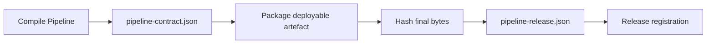

# Produce a Pipeline Release Descriptor

`pipeline-contract.json` describes the compiled Pipeline. `pipeline-release.json` identifies the exact deployable
artefacts that satisfy that contract. Generate the Release Descriptor only after packaging, when the artefact bytes
and their address are known.



The Release Descriptor is written beside the build output. It is not embedded in the artefact it hashes.

## Configure the Maven goal

Add the release plugin to the application module that owns the deployable artefact:

```xml
<plugin>
    <groupId>org.pipelineframework</groupId>
    <artifactId>pipelineframework-release-maven-plugin</artifactId>
    <version>${pipelineframework.version}</version>
    <executions>
        <execution>
            <goals>
                <goal>generate-release-descriptor</goal>
            </goals>
        </execution>
    </executions>
</plugin>
```

The goal runs in Maven's `verify` phase. Supply the immutable Release version explicitly:

```sh
./mvnw verify -Dtpf.release.version=2026.09.23.1
```

The default output is `target/pipeline-release.json`. The goal reads
`target/classes/META-INF/pipeline/pipeline-contract.json`, hashes the Maven project's primary JAR, and uses its
absolute `file:` URI. Override the URI when the artefact has a stable address in Maven, S3, or another repository:

```sh
./mvnw verify \
  -Dtpf.release.version=2026.09.23.1 \
  -Dtpf.release.artifactUri=maven://com.example:payments-worker:2026.09.23.1
```

`tpf.release.version` never defaults to `${project.version}`. In particular, a mutable `SNAPSHOT` must not become
an immutable Release identity accidentally.

## Primary-artefact parameters

| Parameter | Default | Purpose |
| --- | --- | --- |
| `tpf.release.version` | none | Required immutable Release version. |
| `tpf.release.output` | `target/pipeline-release.json` | External descriptor output. |
| `tpf.release.contractFile` | `target/classes/META-INF/pipeline/pipeline-contract.json` | Compiler-produced Pipeline Contract. |
| `tpf.release.artifactFile` | Maven primary artefact | Local bytes to hash. |
| `tpf.release.artifactId` | `${project.artifactId}` | Release-local artefact identity. |
| `tpf.release.artifactKind` | `jar` | Build-produced artefact kind. |
| `tpf.release.artifactUri` | absolute `file:` URI | Address recorded in the Release Descriptor. |

For the primary JAR, the plugin records every authored step in contract order and the transition capabilities known
from Compiled Truth. It verifies that the JAR embeds a Pipeline Contract with the same `pipelineId` and
`contractVersion`.

## Configure a modular Release

Use an ordered `<artifacts>` list when one Release contains several deployables. Each source file is hashed locally;
the URI is the immutable address a release consumer should retain.

```xml
<configuration>
    <releaseVersion>${release.version}</releaseVersion>
    <artifacts>
        <artifact>
            <artifactId>validation-worker</artifactId>
            <kind>jar</kind>
            <file>${project.build.directory}/validation-worker.jar</file>
            <uri>maven://com.example:validation-worker:${release.version}</uri>
            <stepIds>
                <stepId>Validate payment</stepId>
            </stepIds>
            <capabilities>
                <capability>grpc</capability>
            </capabilities>
        </artifact>
        <artifact>
            <artifactId>settlement-function</artifactId>
            <kind>lambda-zip</kind>
            <file>${project.build.directory}/settlement.zip</file>
            <uri>s3://payments-releases/settlement-${release.version}.zip</uri>
        </artifact>
    </artifacts>
</configuration>
```

Configured step IDs must exist in the Pipeline Contract. Omit `stepIds` or `capabilities` when current Compiled
Truth does not establish the association; the descriptor then contains an explicit empty list.

The build producer supports `jar`, `local-file`, `native-binary`, and `lambda-zip`, whose final bytes are available
locally. It does not invent OCI image digests or external-endpoint identity. Produce those entries with post-push
tooling that can observe the authoritative registry or platform value.

## Immutability and repeatability

The digest is lowercase SHA-256 over the exact source file bytes. Re-running the goal with identical inputs produces
identical descriptor content. If the existing output has the same `pipelineId`, `contractVersion`, and
`releaseVersion` but different content, the goal fails instead of overwriting that immutable identity.

For repeatable builds across workspaces, configure a stable artefact URI and reproducible archive timestamps. A
default absolute `file:` URI is intended for local registration and changes when the checkout path changes.
The current self-hosted runtime registrar resolves `jar` artefacts from readable local paths or `file:` URIs. Use a
repository URI such as `maven:` only when the downstream control plane or release tooling provides the corresponding
resolver.

Quarkus fast-JAR output is a directory distribution rather than one self-contained JAR. Point a configured
artefact entry at the actual independently addressable package, or package an uber-JAR when the Release should pin
one JVM file. Runtime layout does not choose this build topology for you.
