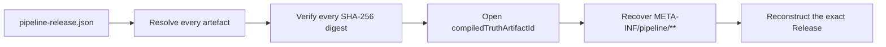

# Produce a Pipeline Release Descriptor

`pipeline-release.json` is the complete immutable input to a deployment consumer. It identifies every deployable
artefact, pins its exact bytes, and identifies the artefact that carries all compiler-produced Compiled Truth.


```mermaid
flowchart LR
    D[pipeline-release.json] --> R[Resolve every artefact]
    R --> H[Verify every SHA-256 digest]
    H --> C[Open compiledTruthArtifactId]
    C --> M[Recover META-INF/pipeline/**]
    M --> X[Reconstruct the exact Release]
```

The descriptor is written beside the build output. It is not embedded in an artefact it hashes.

## Configure the Maven goal

Add the release plugin to the application module that owns the deployable artefact:

```xml
<plugin>
    <groupId>org.pipelineframework</groupId>
    <artifactId>pipelineframework-release-maven-plugin</artifactId>
    <version>${pipelineframework.version}</version>
    <configuration>
        <artifactUri>maven:com.example:payments-worker:${project.version}</artifactUri>
    </configuration>
    <executions>
        <execution>
            <phase>verify</phase>
            <goals>
                <goal>generate-release-descriptor</goal>
            </goals>
        </execution>
    </executions>
</plugin>
```

The goal runs in Maven's `verify` phase. Supply the immutable Release version explicitly:

```sh
./mvnw verify -Dtpf.release.version=2026.10.02.1 -Dmaven.repo.local="$PWD/.m2/repository"
```

The output is `target/pipeline-release.json`. The goal reads
`target/classes/META-INF/pipeline/pipeline-contract.json`, hashes the exact packaged bytes, and verifies that the
named carrier contains the complete `META-INF/pipeline/**` tree byte for byte.

`tpf.release.version` never defaults to `${project.version}`. A mutable `SNAPSHOT` must not accidentally become an
immutable Release identity.

The Mojo delegates hashing, deterministic materialisation, carrier comparison, immutable-output locking, and shared
validation to the framework-neutral `pipelineframework-release-producer` library. A future Gradle integration calls
that library directly; it does not need to reproduce Maven behaviour or Release semantics.

Optionally publish the Maven artefacts referenced by its immutable coordinates:

```sh
./mvnw deploy -Dtpf.release.version=2026.10.02.1 -Dmaven.repo.local="$PWD/.m2/repository"
```

Standard `deploy` traverses `verify` again; use the same Release version and keep final bytes identical. Preserve
`target/pipeline-release.json` separately and unchanged. Configure the plugin → run `mvn verify` → optionally publish
with `mvn deploy` → preserve the descriptor → [verify or deploy it with the CLI](./deployment-cli).
[Install the CLI container](./cli-installation) for the Maven-to-CLI hand-off.

The plugin produces a Release. It has no deployment-target selection and is not a Cloud deployment client; there is
no `tpf:deploy` Maven goal.

## Parameters

| Parameter | Default | Purpose |
| --- | --- | --- |
| `tpf.release.version` | none | Required immutable Release version. |
| `tpf.release.output` | `target/pipeline-release.json` | External descriptor output. |
| `tpf.release.contractFile` | `target/classes/META-INF/pipeline/pipeline-contract.json` | Compiler-produced Pipeline Contract. |
| `tpf.release.artifactFile` | Maven primary artefact | Local bytes to hash. |
| `tpf.release.artifactId` | `${project.artifactId}` | Release-local artefact identity. |
| `tpf.release.artifactKind` | `jar` | Build-produced artefact kind. |
| `tpf.release.artifactUri` | derived absolute `file:` URI | Canonical address recorded in the descriptor; the derived local value requires `allowLocalUris`. |
| `tpf.release.compiledTruthArtifactId` | the sole artefact | Artefact carrying the complete `META-INF/pipeline/**` tree. Required for multi-artefact releases. |
| `tpf.release.allowLocalUris` | `false` | Permit non-promotable `file:` locations for an explicitly local release. |

The primary JAR is associated with every authored step in contract order and all declared runtime capabilities. A
JAR must embed the exact compiler-produced Pipeline Contract, not merely one with the same identity fields.

If no stable repository URI is configured, opt into a local-only descriptor explicitly:

```sh
./mvnw verify \
  -Dtpf.release.version=local-1 \
  -Dtpf.release.allowLocalUris=true
```

## Canonical artefact locations

Release locations describe immutable artefact identity; resolver configuration supplies environment-specific access.

| Profile | Form | Notes |
| --- | --- | --- |
| Local | `file:///absolute/canonical/path/app.jar` | Local development only; not promotable. |
| Maven JAR | `maven:com.example:payments-worker:1.2.3` | Resolves to the ordinary JAR coordinate. |
| Maven typed artefact | `maven:com.example:payments-native:bin:1.2.3` | The fourth component is the extension. |
| Maven classifier | `maven:com.example:payments:zip:lambda:1.2.3` | Extension and classifier are explicit. |
| OCI image | `oci://registry.example/tpf/payments@sha256:<64 lowercase hex>` | The URI digest must equal the descriptor digest. |

Repository roots, mirrors, credentials, cloud accounts, regions, and deployment targets are resolver or Deployment
Plan configuration. They must not be written into the Release Descriptor. The same descriptor can therefore resolve
through different Maven repository roots or environment-specific access to its named OCI registry without changing
its Release identity.

Promotable Maven locations reject `SNAPSHOT` versions. Publish the exact bytes under an immutable repository
coordinate using standard Maven publication before an independent CLI consumer attempts resolution. The descriptor
can be produced during `verify` before publication; its digests must still match the exact subsequently published bytes.

S3 URLs, HTTP endpoints, tags, and mutable Maven coordinates are not canonical Release locations. A post-push tool
may add an OCI image only after it can observe the authoritative digest; it uses the same Release model rather than
creating another manifest.

## Closed artefact units

The local-byte producer accepts these kinds:

| Kind | Closed unit |
| --- | --- |
| `jar` | One JAR containing its executable content. |
| `application-archive` | One deterministic ZIP containing an entire directory-shaped application such as fast-JAR. |
| `native-binary` | One final native executable. It normally needs a separate Compiled Truth carrier. |
| `lambda-zip` | One final Lambda ZIP. |
| `compiled-truth` | A non-deployable deterministic ZIP containing only `META-INF/pipeline/**`. |

`container-image` and `lambda-image` are valid shared consumer kinds, addressed by `oci:`, but the local Maven
producer cannot truthfully derive their registry digest. Tags and external endpoints are not immutable artefacts.

## Fast-JAR

Point an `application-archive` entry at the complete fast-JAR directory. The plugin creates one deterministic ZIP,
adds the compiler output under `META-INF/pipeline/`, and hashes that closed unit.

```xml
<configuration>
    <releaseVersion>${release.version}</releaseVersion>
    <compiledTruthArtifactId>payments-fast-jar</compiledTruthArtifactId>
    <artifacts>
        <artifact>
            <artifactId>payments-fast-jar</artifactId>
            <kind>application-archive</kind>
            <file>${project.build.directory}/quarkus-app</file>
            <uri>maven:com.example:payments-fast-jar:zip:${project.version}</uri>
            <stepIds>
                <stepId>Validate</stepId>
                <stepId>Store</stepId>
            </stepIds>
            <capabilities>
                <capability>local</capability>
                <capability>rest</capability>
            </capabilities>
        </artifact>
    </artifacts>
</configuration>
```

## Modular releases

Use an ordered `<artifacts>` list. Every authored step must belong to exactly one deployable artefact, every declared
runtime capability must be covered, and `compiledTruthArtifactId` must select an inspectable JAR or archive.

```xml
<configuration>
    <releaseVersion>${release.version}</releaseVersion>
    <compiledTruthArtifactId>validation-worker</compiledTruthArtifactId>
    <artifacts>
        <artifact>
            <artifactId>validation-worker</artifactId>
            <kind>jar</kind>
            <file>${project.build.directory}/validation-worker.jar</file>
            <uri>maven:com.example:validation-worker:${project.version}</uri>
            <stepIds><stepId>Validate</stepId></stepIds>
            <capabilities><capability>local</capability></capabilities>
        </artifact>
        <artifact>
            <artifactId>settlement-function</artifactId>
            <kind>lambda-zip</kind>
            <file>${project.build.directory}/settlement.zip</file>
            <uri>maven:com.example:settlement-function:zip:${project.version}</uri>
            <stepIds><stepId>Settle</stepId></stepIds>
            <capabilities><capability>grpc</capability></capabilities>
        </artifact>
    </artifacts>
</configuration>
```

Configured artefact order is preserved. Empty associations are valid only when the remaining deployable artefacts
still provide complete step placement and capability coverage.

## Native releases

A native executable cannot expose ZIP resources. Pair it with a `compiled-truth` entry whose source directory is
the compiler output directory:

```xml
<artifact>
    <artifactId>payments-runner</artifactId>
    <kind>native-binary</kind>
    <file>${project.build.directory}/payments-runner</file>
    <uri>maven:com.example:payments-runner:bin:${project.version}</uri>
    <!-- stepIds and capabilities identify what this executable hosts -->
</artifact>
<artifact>
    <artifactId>payments-compiled-truth</artifactId>
    <kind>compiled-truth</kind>
    <file>${project.build.outputDirectory}/META-INF/pipeline</file>
    <uri>maven:com.example:payments-compiled-truth:zip:${project.version}</uri>
</artifact>
```

Set `compiledTruthArtifactId` to `payments-compiled-truth`. The Compiled Truth-only artefact has no step or
capability associations.

## Repeatability and promotion

Digests are lowercase SHA-256 over exact final bytes. Directory materialisation uses sorted entries and fixed ZIP
timestamps. Re-running with identical inputs produces byte-identical JSON with stable field and list order and a
final newline.

If an existing output has the same pipeline, contract, and Release identity, byte-identical regeneration is allowed;
different content is rejected. A registry remains the cross-build immutability authority.

Promote the descriptor unchanged. Change resolver credentials, mirrors, target accounts, and Deployment Plans per
environment. Do not rewrite URIs, digests, placement, or Compiled Truth during promotion.
