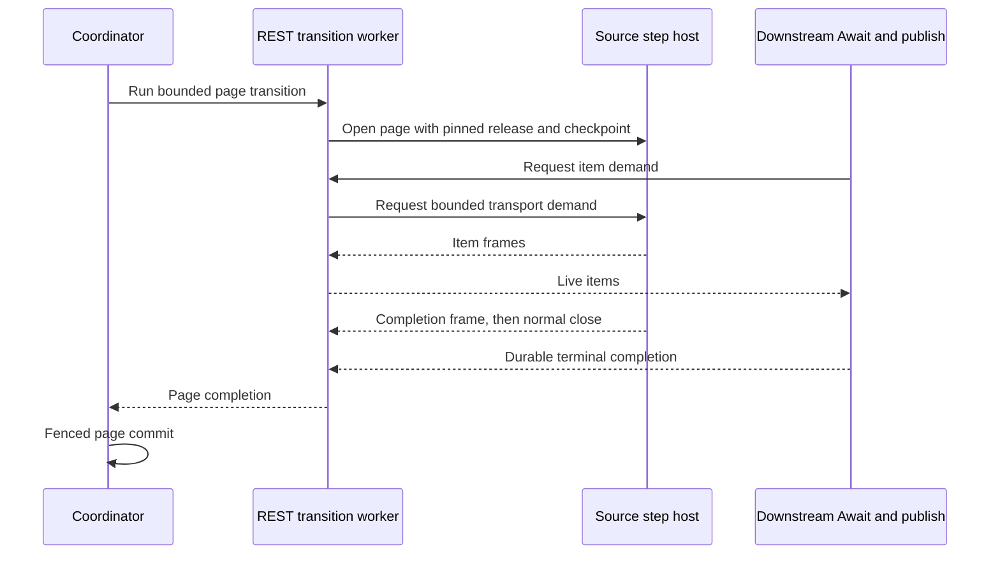

# CSV Payments Pipeline-Runtime Walkthrough

This page documents the grouped pipeline-runtime topology in the standalone
[`csv-kafka-payments`](https://github.com/The-Pipeline-Framework/csv-kafka-payments) application. Paths and commands
below are relative to that repository's root.

## What exists

- Grouped-build root POM: `pom.xml`
- Grouped pipeline runtime module: `pipeline-runtime-svc/pom.xml`
- Runtime mapping scenario: `config/runtime-mapping/pipeline-runtime.yaml`
- Build script: `build-pipeline-runtime.sh`

## Topology shape

- `orchestrator-svc`: generated orchestrator module/artifact. In normal pipeline-runtime runs it is the orchestration entrypoint; in self-host HA references the same artifact can run as the durable coordinator or as the REST transition worker depending on config.
- `pipeline-runtime-svc`: grouped pipeline step runtime (all regular steps)
- `persistence-svc`: plugin/aspect runtime (persistence side effects)

For a paged CSV source, the coordinator's REST transition worker opens one page through the generated source client. With `pipeline.transport=GRPC`, that client calls the source host's `remoteOpenPage` server stream; with `pipeline.transport=REST`, it calls a separate streaming page endpoint. The ordinary `remoteProcess` operation remains available for unpaged calls. The source host validates the shared canonical type catalogue fingerprint and its configured `pipeline.orchestrator.release-version` against the request before it opens the source. It then parses CSV records and validates the pinned snapshot and opaque checkpoint. The worker receives demanded items and one terminal page completion, then follows the normal Await and Object Publish path before the coordinator commits the page.



## Build

```bash
./build-pipeline-runtime.sh -DskipTests
```

What the script does:

- Applies `pipeline-runtime.yaml` as active runtime mapping.
- Installs `pom.xml` (`-N install`) so module parent descriptors are resolvable in clean local repositories (including CI jobs).
- Builds the pipeline-runtime module selection from `pom.xml`.
- Uses `GRPC` transport by default (override with `PIPELINE_TRANSPORT=REST|LOCAL` if needed).
- Restores the previous active mapping file after the build.

## Verification smoke check

```bash
./mvnw -f pom.xml \
  -pl common,payments-processing-svc,pipeline-runtime-svc,persistence-svc,orchestrator-svc \
  -Dcsv.runtime.layout=pipeline-runtime -DskipTests compile
```

## Required runtime environment

`pipeline-runtime-svc` requires explicit TLS path/password variables (no insecure defaults):

```bash
export SERVER_KEYSTORE_PATH=/deployments/server-keystore.jks
export SERVER_KEYSTORE_PASSWORD=secret
export CLIENT_TRUSTSTORE_PATH=/deployments/client-truststore.jks
export CLIENT_TRUSTSTORE_PASSWORD=secret
```

Startup now validates these values and fails fast if they are missing.

If you build container images in CI, set a deterministic image tag:

```bash
export IMAGE_REGISTRY=registry.example.com
export IMAGE_GROUP=csv-payments
export IMAGE_NAME=pipeline-runtime-svc
export IMAGE_TAG="$GITHUB_SHA"
```

## Operational note

This topology is the concrete bridge between fully modular and monolith:

- fewer runtime artifacts than modular,
- clearer isolation than monolith,
- explicit plugin runtime boundary retained.
