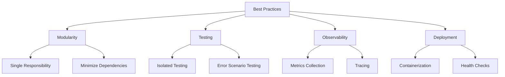

# Design Best Practices

```mermaid
graph TD
    A[Best Practices] --> B[Modularity]
    A --> C[Testing]
    A --> D[Observability]
    A --> E[Deployment]

    B --> F[Single Responsibility]
    B --> G[Minimize Dependencies]
    C --> H[Isolated Testing]
    C --> I[Error Scenario Testing]
    D --> J[Metrics Collection]
    D --> K[Tracing]
    E --> L[Containerization]
    E --> M[Health Checks]
```
