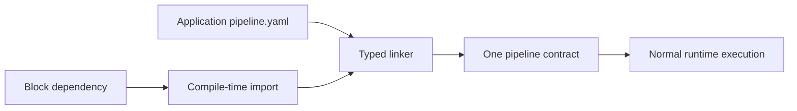

# Blocks Guide

A Block is a reusable Pipeline definition distributed as an ordinary build dependency. The compiler
imports it, merges its canonical types, and links its steps into the application's normal composition
graph. There is no Block registry, runtime download, or second execution engine.

Use a Block when a reusable computation needs several typed steps, package-owned implementation
classes, or contributed canonical types. Use an ordinary service for one application's transformation,
and an operator for a reusable/delegated execution unit that owns its own model or boundary.

Continue with [Use a Block](./use) or [Publish a Block](./publish). The repository currently ships
document text extraction and GraphQL Blocks under
[`blocks/`](https://github.com/The-Pipeline-Framework/pipelineframework/tree/main/blocks).

Blocks first shipped as packaged pipeline segments in v26.9.1 and were renamed to Blocks in v26.9.2.
Current terminology is **Block**. Historical release notes and frozen version snapshots keep their
original wording.
