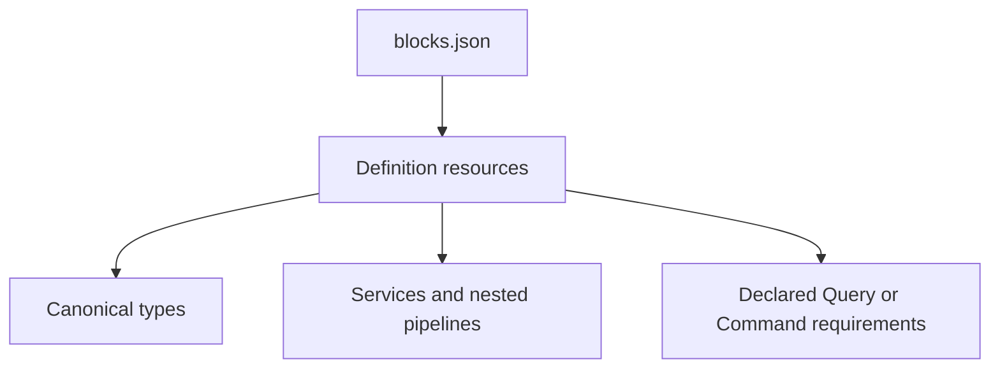

# Publish a Block

A Block artifact contains a schema-1 manifest at `META-INF/pipeline/blocks.json` and one or more
version-3 Pipeline definition resources.



```json
{
  "schemaVersion": 1,
  "namespace": "org.example.documents",
  "artifact": {
    "groupId": "org.example",
    "artifactId": "document-block",
    "version": "${project.version}"
  },
  "definitions": [
    {
      "name": "extract-document",
      "resource": "META-INF/pipeline/document.yaml",
      "requires": {
        "document.lookup": { "kind": "QUERY" }
      }
    }
  ]
}
```

Inside the referenced YAML, authored services and nested `pipeline:` composition use the same shape
as local definitions. A Query or Command step refers to the manifest requirement name in `using` and
may select a fixed operation. It cannot own the consuming application's connector binding,
credentials, or Command identity policy.

Current Block imports deliberately reject application/runtime declarations, Await boundaries, remote
operators, dynamic operations, connector bindings, and checkpoint behaviour. Package definitions
must not collide with local definitions or another package's qualified identity. Prefer qualified
`namespace/name` references when ambiguity is possible.

Use the shipped
[`document-text-extraction`](https://github.com/The-Pipeline-Framework/pipelineframework/tree/main/blocks/document-text-extraction)
and [`graphql`](https://github.com/The-Pipeline-Framework/pipelineframework/tree/main/blocks/graphql)
artifacts as current examples. The durable rationale is recorded in [ADR-0024](/decisions/0024-packaged-blocks-are-static-composition-imports)
and [ADR-0028](/decisions/0028-block-connector-capabilities-are-application-bound).
