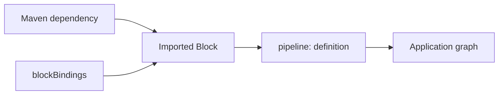

# Use a Block

Add the Block as a normal dependency. Its definitions become compile-time candidates for ordinary
`pipeline:` steps; an unqualified name works only when it is unique.



```xml
<dependency>
  <groupId>org.pipelineframework.blocks</groupId>
  <artifactId>document-text-extraction</artifactId>
  <version>${tpf.version}</version>
</dependency>
```

```yaml
steps:
  - name: Extract document text
    pipeline: document-text-extraction
    cardinality: ONE_TO_ONE
    input: DocumentFile
    output: ExtractedDocument
```

A Block may require named Query or Command capabilities. The Block chooses the required operation;
the application maps that requirement to one of its connector bindings and retains Command authority:

```yaml
blockBindings:
  org.pipelineframework.graphql/graphql-mutation:
    graphql.write:
      using: primary-graphql
      commandIdGenerator: org.pipelineframework.blocks.graphql.GraphQlEffectKeyCommandIdGenerator
      duplicatePolicy: RETURN_RECORDED
      policy:
        requiredExecutionPosture: AUTOMATED
```

Missing, unknown, mismatched, or extra requirement mappings fail compilation. Generated contract
metadata records package and linked fingerprints plus sanitised requirement resolution; it does not
record raw connector configuration or credentials. See the
[GraphQL Block proof](https://github.com/The-Pipeline-Framework/pipelineframework/blob/main/examples/graphql-block-proof/README.md)
for a complete Query-and-Command consumer.
