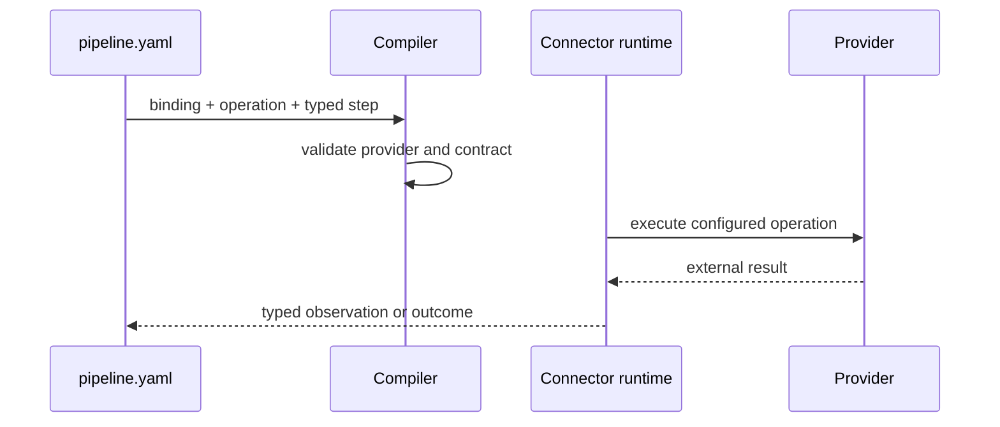

# Author a Connector Boundary

Declare one named binding under `connectors`, then reference that binding from an operation-first
Query or Command step. Provider discovery and operation compatibility are checked during compilation;
provider credentials and endpoints remain deployment configuration.



```yaml
connectors:
  primary-graphql:
    provider: graphql.smallrye
    version: 1
    config:
      connection: primary-graphql
      operations:
        customer.lookup:
          kind: QUERY
          operationName: CustomerLookup
          resource: graphql/customer-lookup.graphql
          sha256: <reviewed-document-digest>

steps:
  - name: Find customer
    kind: query
    using: primary-graphql
    operation: execute.query
    operationVersion: 1
    cardinality: ONE_TO_ONE
    input: <tpf.graphql.GraphQlQueryRequest>
    output: <tpf.graphql.GraphQlResponse>
    capture: { keyFields: [operationKey, variablesJson] }
```

The binding selects a provider. The step selects a declared capability. Query capture records an
external observation for replay; a Command instead needs stable logical effect identity and a
duplicate policy. Neither belongs inside an authored business service.

Keep provider secrets out of `pipeline.yaml`. When authentication is host-managed, the binding uses
a deployment-owned connection reference and the host resolves an initialised client at invocation
time. See [experimental OAuth connections](/develop/oauth-connections/) for the provisional Quarkus path.

Detailed authoring pages cover [Command connectors](/develop/extension/command-connectors),
[GraphQL](/develop/extension/graphql-connector), [MCP imports](/develop/extension/mcp-connector-import),
[LLM Query](/develop/extension/llm-query), and [embedding/vector operations](/develop/extension/embedding-and-vector-connectors).
