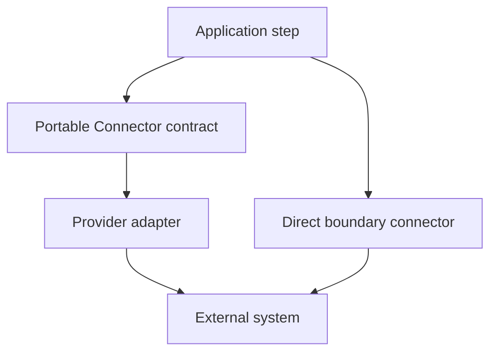

# Connector Catalogue

Current connectors separate portable operation contracts from provider adapters where that
distinction is useful.

| Capability | Modules | Start here |
| --- | --- | --- |
| Object ingest | `object-ingest` | [Object ingest and publish](/architecture/object-ingest) |
| Hibernate/JPA Query | `query-jpa`, `query-hibernate-reactive`, `query-hibernate-common` | [JPA Query Connector](/architecture/jpa-query-connector/) |
| GraphQL Query and Command | `graphql-connector`, `graphql-smallrye-connector` | [GraphQL Connector](/develop/extension/graphql-connector) |
| MCP Query and Command | `mcp`; internal pin model in `mcp-contract` | [Import MCP tools](/develop/extension/mcp-connector-import) |
| One-turn LLM Query | `llm-query`, `llm-query-langchain4j` | [LLM Query](/develop/extension/llm-query) |
| Embeddings | `embedding-query`, `embedding-query-langchain4j` | [Embedding and vector connectors](/develop/extension/embedding-and-vector-connectors) |
| Vector storage | `vector-store`, `vector-store-pgvector` | [Embedding and vector connectors](/develop/extension/embedding-and-vector-connectors) |
| Gmail read Query | `gmail-query` | [Host-authenticated Connectors](/develop/oauth-connections/reference) |

The complete module source is under
[`framework/connectors`](https://github.com/The-Pipeline-Framework/pipelineframework/tree/main/framework/connectors).
`query-hibernate-common` and `mcp-contract` are shared implementation/contract modules rather than
application-selected providers.

Choose the portable contract first when several providers can satisfy the same application
operation. Choose a direct connector only when the external boundary itself defines the portable
semantics. Do not infer production support merely from a module name: follow its specialist page and
matching example, then verify the version your application pins.
