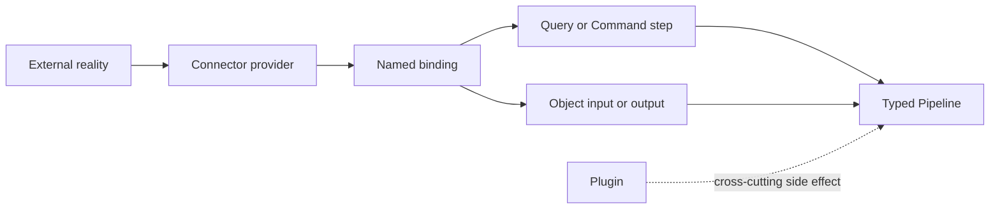

# Connectors Guide

A Connector is a typed boundary between a Pipeline and external reality. It admits or publishes
objects, performs a fresh Query, or carries out a Command. The connector owns protocol and provider
integration; `pipeline.yaml` keeps the operation visible in the application contract.

Connectors and plugins solve different problems. A Connector is part of a typed I/O boundary. A
plugin adds cross-cutting behaviour such as persistence, caching, or telemetry around the flow.

Use this Guide in order:

1. [Author a binding and step](./authoring) to understand the common YAML shape and ownership rules.
2. [Choose a shipped connector](./catalogue) for the provider-neutral contract or adapter you need.
3. Follow the linked specialist page for provider configuration, schema pins, capture, effect identity, and runtime setup.

For architecture, see [Functional Core, Imperative Shell](/architecture/fcis). For the durable
difference between observations and effects, see [Query and Command](/architecture/data-architecture/query-command).
