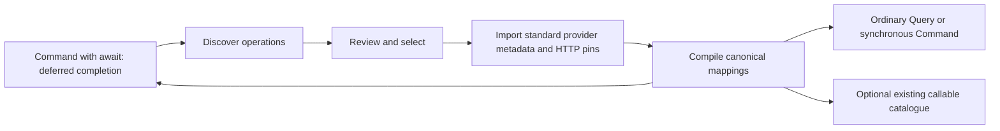

# Import OpenAPI operations

Use the OpenAPI importer when a SaaS API publishes a usable OpenAPI 3 contract and the application
needs selected operations as ordinary TPF Query or Command capabilities. The contract is a
release-time source, not a runtime dependency.



Discovery, import, and callable exposure are separate gates. Discovering an operation grants no
authority; importing it does not make it model-callable.

## Supported contracts

The first importer qualifies OpenAPI 3.0.0–3.0.4 and 3.1.0–3.1.2. OpenAPI 3.2 is rejected until it
has separate compatibility coverage. The importer supports path, query, header, and cookie
parameters, JSON and `+json` request/response media, selected status variants, local or explicitly
acquired references, security requirements, and descriptive servers and vendor extensions.

The importer does not infer Query or Command from the HTTP method. An effectful `GET` remains a
Command when the application classifies it that way; `POST` can be a Query when it only observes
external reality. A selected callback does not create another step: it supplies the completion
contract for a Command whose native `await:` modifier pauses the Pipeline after dispatch.

## Add the importer and runtime capability

Add the generic Connector and representation provider to the application, and configure the Maven
plugin that owns the release-time import:

```xml
<dependencies>
  <dependency>
    <groupId>org.pipelineframework</groupId>
    <artifactId>http-connector</artifactId>
    <version>${pipelineframework.version}</version>
  </dependency>
  <dependency>
    <groupId>org.pipelineframework</groupId>
    <artifactId>representation-provider-http</artifactId>
    <version>${pipelineframework.version}</version>
    <scope>provided</scope>
  </dependency>
</dependencies>

<build>
  <plugins>
    <plugin>
      <groupId>org.pipelineframework</groupId>
      <artifactId>connector-openapi-maven-plugin</artifactId>
      <version>${pipelineframework.version}</version>
      <configuration>
        <importFile>${project.basedir}/openapi-import.yaml</importFile>
        <outputDirectory>${project.basedir}/src/main/resources</outputDirectory>
      </configuration>
    </plugin>
  </plugins>
</build>
```

## Acquire and discover

`openapi:acquire` is the only network-capable goal. It accepts an absolute HTTPS root, follows no
redirects, vendors referenced documents only from the root origin or an explicit `allowedOrigins`
list, rewrites those references locally, and records original document and closure digests.

```bash
./mvnw openapi:acquire \
  -Dopenapi.source=https://api.example.com/openapi.yaml \
  -Dopenapi.snapshot="$PWD/contract/openapi.yaml" \
  -Dmaven.repo.local="$PWD/.m2/repository"
```

Review and commit the snapshot, its `.acquisition.json` evidence, and any acquired reference files.
Then create `openapi-import.yaml` and run `openapi:discover`. Discovery reads only the local closure
and writes a deterministic report under `target/`; it imports nothing.

Repositories and API catalogues may supply the same local snapshot. They do not change the import
contract.

## Select authority explicitly

Every selected operation chooses the TPF identity and semantics that enter the release:

```yaml
schemaVersion: 1
importId: evidence-api

source:
  snapshot: contract/openapi.yaml
  closureSha256: 15c5db59b139a7d34bf2c678c5f36065a8453c93c78d3c4de64890ece1fce4a6

operations:
  - source:
      operationId: lookupEvidence
      method: POST
      path: /evidence/{subject}/lookup
    operation: evidence.lookup
    version: 1
    kind: QUERY
    input: LookupArguments
    output: LookupResult
    server: APPLICATION_BOUND
    security:
      require: { oauth2: [evidence.read] }
    request:
      mediaType: application/json
      bodyPath: body
      parameterSources: { subject: subject, verbose: verbose }
      representation: http.evidence.lookup.request
    responses:
      - status: "200"
        mediaType: application/json
        outcome: RESULT
        representation: http.evidence.lookup.response
      - status: "404"
        outcome: EMPTY
        code: evidence-not-found

  - source:
      operationId: recordEvidence
      method: POST
      path: /evidence
    operation: evidence.record
    version: 1
    kind: COMMAND
    input: RecordArguments
    output: RecordResult
    server: APPLICATION_BOUND
    security:
      require: { apiKey: [] }
    request:
      mediaType: application/json
      representation: http.evidence.record.request
    providerIdempotencyKey: { location: HEADER, name: Idempotency-Key }
    responses:
      - status: "202"
        mediaType: application/json
        outcome: SUCCEEDED
        confirmation: PROVIDER_ACKNOWLEDGED
        representation: http.evidence.record.response
      - { status: "409", outcome: TERMINAL_FAILURE, code: evidence-conflict }
      - { status: "429", outcome: RETRYABLE_FAILURE, code: rate-limited }
```

Method and path guard against `operationId` drift. `server: APPLICATION_BOUND` makes the ownership
choice explicit: OpenAPI servers and server variables are fingerprinted hints, never runtime
authority. The selected security alternative constrains what the host connection may supply; it is
not a credential or OAuth configuration.

For Commands, provider idempotency is enabled only by an explicit projection of TPF's existing
provider idempotency key onto a declared header. The application still selects its Command ID
generator, duplicate policy, and `CommandPolicy` in `pipeline.yaml`.

## Command completion callbacks

Select a callback from the initiating Command's OpenAPI `callbacks` explicitly:

```yaml
callbacks:
  - source:
      name: jobStatus
      expression: '{$request.body#/callbackUrl}'
      operationId: jobCompleted
      method: POST
    callback: job.completed
    input: JobCallback
    request:
      mediaType: application/json
      representation: http.job.completed.request
    acknowledgement:
      status: '202'
    security:
      require: { callbackSignature: [] }
```

Use the selected identity in `await.callback` on the native Command. The initiating acknowledgement,
callback payload, and final projected output have separate types. The completion projector receives
the original canonical Command input. See [Command Connectors](../extension/command-connectors).

One required POST callback is supported per HTTP Command; optional HTTP callback pins are rejected.
Its inbound payload must be a JSON body with
an explicitly selected schema, mapping, security alternative, and exact advertised 2xx acknowledgement.
Injection supports object fields under `$request.body#/`, declared `$request.query.` parameters, and
declared `$request.header.` parameters. JSON Pointer escapes are decoded; arrays, wildcards,
response expressions, arbitrary URLs, and authorization/idempotency collisions are rejected.
Top-level webhooks cannot complete an initiating Command.

The compiler excludes the reserved injection field from authored canonical input mapping. The
runtime injects the trusted URI and validates the complete wire shape for all mapping routes.
Provider schema 7 and HTTP pin schema 2 release-pin callback contracts and mappings.

Application beans implement `org.pipelineframework.connector.ProviderCallbackEndpointResolver`
and `ProviderCallbackAuthenticator`. The resolver returns the trusted public base URI. The framework
appends `pipeline/callbacks/{signed-token}`; configure any public proxy prefix in that base URI.
HTTPS is required for both the public callback address and the initiating provider endpoint unless
the host explicitly enables `pipeline.callback.allow-http` for local use.
The authenticator asynchronously returns an optional `ProviderCallbackActor` through
`CompletionStage`, using bounded raw headers/body and the selected security requirements. An empty
result rejects the request. Choose a stable audit identifier; never use a signature or credential.

The Quarkus ingress validates the signed token against durable state, resolves the exact generated
descriptor and pin, authenticates, validates/maps the payload, and calls ordinary Await completion.
It returns the pinned acknowledgement only after accepted or duplicate admission. Spring ingress is
not implemented. Runtime requires neither source OpenAPI documents nor the Swagger parser.

## Resolve canonical representations

Each request and successful response names an ordinary v3 mapping key. Resolution follows the
existing sequence:

1. direct mapping when canonical and wire shapes agree;
2. bounded deterministic HTTP mapping options; or
3. a curated representation type and `Mapper` class.

Use `org.pipelineframework.openapi/openapi-representation-mapper` as an optional authoring aid for
the middle case. It packages deterministic preparation and validation around one application-bound
LLM Query, preserves schema fingerprints in its typed state, returns diagnostics through at most
eight turns, and produces only a reviewable proposal. Copy an accepted proposal into the relevant
`types.<type>.mappings.<key>.options` declaration and commit it. Compilation revalidates the actual
canonical and wire schemas and generates deterministic mapper classes; the Block cannot write or
accept its own output.

Open objects use nominal validated JSON-object wrappers. Ambiguous unions, incompatible
constraints, recursive references, or conversions outside the bounded option language require a
curated DTO and Mapper. No runtime model interpretation is available.

## Refresh, verify, and execute

Run refresh only when intentionally changing the imported release contract:

```bash
./mvnw openapi:refresh-import -Dmaven.repo.local="$PWD/.m2/repository"
```

Review and commit:

- `META-INF/pipeline/connector-providers.json`;
- `META-INF/pipeline/http-operations.json`; and
- `META-INF/pipeline/connector-operation-provenance.json`.

Bind `openapi:verify-import` to the normal build. It is offline and read-only; it fails when the
committed outputs differ from the local source, selection, or shared provider manifest. Runtime
needs none of the source contract, parser, importer, or mapping model.

Configure `http.client` with a logical host connection, then invoke the imported operation exactly
like any other capability:

```yaml
connectors:
  vendor-http:
    provider: http.client
    version: 1
    config:
      connection: evidence-api
      maxResponseBytes: 1048576
      requestTimeout: PT10S

steps:
  - name: Lookup evidence
    kind: query
    using: vendor-http
    operation: evidence.lookup
    operationVersion: 1
    input: LookupArguments
    output: LookupResult
    capture: { keyFields: [subject] }
```

The host resolves `HttpClientConnection` with its chosen base URI, borrowed asynchronous client,
tenant policy, and already-resolved authorization material. The Connector neither implements nor
owns OAuth lifecycle, credentials, tenant selection, or client shutdown.

An imported operation becomes model-callable only if an existing `callables` catalogue names it.
No OpenAPI-specific catalogue or agent path exists.

## Inspect release provenance

Generated `connector-bindings.json` schema 3 and `pipeline-contract.json` schema 3 project only the
imported operations actually referenced by the application. `capabilityImports` includes source,
closure, operation, security, wire, pin, and accepted mapping fingerprints. Those values participate
in the existing contract hash. Documents, base URLs, credentials, authorization values, tenant data,
and response bodies do not.

See the [OpenAPI Capability Proof](https://github.com/The-Pipeline-Framework/pipelineframework/tree/main/examples/openapi-capability-proof)
for a Query and synchronous Command used directly and through the packaged callable loop, plus a
`job.start` Command with a required body callback URI and external completion schema. Its sibling
jobs application proves callback completion after a real JVM restart using TPF's Dynamo stores,
with neither the OpenAPI source nor Swagger Parser in runtime JARs.

See [ADR-0035](/decisions/0035-openapi-imports-release-pinned-capabilities-not-authority) for the
authority boundary and [Pinned HTTP Connector capabilities](/develop/extension/pinned-http-connector)
for runtime pin behavior.
