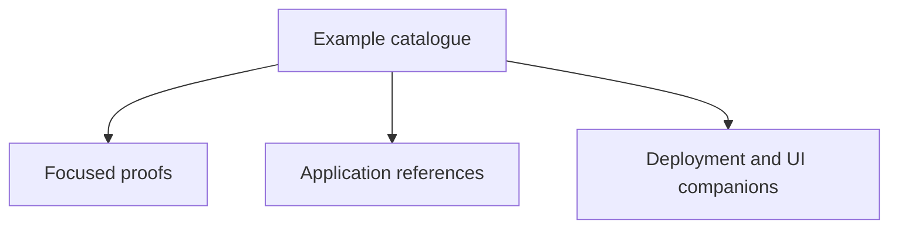

# Example Catalogue

The links below point to the repository README that owns each example's build and run instructions. Focused proofs
and Restaurant Approval live in the standalone
[`pipelineframework-examples`](https://github.com/The-Pipeline-Framework/pipelineframework-examples) repository;
real applications and long-lived reference implementations keep separate ownership boundaries.

## Focused proofs

- [Callable Loop Proof](https://github.com/The-Pipeline-Framework/pipelineframework-examples/blob/main/callable-loop-proof/README.md) — proves that a packaged Block can own typed model decisions, dynamic Query/Command routing, trusted context, reduction, completion, and bounded recursion while the application supplies bindings and Command authority.
- [GraphQL Block Proof](https://github.com/The-Pipeline-Framework/pipelineframework-examples/blob/main/graphql-block-proof/README.md) — runs the production `graphql-agent` Block through persisted Query → partial-error Mutation → typed completion while the application retains LLM, document, connection, and effect authority.
- [OpenAPI Capability Proof](https://github.com/The-Pipeline-Framework/pipelineframework-examples/blob/main/openapi-capability-proof/README.md) — imports three `POST` operations as an ordinary Query, synchronous Command, and callback-completed Command; exercises direct and packaged composition; and proves the runtime contains pins rather than an OpenAPI parser or source document. It does not host the representation-mapper Block.
- [Local Command Proof](https://github.com/The-Pipeline-Framework/pipelineframework-examples/blob/main/local-command-proof/README.md) — a small, infrastructure-free fixture for generated LOCAL Command execution and durable effect identity.
- [RAG Composition Proof](https://github.com/The-Pipeline-Framework/pipelineframework-examples/blob/main/rag-composition-proof/README.md) — deterministic composition fixture; use Turnkey RAG for the recommended independently deployable topology.
- [Stdio Object Demo](https://github.com/The-Pipeline-Framework/pipelineframework-examples/blob/main/stdio-object-demo/README.md) — admits one JSON value from stdin and publishes typed output to stdout through generated object connectors.

## Application references

- [Checkout / TPFGo](https://github.com/The-Pipeline-Framework/pipelineframework-reference-implementations/tree/main/checkout/README.md) — cross-pipeline checkpoint handoff and domain-oriented application boundaries.
- [CSV Kafka Payments](https://github.com/The-Pipeline-Framework/csv-kafka-payments/blob/main/README.md) — the main topology, Await, replay, telemetry, branching, and performance reference.
- [QuickBooks Collections Briefing](https://github.com/The-Pipeline-Framework/pipelineframework-reference-implementations/tree/main/quickbooks-collections-briefing/README.md) — imports one pinned MCP tool and turns an unstructured report into a typed collections plan.
- [Restaurant Approval](https://github.com/The-Pipeline-Framework/pipelineframework-examples/blob/main/restaurant-approval/README.md) — canonical interaction-API Await application with a small UI.
- [Search](https://github.com/The-Pipeline-Framework/pipelineframework-reference-implementations/tree/main/search/README.md) — generated search pipeline covering fan-out/fan-in, replay, REST/gRPC, function providers, and branch-aware execution.
- [Turnkey RAG](https://github.com/The-Pipeline-Framework/pipelineframework/blob/main/examples/rag-turnkey/README.md) — separate indexing and query applications backed by Ollama and PostgreSQL/pgvector.

## Companion READMEs

- [Checkout service-map UI](https://github.com/The-Pipeline-Framework/pipelineframework-reference-implementations/tree/main/checkout/nextjs-ui/README.md) — educational frontend for the Checkout service and handoff topology.
- [CSV common module](https://github.com/The-Pipeline-Framework/csv-kafka-payments/blob/main/common/README.md) — shared canonical types, DTOs, mappers, and service contracts.
- [CSV input processing service](https://github.com/The-Pipeline-Framework/csv-kafka-payments/blob/main/input-csv-file-processing-svc/README.md) — file admission and CSV fan-out boundary.
- [CSV orchestrator service](https://github.com/The-Pipeline-Framework/csv-kafka-payments/blob/main/orchestrator-svc/README.md) — generated admission, coordination, publication, and step-client surface.
- [CSV payment-status service](https://github.com/The-Pipeline-Framework/csv-kafka-payments/blob/main/payment-status-svc/README.md) — status lookup boundary used by the modular topology.
- [CSV payments-processing service](https://github.com/The-Pipeline-Framework/csv-kafka-payments/blob/main/payments-processing-svc/README.md) — payment-processing transformation and provider-facing service contract.
- [CSV self-hosted HA reference](https://github.com/The-Pipeline-Framework/csv-kafka-payments/blob/main/self-host/container/README.md) — provider-portability stack with explicit scale profiles and operational budgets.
- [Restaurant self-hosted coordinator](https://github.com/The-Pipeline-Framework/pipelineframework-examples/blob/main/restaurant-approval/self-host/README.md) — single-process local coordinator with optional separate-worker experiments.
- [Restaurant container HA reference](https://github.com/The-Pipeline-Framework/pipelineframework-examples/blob/main/restaurant-approval/self-host/container/README.md) — compute-first container topology with durable backing services and a separate worker.
