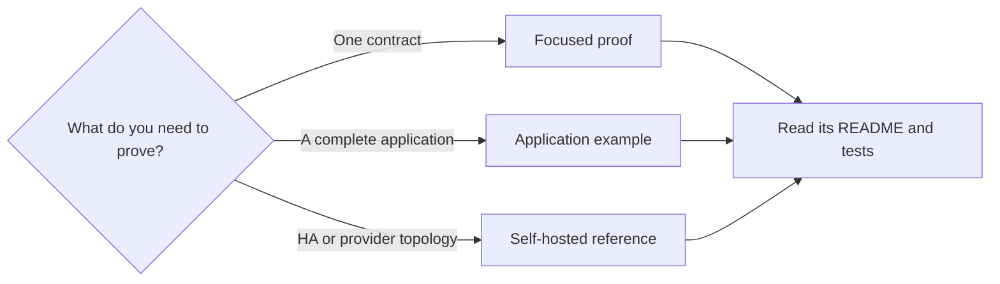

# Examples Guide

TPF examples are compatibility surfaces: each one proves a particular combination of authoring,
generated code, runtime behaviour, or deployment shape. Start with the smallest example that matches
the question you are trying to answer; do not copy the largest topology by default.

The [example catalogue](./catalogue) links each owning repository and explains what every proof,
reference implementation, and application is for. Focused proofs live in the standalone
[`pipelineframework-examples`](https://github.com/The-Pipeline-Framework/pipelineframework-examples) repository
and consume released TPF artifacts. A few useful starting points are:

- [Stdio Object Demo](https://github.com/The-Pipeline-Framework/pipelineframework-examples/blob/main/stdio-object-demo/README.md) for the smallest generated object-I/O pipeline;
- [Restaurant Approval](https://github.com/The-Pipeline-Framework/pipelineframework-examples/blob/main/restaurant-approval/README.md) for a typed Await interaction;
- [Turnkey RAG](https://github.com/The-Pipeline-Framework/pipelineframework/blob/main/examples/rag-turnkey/README.md) for two independently deployable applications using Blocks, Query, Command, object ingest, and vector storage;
- [CSV Kafka Payments](https://github.com/The-Pipeline-Framework/csv-kafka-payments/blob/main/README.md) for the broadest runtime, telemetry, replay, and deployment compatibility surface.

Examples prove the released artifact versions declared by their owning repository. For an application pinned to
a released TPF version, use the matching tag rather than assuming `main` has the same contract.
