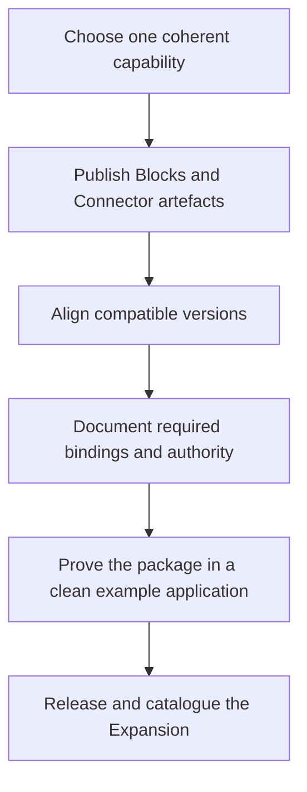

# Package an Expansion

An Expansion does not require a compiler-discovered manifest or a separate runtime. Package it as a
coherent release of ordinary TPF artefacts, and keep each contained capability's existing contract
intact.

## Define the package boundary

Include only assets that serve the same application capability. A useful Expansion may contain:

- Block artefacts with reusable `META-INF/pipeline/blocks/*.yaml` definitions;
- Connector contracts and one or more provider implementations;
- canonical or protocol types needed at their boundaries;
- configuration keys and safe defaults;
- an example that installs the released artefacts without copying their internals;
- operational guidance, compatibility limits, and upgrade notes.

Do not hide a required Connector binding or external-effect authority inside the package. A Block
may declare required Query or Command capabilities, but the consuming application supplies the
provider binding and continues to own Command authority.

## Publish and consume explicit artefacts

Publish the contained Blocks and Connectors under their own Maven coordinates and compatible
versions. The consumer installs the artefacts it needs, includes any required build-time processor
paths, and selects Connector providers in its own configuration. Do not invent an `expansion:`
section in `pipeline.yaml` or imply that an Expansion creates a hidden runtime.

Keep all artefacts in the Expansion release-compatible. State which combinations were verified and
link each contained capability to its dedicated reference page.

## Prove the release boundary

Validate the Expansion from a clean application that depends only on released artefacts. The proof
should cover compilation, generated contracts, required Connector bindings, Command authority,
runtime startup, and one deterministic end-to-end path. Add the example to the
[Examples Catalogue](../examples/catalogue) and add the released package to the catalogue on the
[Expansions overview](./).
