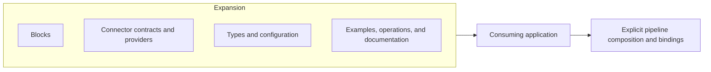

# Expansions Guide

An Expansion is a versioned distribution package that brings together related TPF capabilities. It
can include Blocks, Connector contracts and providers, shared types, configuration, examples,
operational assets, and focused documentation. Consumers install the relevant artefacts and use
them through ordinary TPF contracts.

An Expansion is a packaging and release boundary, not a new runtime step kind. Its Blocks still
compose at compile time, its Connectors still own typed I/O boundaries, and the consuming
application still owns configuration, credentials, Connector bindings, and Command authority.

Do not use Expansion as a synonym for `ONE_TO_MANY`. The canonical name for that step cardinality
is `ONE_TO_MANY`; compatibility code may still recognise the historical `EXPANSION` cardinality
token, but that token is not the package described by this Guide.

## Choose the right distribution unit

| Unit | Use it for |
| --- | --- |
| Block | One or more reusable pipeline definitions imported at compile time |
| Connector | A typed boundary to external observations, effects, or object I/O |
| Expansion | A coherent, versioned package of Blocks, Connectors, and supporting assets |

Read [Package an Expansion](./author) for the publication model. Use the
[Blocks Guide](../blocks/) and [Connectors Guide](../connectors/) for the contracts contained in an
Expansion.

## GraphQL Expansion

The GraphQL Expansion is the first concrete proof of this package boundary. Its release-aligned
family includes:

- the provider-neutral `graphql-connector` contract;
- the `graphql-smallrye-connector` provider;
- the `graphql` Block containing reusable persisted Query and Mutation definitions;
- the `graphql-agent` Block containing a bounded GraphQL-aware callable loop;
- the GraphQL proof application, generated-contract checks, and focused authoring guidance.

Applications may consume only the lower-level Query and Mutation Blocks or invoke the packaged
agent loop. In either case they retain the digest-pinned operation catalogue, connection, LLM
binding, effect scope, Command identity, duplicate policy, and Command policy.

The Expansion does not require an umbrella runtime or registry. It is a coherent, versioned family
of ordinary artefacts whose contracts are linked into the consuming application.

## OpenAPI Expansion

The OpenAPI Expansion maps selected external operations into TPF semantics:

- synchronous request/response becomes Query or Command;
- asynchronous request plus callback becomes Command → Await;
- schema adaptation chooses direct mapping first, with an LLM fallback or a curated DTO when needed.

This is distinct from the [public OpenAPI contract filter](../openapi-contract), which publishes a
focused application-owned contract. The Expansion consumes an external contract into application
capabilities; the filter controls what an application publishes.

Synchronous import is documented in [Import OpenAPI operations](../connectors/openapi-import). It
uses the generic pinned HTTP Connector and ordinary callable catalogues. Callback-to-Await support
is a separate delivery so the synchronous importer does not invent or partially duplicate Await
semantics.

## Specialised loops

An Expansion may package a domain- or protocol-specific agentic loop so each application does not
have to rebuild operation guidance, routing, observation normalisation, reduction, recursion, and
completion. The loop remains an ordinary imported Block. Applications can place deterministic
steps, policy, Await boundaries, or nested pipelines around it—or compose a different loop from the
lower-level capabilities when the business process demands another shape.
