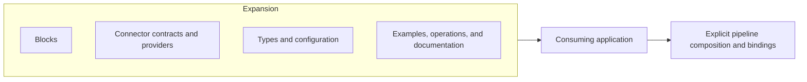

# Expansions Guide

An Expansion is a versioned distribution package that brings together related TPF capabilities. It
can include Blocks, Connector contracts and providers, shared types, configuration, examples,
operational assets, and focused documentation. Consumers install the relevant artefacts and use
them through ordinary TPF contracts.

An Expansion is a packaging and release boundary, not a new runtime step kind. Its Blocks still
compose at compile time, its Connectors still own typed I/O boundaries, and the consuming
application still owns configuration, credentials, Connector bindings, and Command authority.

Do not use Expansion as a synonym for `ONE_TO_MANY`. The canonical name for that step cardinality
is `ONE_TO_MANY`; compatibility code may still recognise the historical `EXPANSION` cardinality
token, but that token is not the package described by this Guide.

## Choose the right distribution unit

| Unit | Use it for |
| --- | --- |
| Block | One or more reusable pipeline definitions imported at compile time |
| Connector | A typed boundary to external observations, effects, or object I/O |
| Expansion | A coherent, versioned package of Blocks, Connectors, and supporting assets |

Read [Package an Expansion](./author) for the publication model. Use the
[Blocks Guide](../blocks/) and [Connectors Guide](../connectors/) for the contracts contained in an
Expansion.

## GraphQL Expansion

The GraphQL Expansion is the first concrete proof of this package boundary. Its release-aligned
family includes:

- the provider-neutral `graphql-connector` contract;
- the `graphql-smallrye-connector` provider;
- the `graphql` Block containing reusable persisted Query and Mutation definitions;
- the `graphql-agent` Block containing a bounded GraphQL-aware callable loop;
- the GraphQL proof application, generated-contract checks, and focused authoring guidance.

Applications may consume only the lower-level Query and Mutation Blocks or invoke the packaged
agent loop. In either case they retain the digest-pinned operation catalogue, connection, LLM
binding, effect scope, Command identity, duplicate policy, and Command policy.

The Expansion does not require an umbrella runtime or registry. It is a coherent, versioned family
of ordinary artefacts whose contracts are linked into the consuming application.

## OpenAPI Expansion

The OpenAPI Expansion is the release-aligned family for importing selected SaaS REST operations. It
includes:

- the `connector-openapi-maven-plugin` for bounded acquisition, offline discovery, explicit
  selection, refresh, and drift verification;
- the generic pinned HTTP Connector and representation provider used at runtime;
- the optional `openapi-representation-mapper` Block, which produces a reviewable mapping proposal;
  and
- synchronous and callback-completion proof applications, generated-contract checks, and focused
  authoring guidance.

Selected request/response operations become ordinary Query or Command capabilities. A selected
required callback on a Command becomes that Command's deferred-completion contract: the Command
dispatch produces its trusted acknowledgement, `await:` suspends the Pipeline, and the authenticated
callback is projected into the final typed output. It is one authored operation with an orthogonal
lifecycle modifier, not a generated `Command` step followed by a generated `Await` step.

Schema adaptation uses direct mapping, bounded deterministic options, or an explicit curated
DTO/Mapper. The optional LLM Query is an authoring aid: it proposes bounded options, but author
review, committed configuration, and compiler validation remain authoritative. No model interprets
the contract or mapping at runtime.

This is distinct from the [public OpenAPI contract filter](../openapi-contract), which publishes a
focused application-owned contract. The Expansion consumes an external contract into application
capabilities; the filter controls what an application publishes.

[Import OpenAPI operations](../connectors/openapi-import) documents the complete workflow, including
callback selection, trusted endpoint injection, callback authentication, and the current support
boundary. The importer supports one required `POST` callback per HTTP Command; top-level webhooks,
optional callback pins, and Spring callback ingress are not part of the current contract.

## Specialised loops

An Expansion may package a domain- or protocol-specific agentic loop so each application does not
have to rebuild operation guidance, routing, observation normalisation, reduction, recursion, and
completion. The loop remains an ordinary imported Block. Applications can place deterministic
steps, policy, Await boundaries, or nested pipelines around it—or compose a different loop from the
lower-level capabilities when the business process demands another shape.
