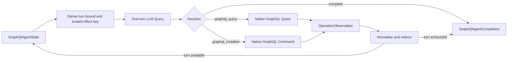

# GraphQL Connector and Blocks

TPF exposes GraphQL as ordinary Connector operations and reusable Blocks. The Connector is the
external I/O shell; the Blocks own validation, normalization, and composition. There is no GraphQL
step kind or Block execution runtime:

```text
GraphQL Block requirement
→ application connector binding
→ ordinary v3 Query or Command
→ SmallRye dynamic client
```

GraphQL queries map to TPF Query, preserving capture and replay. GraphQL mutations map to TPF
Command, preserving effect identity, duplicate policy, confirmation, and ambiguity handling.

## Add the artifacts

The portable contract contributes the `tpf.graphql` canonical vocabulary and provider-neutral
operation contracts. The SmallRye artifact supplies provider `graphql.smallrye`. The `graphql`
Block artifact supplies the reusable `graphql-query` and `graphql-mutation` definitions. The
separate `graphql-agent` Block packages a complete GraphQL-aware callable loop.

```xml
<dependency>
  <groupId>org.pipelineframework</groupId>
  <artifactId>graphql-connector</artifactId>
  <version>${pipelineframework.version}</version>
</dependency>
<dependency>
  <groupId>org.pipelineframework</groupId>
  <artifactId>graphql-smallrye-connector</artifactId>
  <version>${pipelineframework.version}</version>
</dependency>
<dependency>
  <groupId>org.pipelineframework.blocks</groupId>
  <artifactId>graphql</artifactId>
  <version>${pipelineframework.version}</version>
</dependency>
```

The portable operations are:

- `execute.query` version 1: `GraphQlQueryRequest → GraphQlResponse`, `ONE_TO_ONE`, live-only Query.
- `execute.mutation` version 1: `GraphQlMutationRequest → GraphQlResponse`, `ONE_TO_ONE` Command.

`GraphQlQueryRequest` contains `operationKey` and `variablesJson`. `GraphQlMutationRequest` also
contains a semantic `effectKey`. Variables and response data use nominal validated JSON-object
wrappers rather than untyped pipeline `Map`, `Object`, or `JsonNode` values. A response contains
optional normalized data and a bounded list of sanitized GraphQL errors. `GraphQlResult` is the
Block-normalized boundary.

### Deterministic calls and LLM-backed argument mapping

Applications can construct `GraphQlQueryRequest` or `GraphQlMutationRequest` directly when the
operation and variables are already known. The `graphql-agent` Block adds the LLM-backed path: on
each agent turn, TPF exposes generated callable schemas for `graphql_query` and `graphql_mutation`.
The model selects one and supplies its untrusted arguments. For example, the proof model returns:

```json
{
  "alias": "graphql_query",
  "argumentsJson": "{\"operationKey\":\"customer.lookup\",\"variablesJson\":\"{\\\"id\\\":\\\"customer-7\\\"}\"}"
}
```

The LLM Query validates the proposal against the callable's canonical input schema, materialises a
`<tpf.llm.AgentCall>`, restores trusted context, and the next dynamic-operation step immediately
invokes the application-pinned GraphQL operation. Mutation `effectKey` is excluded from the model
schema and injected from trusted pipeline state.

This is runtime mapping from an objective and operation guide to a selected operation's arguments;
it normally incurs one model call per agent turn. GraphQL's direct path needs no model; the packaged
agent path uses the model deliberately.

OpenAPI mapping follows the same cost model only when an application explicitly authors an LLM
Query as its runtime mapping step. That is one additional model call per item or Pipeline execution,
not an automatic importer fallback. Missing OpenAPI mappings otherwise fail the build and should be
resolved with deterministic `options.fields` or a curated `Mapper`. The existing OpenAPI
authoring-only mapper Block is retained as a possible future optimisation, not presented as today's
usable fallback.

## Pin the application operation catalogue

Keep GraphQL documents as application resources. The binding maps stable request keys to exactly
one named, digest-pinned document and declares whether it is a Query or Mutation:

```yaml
connectors:
  primary-graphql:
    provider: graphql.smallrye
    version: 1
    config:
      connection: primary-graphql
      operations:
        customer.lookup:
          kind: QUERY
          operationName: CustomerLookup
          resource: graphql/customer-lookup.graphql
          sha256: "<sha256-of-resource-bytes>"
        customer.update:
          kind: MUTATION
          operationName: CustomerUpdate
          resource: graphql/customer-update.graphql
          sha256: "<sha256-of-resource-bytes>"
```

Provider activation performs no network call. It loads each resource from the application
classpath, verifies its digest, parses exactly one named operation, and verifies its declared kind.
A missing key or Query/Mutation mismatch fails before external dispatch. Runtime requests cannot
supply a document, endpoint, headers, credentials, tenant, or account selector.

The generated `connector-bindings.json` and Block provenance record the connector-configuration
digest, so changing the catalogue changes release identity. They do not expose the catalogue,
connection value, endpoint, credentials, or raw binding configuration.

## Bind the reusable Blocks

The application grants each qualified definition the capability it requires. The mutation mapping
must explicitly select Command identity and policy:

```yaml
blockBindings:
  org.pipelineframework.graphql/graphql-query:
    graphql.read:
      using: primary-graphql

  org.pipelineframework.graphql/graphql-mutation:
    graphql.write:
      using: primary-graphql
      commandIdGenerator: org.pipelineframework.connector.graphql.GraphQlEffectKeyCommandIdGenerator
      duplicatePolicy: RETURN_RECORDED
      policy:
        requiredExecutionPosture: AUTOMATED
        minimumMachineConfirmation: PROVIDER_ACKNOWLEDGED
```

Then invoke them with ordinary nested composition:

```yaml
- name: Look up customer
  pipeline: graphql-query
  input: <tpf.graphql.GraphQlQueryRequest>
  output: <tpf.graphql.GraphQlResult>

- name: Update customer
  pipeline: graphql-mutation
  input: <tpf.graphql.GraphQlMutationRequest>
  output: <tpf.graphql.GraphQlResult>
```

The reusable effect-key generator derives a stable Command ID from `operationKey` and `effectKey`.
The application remains responsible for choosing a semantic effect key and deliberately granting
the generator, duplicate policy, and Command policy. The Block packages none of those authority
choices.

## Add the packaged GraphQL agent

Use the separate production `graphql-agent` Block when an application needs a bounded GraphQL-aware
callable loop. It exports
`org.pipelineframework.graphql/graphql-agent` and adds one LLM Query requirement without changing
the standalone `graphql-query` or `graphql-mutation` Blocks.

```xml
<dependency>
  <groupId>org.pipelineframework.blocks</groupId>
  <artifactId>graphql-agent</artifactId>
  <version>${pipelineframework.version}</version>
</dependency>
```



Map all three requirements on the qualified definition:

```yaml
blockBindings:
  org.pipelineframework.graphql/graphql-agent:
    llm.decide:
      using: decision-model
    graphql.read:
      using: primary-graphql
    graphql.write:
      using: primary-graphql
      commandIdGenerator: org.pipelineframework.connector.graphql.GraphQlEffectKeyCommandIdGenerator
      duplicatePolicy: RETURN_RECORDED
      policy:
        requiredExecutionPosture: AUTOMATED
        minimumMachineConfirmation: PROVIDER_ACKNOWLEDGED
```

Then invoke it through ordinary composition:

```yaml
- name: Resolve objective through persisted GraphQL operations
  pipeline: graphql-agent
  input: GraphQlAgentState
  output: GraphQlAgentCompletion
```

`GraphQlAgentState.start(...)` takes the objective, a typed operation guide, an application effect
scope, and `maxTurns` from 1 through 16. The guide helps the model choose, but the Connector's
digest-pinned operation catalogue remains authoritative.

The model-facing Query and Mutation tools accept only `operationKey` and validated `variablesJson`.
The Mutation's `effectKey` is deterministically derived from application effect scope and logical
turn, excluded from model input, and injected as a trusted argument. Command identity also includes
the application-pinned operation key. A model cannot submit raw GraphQL, replace the effect key, or
select endpoint, credentials, tenant, account, duplicate policy, or Command policy.

## Supply the host-owned connection

Implement the existing `ConnectionResolver` and return an `AuthenticatedGraphQlConnection` holding
an already configured SmallRye `DynamicGraphQLClient`. Resolve it from the binding's `ConnectionRef`
and `ConnectorExecutionContext`, especially tenant identity. The connector borrows the client for a
live invocation; it does not create, authenticate, reconfigure, or close it. Captured Query replay
and Command duplicate replay therefore do not resolve a connection or redispatch.

## Outcome rules

For Query, a valid GraphQL response is a captured `Found` observation even when it contains GraphQL
application errors. Connection and transport failures follow ordinary Query failure handling.

For Mutation:

- an unknown or wrong-kind operation key is a terminal pre-dispatch failure;
- failure to resolve the host connection is retryable because dispatch has not started;
- a valid GraphQL response, including partial data and GraphQL errors, is `Succeeded` with
  `PROVIDER_ACKNOWLEDGED` confirmation because effects may have occurred;
- connection loss or an invalid response after dispatch is `Ambiguous`;
- the provider advertises no safe retry-redrive, provider idempotency, or reconciliation.

Do not automatically redispatch an ambiguous mutation. Use the ordinary Command effect record and
application reconciliation policy.

## Scope

The contract deliberately excludes pagination, subscriptions/Await, schema introspection, schema or
client generation, runtime catalogue updates, arbitrary raw GraphQL, endpoint selection from request
data, and provider-specific Shopify or QuickBooks semantics. Pagination follows TPF's paging work;
it is not implemented by the GraphQL Blocks.

See `examples/graphql-block-proof` for a packaged Query → Mutation → typed completion loop using
application-owned documents, connection resolution, LLM binding, and Command authority.
