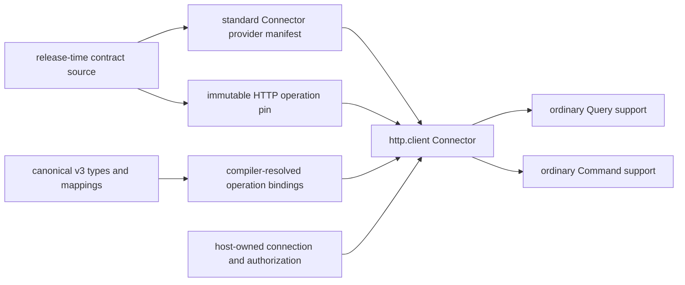

# Pinned HTTP Connector capabilities

TPF's generic HTTP Connector executes release-pinned wire operations as ordinary Query or Command
capabilities. It is infrastructure for contract importers: applications should generate the private
pin resources from a reviewed source rather than hand-authoring them.

For the supported release-time source and author workflow, see [Import OpenAPI operations](/develop/connectors/openapi-import).

The source format is absent from runtime. Provider `http.client` version 1 reads only the standard
provider manifest, immutable `META-INF/pipeline/http-operations.json`, and compiler-generated
`META-INF/pipeline/http-operation-bindings.json`. Their operation kind, identity, version and
canonical contracts must agree exactly before the provider starts.

## What an operation pin contains

Each pin records the deterministic information needed to create one request and interpret its
response:

- a TPF operation identity, explicit Query or Command kind, and major version;
- canonical input and output identities;
- an origin-relative path and HTTP method;
- path, query, header and cookie parameter locations and serialisation rules;
- one JSON or `+json` request representation;
- explicit status, media type and TPF outcome mappings;
- bounded normalised wire schemas and fingerprints;
- a selected security compatibility constraint;
- canonical-to-wire mapping keys; and
- an optional explicit Command idempotency-header projection.

The pin does not contain a server authority, endpoint credential, OAuth configuration, tenant,
account, or runtime authorization value. HTTP methods carry no Query or Command authority.

Command pins may declare input-only completion callbacks. HTTP pin schema 2 records their injection
targets, POST media/schema, inbound mappings, security compatibility, and acknowledgement status.
Schema 1 remains readable for synchronous operations. Provider callback descriptors must agree.
HTTP Commands support one required callback; optional callback pins are rejected because the
authorable mapping must know whether runtime injection changes the wire property counts.

The runtime supplies `ConnectorCallbackContext` after registering durable completion. The Connector
rejects missing or mismatched context before connection work, maps the input, deep-copies the wire
value, and injects the trusted URI. Any pre-existing value at the reserved target, including JSON
null, is rejected. Full wire-schema validation follows injection for direct, generated, and curated
mappings. Ordinary operations reject extra callback context. See
[OpenAPI callback import](../connectors/openapi-import#command-completion-callbacks).

The initiating provider endpoint must use HTTPS when transmitting callback authority. An explicit
`ConnectorCallbackContext.UriPolicy.LOCAL_HTTP` opt-in permits plaintext only for local deployments,
including container test networks. Imported pins cannot enable that policy.

## Supply the host connection

The Connector asks the application's existing `ConnectionResolver` for an `HttpClientConnection`.
The host supplies:

- a borrowed asynchronous `java.net.http.HttpClient` with automatic redirects disabled;
- the application-selected base URI;
- the security capabilities available on that connection; and
- an asynchronous callback returning already-resolved permitted headers, query values or cookies.

The callback is the last-mile material boundary, not an OAuth implementation. Token acquisition,
refresh, consent, credential storage, tenant/account routing and client shutdown stay in application
or platform infrastructure. See [Host-authenticated Connectors](/develop/oauth-connections/reference).

Requests can contain only the pinned relative path. The Connector rejects parameter/auth collisions,
reserved transport headers, path escape, automatic redirects, cross-origin responses and bodies over
the configured bounds.

## Map canonical and wire representations

Operation boundaries use the same `types.<type>.mappings.<key>` declarations and
`Mapper<Canonical, External>` contract as other representations. The HTTP representation provider
resolves each request and successful response mapping in this order:

1. direct mapping when the canonical and normalised wire schemas agree;
2. generated mapping from bounded provider options; or
3. an explicitly curated representation type and Mapper.

Bounded options cover named record paths, rename/nest/flatten, scalar constants, exact enum
translations, element-wise record collections, nominal JSON-object wrappers and closed
discriminators. They cannot contain scripts, expressions, JSONPath, reflection, network access or a
runtime model call. Difficult conversions remain explicit curated Java.

The compiler emits deterministic mapper classes and a mapping fingerprint. Runtime applies the
pinned mapper and validates the resulting value against the pinned wire schema; it never interprets
mapping options or invokes an LLM.

## Query and Command outcomes

Queries are `ONE_TO_ONE` and initially `LIVE_ONLY`. The pin maps response variants to found, empty,
temporary, authentication or terminal outcomes. Existing Query capture means replay does not resolve
a connection or send HTTP again.

Commands retain application-owned ID generation, duplicate policy and `CommandPolicy`. A pin may
mark a provider acknowledgement only for an explicit successful response. A definite pre-dispatch
failure can be retryable; transport loss, an oversized or malformed response, or an unclassified
status after dispatch is ambiguous.

Provider idempotency is opt-in. It is advertised only when the imported pin explicitly projects the
existing provider idempotency key onto a declared header. The Connector never infers safe retry from
`POST`, `PUT`, a header name or source-contract extension.

See [ADR-0034](/decisions/0034-pinned-http-operations-execute-as-ordinary-connector-capabilities)
for the ownership boundary.
