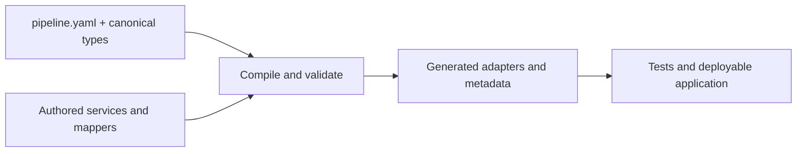

# Develop with TPF

Start from the typed application contract, then let compilation generate the transport and runtime
shell around small Java transformations.

If you are new to the framework, read the [Pipeline Template Guide](./pipeline-template/),
[Code a Step](./code-a-step), and [Pipeline Compilation](./pipeline-compilation/) in that order. The
template is the authoring front door to the Functional Core: it names the application's types and
flow before the compiler generates the imperative shell.

Use the focused Guides when the flow crosses a boundary or introduces reusable composition:

- [Examples](./examples/) — choose a current proof or reference application;
- [Connectors](./connectors/) — model typed external observations, effects, and object I/O;
- [Blocks](./blocks/) — consume or publish compile-time reusable Pipeline definitions;
- [Expansions](./expansions/) — distribute related Blocks, Connectors, and supporting assets as one coherent package;
- [Experimental OAuth Connections](./oauth-connections/) — let a Quarkus host manage provisional OAuth-backed client lifecycles.

Publishing an API for customers or integration partners? [Publish a Public OpenAPI Contract](./openapi-contract)
to expose application-owned facade paths without leaking generated step and runtime surfaces.

Keep deployment shape separate from authoring. Runtime layout, build topology, transport, and platform
configuration are covered under [Deploy](/deploy/).
