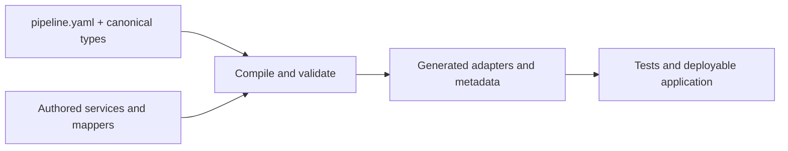

# Develop with TPF

Start from the typed application contract, then let compilation generate the transport and runtime
shell around small Java transformations.

```mermaid
flowchart LR
    Y[pipeline.yaml + canonical types] --> C[Compile and validate]
    J[Authored services and mappers] --> C
    C --> G[Generated adapters and metadata]
    G --> T[Tests and deployable application]
```

If you are new to the framework, read the [Pipeline Template Guide](./pipeline-template/),
[Code a Step](./code-a-step), and [Pipeline Compilation](./pipeline-compilation/) in that order. The
template is the authoring front door to the Functional Core: it names the application's types and
flow before the compiler generates the imperative shell.

Upgrading from 26.9.3? Start with the [26.9.4 upgrade guide](./upgrade-26.9.4) for the new product BOM,
repository ownership boundaries, DSL v3 checks and committed IDL state.

For current TPF development, select `org.pipelineframework:pipelineframework-bom:26.10.1-SNAPSHOT`
and omit versions from BOM-managed application dependencies. Use the configured Sonatype snapshot repository
and Maven `-U` to refresh snapshots; `LATEST` does not mean the latest Git `main`.
The TPF development repositories refresh snapshots automatically and publish Maven-producing components
after merges to `main`, with manual publication available for recovery. Publication takes time, so a successful merge is not yet proof
that its snapshot is available. Stable releases select a frozen compatible component set instead.

Use the focused Guides when the flow crosses a boundary or introduces reusable composition:

- [Examples](./examples/) — choose a current proof or reference application;
- [Connectors](./connectors/) — model typed external observations, effects, and object I/O;
- [Blocks](./blocks/) — consume or publish compile-time reusable Pipeline definitions;
- [Expansions](./expansions/) — distribute related Blocks, Connectors, and supporting assets as one coherent package;
- [Experimental OAuth Connections](./oauth-connections/) — let a Quarkus host manage provisional OAuth-backed client lifecycles.

Publishing an API for customers or integration partners? [Publish a Public OpenAPI Contract](./openapi-contract)
to expose application-owned facade paths without leaking generated step and runtime surfaces.

Keep deployment shape separate from authoring. Runtime layout, build topology, transport, and platform
configuration are covered under [Deploy](/deploy/).
