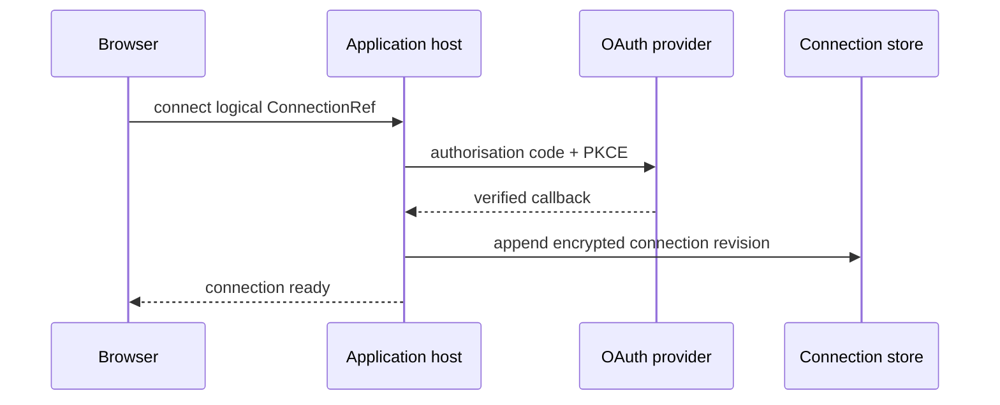

# Configure an OAuth Connection Host

Use a dedicated Quarkus OIDC tenant for the connection flow. The callback path belongs to the host,
not to a Pipeline step.



The Gmail proof uses a named OIDC tenant similar to:

```properties
quarkus.oidc.gmail.provider=google
quarkus.oidc.gmail.client-id=${GOOGLE_CLIENT_ID}
quarkus.oidc.gmail.credentials.secret=${GOOGLE_CLIENT_SECRET}
quarkus.oidc.gmail.tenant-paths=/connections/gmail/authorize
quarkus.oidc.gmail.authentication.scopes=openid,https://www.googleapis.com/auth/gmail.readonly
quarkus.oidc.gmail.authentication.extra-params.access_type=offline
quarkus.oidc.gmail.authentication.extra-params.prompt=consent
quarkus.oidc.gmail.authentication.pkce-required=true
quarkus.oidc.gmail.authentication.state-secret=${OIDC_STATE_SECRET}
quarkus.oidc.gmail.token-state-manager.strategy=id-token
quarkus.oidc.gmail.token.refresh-expired=false
```

Register the exact HTTPS authorisation URI with the provider. Use an independent OIDC client for
refresh authority, apply `META-INF/tpf-oidc-connections.sql` to a dedicated security schema, and
supply host-owned authenticated-encryption keys. The database token-state manager only protects the
short browser session; it is not the durable connection registry.

Create one `ConnectionRegistration` per provider flow, including issuer, client, scopes, provider
identity policy, callback URI, and capability type. Assemble `JdbcConnectionStore`,
`ConnectionEncryption`, and `QuarkusConnections` in host code. The application must authenticate and
authorise the actor and tenant before starting, inspecting, or disconnecting a connection.

Gmail is the current end-to-end proof. A bounded Microsoft Graph client factory also exists. Local
QuickBooks STDIO uses a different Node-owned authorisation model; Java attests the tenant-to-process
binding but does not inspect or refresh Node's credentials.
