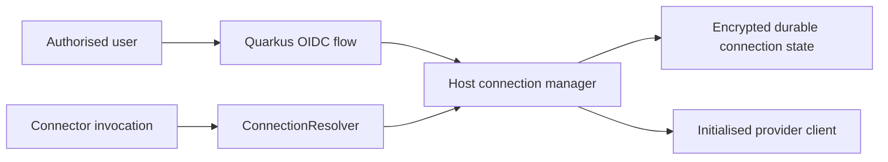

# Experimental OAuth Connections Guide

TPF's provisional Quarkus host libraries can manage a durable OAuth-backed connection and expose an
initialised client to a Connector. They do not add OAuth to `pipeline.yaml` and do not define a
portable OAuth SPI.

::: warning Experimental
The current implementation is verified with Quarkus 3.39.2. The host APIs are provisional, Spring
support is separate work, and provider registration, tenant policy, encryption, storage, and
operations remain the application's responsibility.
:::

`ConnectionRef` is a deployment-owned logical name. A Connector borrows the resolved capability at
invocation time; it does not acquire grants, refresh tokens, choose an account from payload data, or
close host clients. Recorded Query or Command replay bypasses live connection resolution.

Continue with [Configure a connection host](./configure) and [Operate the lifecycle](./operate).
For generic, externally managed credentials and brokers, see
[Host-authenticated Connectors](/develop/oauth-connections/reference).
