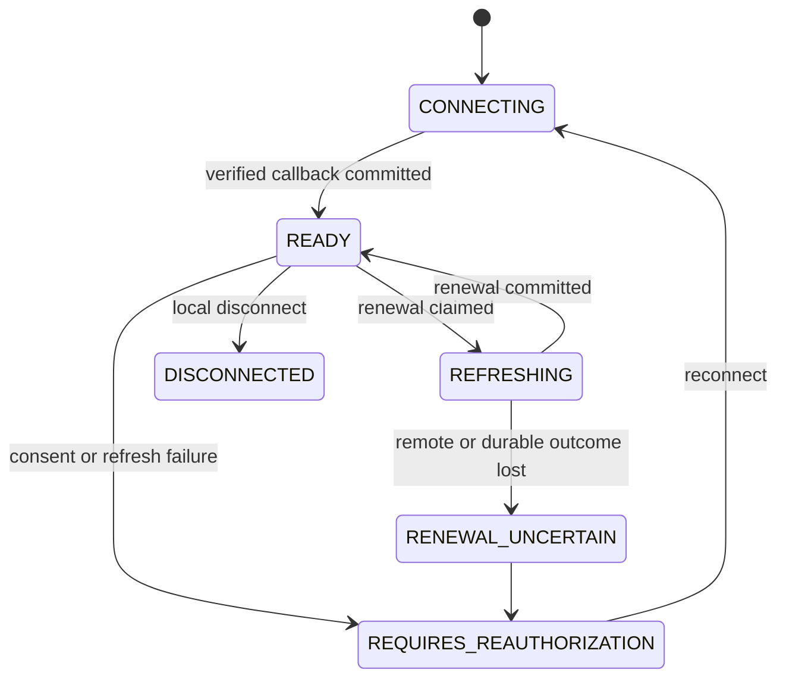

# Operate OAuth Connections

Connection state is a security authority separate from Pipeline persistence, replay, Query capture,
Command effects, and Await state. Lifecycle transitions use immutable conditional revisions.

- `READY` means locally usable, subject to provider acceptance.
- `CONNECTING` means a one-use authorised attempt is awaiting completion.
- `REFRESHING` means another worker owns renewal.
- `RENEWAL_UNCERTAIN` fails closed because remote or durable outcome is unknown.
- `REQUIRES_REAUTHORIZATION` needs interaction or renewed consent.
- `DISCONNECTED` means local authority has been removed.

One provider account has one managed logical owner in the shared store. Do not run another token
broker or process that independently refreshes the same grant. A refresh must win durable authority
before calling the provider; a lost outcome is not described as exactly once. Disconnect and
reconnect supersede older writers and cached client generations.

Monitor renewal failures, uncertain outcomes, reauthorisation demand, connection age, and callback
failures without logging tokens or credential payloads. Disconnect is local; provider-side consent
revocation is a separate, explicitly authorised host operation. Drain in-flight invocations before
closing managers, SDK transports, and the host executor.

See [ADR-0030](/decisions/0030-optional-host-connection-lifecycle) for the security and ownership rationale.
