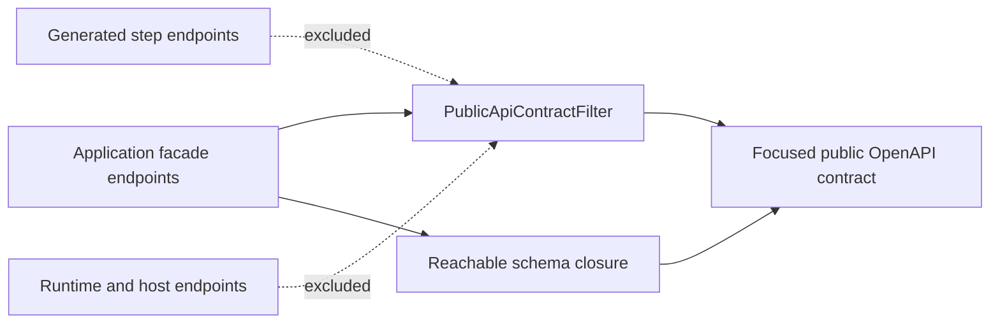

# Publish a Public OpenAPI Contract

TPF can generate many useful typed REST surfaces without forcing all of them into the API that
customers, frontends, or integration partners consume. Its opt-in OpenAPI filter publishes only
application-owned facade paths and the component definitions those operations actually reach.



## Enable the filter

Add the SmallRye OpenAPI extension to the application:

```xml
<dependency>
  <groupId>io.quarkus</groupId>
  <artifactId>quarkus-smallrye-openapi</artifactId>
</dependency>
```

Then set these runtime properties:

```properties
mp.openapi.filter=org.pipelineframework.openapi.PublicApiContractFilter
pipeline.openapi.public-path-prefixes=/api/cases
```

`pipeline.openapi.public-path-prefixes` accepts a comma-separated list when the public contract has
more than one application-owned root:

```properties
pipeline.openapi.public-path-prefixes=/api/cases,/api/customers
```

The filter normalises configured roots and retains matching paths. If it is activated without a
valid public root, it fails closed and publishes no paths.

## What the public contract contains

The filter retains:

- operations below the configured path roots;
- schemas reachable from those operations;
- referenced request bodies, parameters, responses, headers, callbacks, and their transitive schema dependencies.

Unrelated generated step resources and runtime schemas remain outside the published contract. This
turns the default OpenAPI document into a small integration contract without maintaining bespoke
schema-pruning code.

## Keep the application facade explicit

The application still owns the facade resources and their OpenAPI annotations. This is where several
generated boundaries can become one customer-facing operation and where application language can
replace internal step language.

For sealed or polymorphic contracts, annotate concrete variants and discriminator mappings on the
application contract. The filter preserves reachable discriminator metadata; it does not infer
application-specific discriminator values.

## Verify the result

Start the application and inspect its OpenAPI endpoint, normally `/q/openapi`. Check that:

1. every intended facade path is present;
2. generated step and runtime-only paths are absent;
3. request, response, nested, and polymorphic schemas required by retained operations remain present;
4. activating the filter with an empty or invalid root exposes nothing.

For the resource-extension pattern used to implement the facade, see [REST Resource Extensions](./extension/rest-resources).
