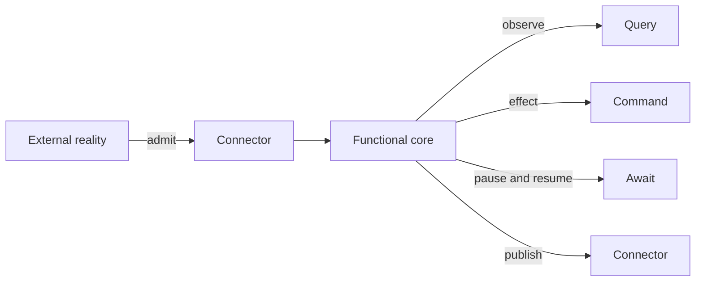

# Declare Boundaries

The Pipeline template keeps external uncertainty visible. A boundary says what kind of interaction is
happening, which typed contract crosses it, and which runtime concern TPF must own.

## Select the semantic boundary

| Need | Boundary |
| --- | --- |
| Admit or publish files, objects, or external payloads | Connector input/output |
| Read external reality and replay the captured answer | Query |
| Perform an external effect with stable identity and policy | Command |
| Pause until a correlated external completion arrives | Await |
| Reuse pure or synchronous existing compute | Operator or authored service |

Do not hide a network or database call in an ordinary business step when one of these boundaries owns
the semantics. Generated transport is also part of the shell: `REST`, `GRPC`, and `LOCAL` describe
component call modes, while platform and deployment choices remain separate.

## Bind representations explicitly

Step `input` and `output` always name logical contracts. Use Java bindings and Mappers where a real
representation boundary exists or where the compiling module cannot inspect the service signature.
Do not add a Mapper merely to restate a local signature the compiler can already see.

Start with the [Connectors Guide](/develop/connectors/) for boundary authoring. The
[complete DSL reference](./reference#java-bindings-and-mappers) documents Java visibility, mapper
selection, object I/O, and coordinator-side bindings.
