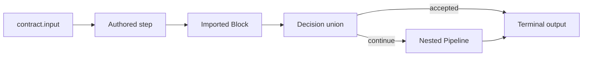

# Compose the Pipeline

A Pipeline contract connects typed steps in order. Omitted inputs can inherit one concrete predecessor
output; explicit inputs are assertions, not coercions. Unions, branches, and ambiguous predecessors
stay explicit.

## Linear contracts

Declare `contract.input` and `contract.output` as the application's end-to-end assertion. Each step
names its output; a later step may inherit it only when the predecessor has one concrete result.
Cardinality remains an execution-shape choice such as `ONE_TO_ONE` or `ONE_TO_MANY`—it is unrelated
to an Expansion package.

## Reuse a definition

Root `pipelines` contains local compile-time definitions. A `pipeline:` step can call one of those or
a Block supplied by an installed dependency. The compiler links either form into the release contract;
it does not create a second runtime execution.

Applications bind the Query and Command capabilities required by an imported Block. The Block can
name the requirement, but it cannot own endpoints, credentials, tenant choices, or Command authority.
See the [Blocks Guide](/develop/blocks/) for the complete packaging and binding journey.

## Use recursion deliberately

Direct self-recursion is a bounded nested invocation, not a jump to an earlier step. The definition
must make its base case visible through ordinary union routing and `accepts`. Runtime depth is bounded
by `pipeline.max-recursive-depth`.

See the [complete reference](./reference#pipeline-contracts) for syntax, capability manifests,
`blockBindings`, current restrictions, and bounded recursion.

Continue with [Declare Boundaries](./boundaries).
