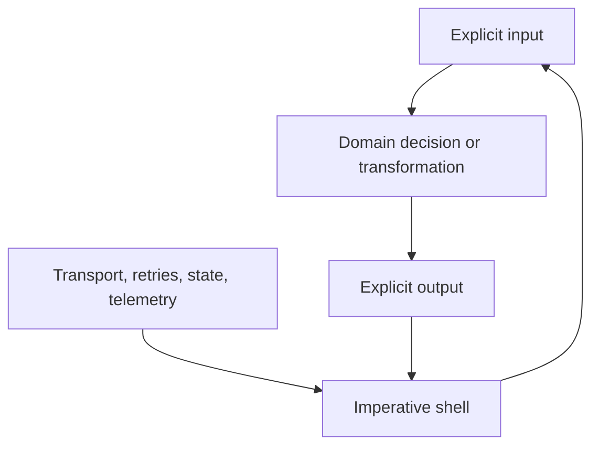

# Model the Functional Core

Use the template to describe the language of the application before choosing transport, persistence,
or deployment shape. A useful contract remains understandable when every framework adapter is hidden.

## Put these in the core

- canonical domain types and their invariants;
- the Pipeline's input and output contract;
- ordered business transformations;
- explicit business outcomes, including closed unions;
- small Java services whose signatures express those contracts.

The template does not replace business code. It gives that code a typed, compiler-checked place in
the flow and makes mismatches visible before deployment.

## Put these in the shell

- REST, gRPC, local, function, and worker adapters;
- object admission and publication;
- external Queries and Commands;
- Await correlation and durable resume state;
- persistence, caching, retries, replay, telemetry, and deployment wiring.

Prefer a supported semantic boundary over hiding I/O inside an ordinary service. The boundary then
has an explicit contract, lifecycle, and operational representation while the business function stays
focused on the decision.

## Check the separation

For each step, ask:

1. Can its input and output be named in domain language?
2. Can its decision be tested without a network, database, or runtime container?
3. Is uncertainty at an external boundary represented as Query, Command, Await, or Connector behaviour?
4. Would changing deployment topology leave the business signature intact?

If the answers are yes, the template is describing the Functional Core rather than leaking the
imperative shell into it.

See [Functional Core, Imperative Shell](/architecture/fcis) for the architectural rationale, then
[Declare Canonical Types](./types) to model the contract.
