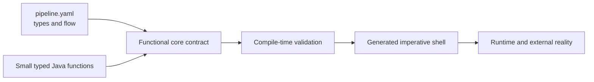

# Pipeline Template Guide

The pipeline template is the authoring front door to TPF's Functional Core, Imperative Shell model.
It names the domain types and flow that form the application contract; small Java functions make the
business decisions; the compiler validates both and generates the surrounding shell.



## Start here

Follow the Guide according to the decision you are making:

1. [Model the Functional Core](./functional-core) — decide what belongs in the domain contract and what belongs in the shell.
2. [Declare Canonical Types](./types) — choose products, wrappers, aliases, unions, constraints, and representations.
3. [Compose the Pipeline](./composition) — connect typed steps, local definitions, Blocks, and bounded recursion.
4. [Declare Boundaries](./boundaries) — keep Query, Command, Await, object I/O, and transport concerns outside business functions.
5. [Complete DSL Reference](./reference) — use the exhaustive syntax and compatibility reference when implementing details.

## The smallest useful template

```yaml
version: 3
basePackage: com.example.orders

types:
  OrderRequest:
    fields: [[orderId, string], [amount, decimal]]
  OrderDecision:
    fields: [[accepted, boolean], [reason, string]]

contract:
  input: OrderRequest
  output: OrderDecision

steps:
  - name: Decide order
    service: com.example.orders.DecideOrder
    output: OrderDecision
```

Here `pipeline.yaml` owns the logical types and flow. `DecideOrder` owns the business decision. TPF
owns generated adapters, metadata, validation, and runtime integration.

Continue with [Model the Functional Core](./functional-core).
