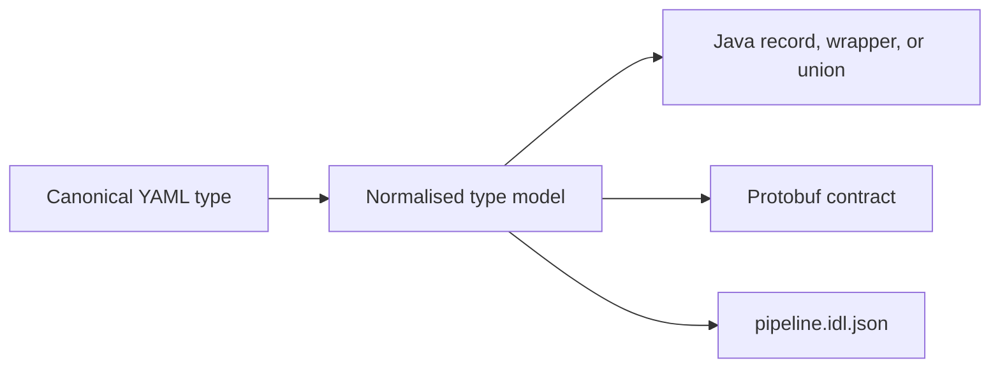

# Declare Canonical Types

Version 3 uses one normalised type model to generate domain-facing Java contracts, protobuf
representations, adapters, and compatibility state. Transport representations do not become the
domain model.

## Choose the declaration by meaning

| Declaration | Use it for |
| --- | --- |
| `fields` | A product that contains all declared fields. |
| `wraps` | A nominal value that must not be confused with another value over the same scalar. |
| `alias` | A transparent alternate name for another type. |
| `variants` | A closed set of explicitly named outcomes. |

Use constraints to state invariants at the contract boundary. Use optionality and nullability only
when absence and explicit null are meaningful states. For large content, use `payload_ref` rather than
turning an unbounded payload into an ordinary scalar field.

## Keep identity stable

Type names, field names, and union discriminators are semantic identities. The compiler owns protobuf
tag allocation and records it in the sibling `pipeline.idl.json` file. Commit that file so removals,
reservations, and compatibility checks remain deterministic across builds.

An external representation or application-owned Java type is a boundary binding. It does not create a
second canonical type system, and changing a mapper does not silently change the canonical wire identity.

The [complete reference](./reference#domain-types) covers scalar forms, constraints, optional and
nullable fields, contributed protocol types, external representations, wrappers, aliases, unions,
and generated Java/protobuf behaviour.

Continue with [Compose the Pipeline](./composition).
