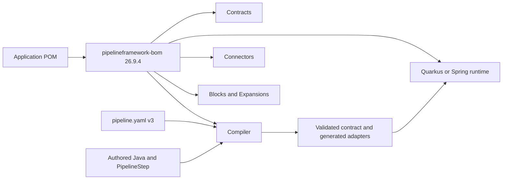

# Upgrade from 26.9.3 to 26.9.4

TPF 26.9.4 deliberately changes the product boundary. The framework is now released from several repositories and
validated as one compatible product set. Most Maven artifact IDs remain stable, but applications must stop relying on
the former monorepo reactor to supply compatible versions implicitly.

The safest upgrade is to import the new product BOM, move authored pipelines to DSL v3, regenerate committed IDL
state, and then fix any newly reported compile-time contract failures.

::: warning Not a drop-in upgrade
26.9.4 is not fully source- or configuration-compatible with 26.9.3. The list below covers the known migration
surfaces, but the compiler also validates substantially more of the authored contract at build time. Plan to run a
full clean build and the application's E2E suite rather than treating a dependency-version edit as sufficient.
:::



## Import the product BOM

Add the TPF BOM beside the Quarkus platform BOM. Keep a single TPF version at the application boundary and omit
versions from TPF dependencies managed by the BOM.

```xml
<properties>
    <tpf.version>26.9.4</tpf.version>
</properties>

<dependencyManagement>
    <dependencies>
        <dependency>
            <groupId>org.pipelineframework</groupId>
            <artifactId>pipelineframework-bom</artifactId>
            <version>${tpf.version}</version>
            <type>pom</type>
            <scope>import</scope>
        </dependency>
    </dependencies>
</dependencyManagement>
```

Do not use `framework-parent` as an application parent. It coordinates publication in the `pipelineframework`
repository; `pipelineframework-bom` is the public compatibility contract for consumers.

## Repository names are not replacement artifact IDs

The source repository split does not imply a matching rename of every Maven coordinate.

| Concern | 26.9.4 owner | Consumer-facing change |
| --- | --- | --- |
| Product version alignment | `pipelineframework` | Import the new `org.pipelineframework:pipelineframework-bom`. |
| Shared model, DSL and runtime contracts | `pipelineframework-contracts` | Use BOM-managed released artifacts; do not compile sibling source modules. |
| Compiler | `pipelineframework-compiler` | Compiler hosts and tooling may depend on `pipelineframework-compiler` directly. Quarkus applications normally receive it through build integration. |
| Quarkus runtime and deployment | `pipelineframework-runtime` | The application dependency remains `org.pipelineframework:pipelineframework`; it was **not** renamed to `pipelineframework-runtime`. |
| Spring adapter | `pipelineframework-runtime` | Use the BOM-managed `pipelineframework-runtime-spring` artifact; Spring support is still narrower than Quarkus support. |
| Connectors and import tooling | `pipelineframework-connectors` | Declare the connector or tooling artifact actually used; it is no longer supplied by a monorepo source reactor. |
| Packaged Blocks | `pipelineframework-blocks` | Declare the required Block as an ordinary BOM-managed dependency. |
| Expansion distributions | `pipelineframework-expansions` | Declare the chosen distribution POM; applications still own bindings, credentials and Command authority. |

Examples, reference implementations, CSV/Kafka Payments and RAG Turnkey also moved to their own repositories. That
changes where their source and tests live, not the runtime process model of a customer application.

Common connector coordinates retain names such as `object-ingest-connector`, `query-jpa-connector`,
`graphql-connector` and `graphql-smallrye-connector`. Import and code-generation tooling likewise keeps explicit
coordinates such as `connector-maven-plugin`, `connector-openapi-maven-plugin` and
`connector-mcp-maven-plugin`. Select only the boundary or build tool the application actually uses.

## Move authored pipelines to DSL v3

DSL v3 is the canonical authored contract in 26.9.4. Some version 2 input remains temporarily readable, but it is a
compatibility path rather than the model against which new features are designed. Treat this release as the point to
migrate rather than depending on that temporary reader.

Expect compilation to fail where 26.9.3 tolerated an ambiguous or incomplete model. In particular, v3 requires
canonical type references, non-empty unions, valid topology and cardinality, resolvable callable and connector
capabilities, and compatible step contracts. Legacy wire-oriented step fields are not substitutes for the canonical
v3 type model.

The compiler now owns these checks independently of the Quarkus runtime. A build failure during semantic analysis is
therefore an authored-contract failure to correct, not a reason to add runtime implementation classes to the compiler
classpath.

## Regenerate and commit IDL state

The compiler allocates stable protobuf identities in `config/pipeline.idl.json`. Run the normal application build,
review the generated IDL state, and promote it to the committed file when the contract change is intentional. The
build now rejects unreviewed IDL drift, reservation loss and incompatible identity reuse that could previously remain
latent.

Do not delete the lock file merely to make the build pass. Its tags and reservations are part of the pipeline's
serialised compatibility contract.

## Recompile extensions and custom tooling

Application code using the ordinary `pipelineframework` dependency should retain its main runtime imports. Code that
extended compiler/runtime internals may need explicit dependencies and import updates because shared types now live
in purpose-specific artifacts such as:

- `pipelineframework-api` and `pipelineframework-semantic-model` for authored and semantic contracts;
- `pipelineframework-runtime-core` and `pipelineframework-runtime-api` for customer-facing runtime abstractions;
- `pipelineframework-runtime-spi` for provider extension points;
- `pipelineframework-runtime-protocol` and `pipelineframework-runtime-serialization` for durable wire and payload contracts;
- `representation-provider-api` for representation providers.

The legacy `PipelineTemplateTypeModel.fromLegacy(...)` convenience path has been removed. Extension code that still
constructs the old message/union model must migrate to the canonical type model instead of preserving a second
representation.

## Review platform prerequisites

TPF 26.9.4 aligns with Quarkus 3.39.2 and Java 21. Native builds require GraalVM or Mandrel 25 or newer. Applications
using Hibernate ORM or Hibernate Reactive with PostgreSQL require PostgreSQL 14 or newer. Review the linked Quarkus
migration guides in [Dependency Management](/deploy/dependency-management) when upgrading an existing application.

## Upgrade checklist

1. Import `org.pipelineframework:pipelineframework-bom:26.9.4`.
2. Remove versions from TPF dependencies managed by the BOM.
3. Keep `org.pipelineframework:pipelineframework` for the Quarkus runtime; do not rename it after the repository.
4. Add explicit dependencies for the Connectors, Blocks or Expansions the application uses.
5. Convert authored templates to `version: 3` and remove legacy wire-oriented type declarations.
6. Run the complete build, review `config/pipeline.idl.json`, and commit intentional IDL changes.
7. Fix compiler diagnostics rather than weakening semantic validation or adding runtime implementation dependencies.
8. Recompile custom compiler/runtime/connector extensions against the new API and SPI artifact boundaries.
9. Run the application's integration and E2E suite, especially durable Command, Query, Await, replay and connector paths.

For the ownership map behind these changes, see [Components and Repositories](/architecture/components-and-repositories).
For dependency examples, see [Dependency Management](/deploy/dependency-management).
