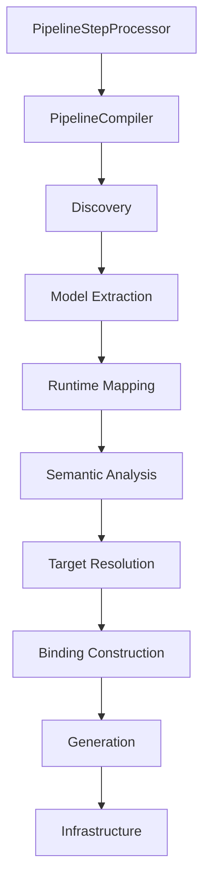

# Annotation Processor Architecture

This page links to the split guide:

- [Annotation Processor Guide: Overview](/evolve/annotation-processor/)
- [Phases and Flow](/evolve/annotation-processor/phases-and-flow)
- [Models and Bindings](/evolve/annotation-processor/models-and-bindings)
- [Generation and Rendering](/evolve/annotation-processor/generation-and-rendering)
- [Current Architecture](/evolve/annotation-processor/current-architecture)

Related:

- [Compiler Pipeline Architecture](/evolve/compiler-pipeline-architecture)
